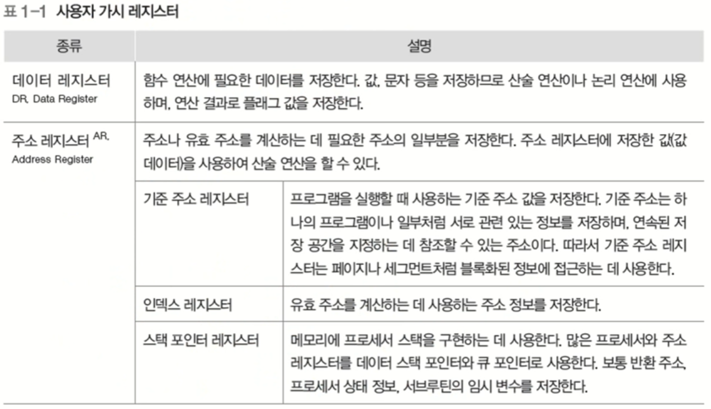
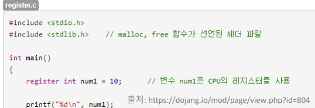
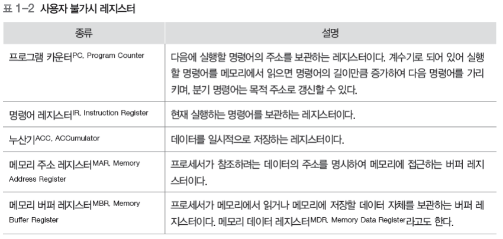
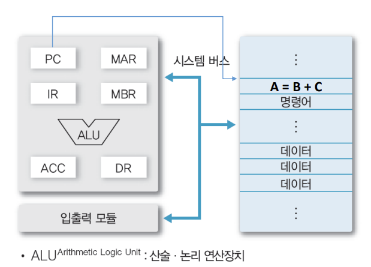
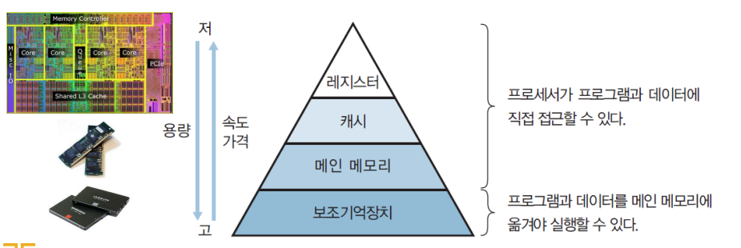
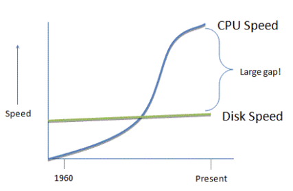
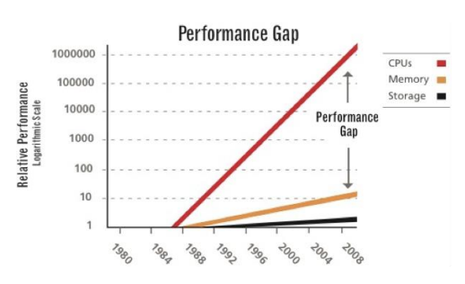
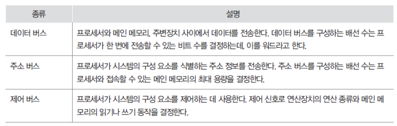
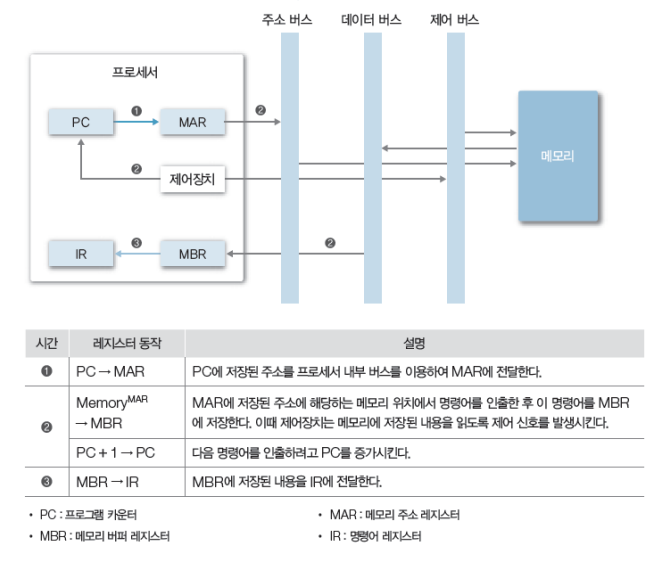

# 컴퓨터 시스템 개요

## 컴퓨터 하드웨어

* 프로세서(Processor)
  * CPU
  * 그래픽카드(GPU)
  * 응용 전용 처리장치 등

> 계산

* 메모리 (Memory)
  * 주 기억장치
  * 보조 기억장치 등

> 저장하는 것, DRAM, Disk

* 주변장치
  * 키보드/마우스
  * 모니터, 프린터
  * 네트워크 모뎀 등

## 프로세서

* 컴퓨터의 두뇌 (중앙처리장치)
  * 연산 수행(계산)
  * 컴퓨터의 모든 장치의 동작 제어

## 레지스터

* 프로세서 내부에 있는 메모리
  * 프로세서가 사용할 데이터 저장
  * 컴퓨터에서 가장 빠른 메모리
* 레지스터의 종류
  * 용도에 따른 분류
    * 전용 레지스터, 범용 레지스터
  * 사용자가 정보 변경 가능 여부에 따른 분류
    * 사용자 가시 레지스터, 사용자 불가시 레지스터
  * 저장하는 정보의 종류에 따른 분류
    * 데이터 레지스터, 주소 레지스터, 상태 레지스터

>  C 언어 예시, 이왕이면 레지스터에 저장해줘

> 일반적으로 전용 레지스터가 불가시 레지스터가 해당
>
> 프로그램 카운터 : 다음에 실행할 프로그램의 위치, 주소를 가지고 있는 것
>
> 명령어 레지스터 : 명령어 보관
>
> 누산기 : 일시적으로 저장

> 프로세서는 다양한 레지스터로 동작

## 운영체제와 프로세서

* 프로세서에게 처리할 작업 할당 및 관리
  * 프로세스 생성 및 관리(3장)
* 프로그램의 프로세서 사용 제어
  * 프로그램의 프로세서 사용 시간 관리
  * 복수 프로그램간 사용 시간 조율 등(4장)

## 메모리(Memory)

* 데이터를 저장하는 장치 (기억장치)
  * 프로그램(OS, 사용자sw 등), 사용자 데이터 등

* 메모리의 종류

> 위로 올라갈수록 속도 빠르고, 비싸지고, 용량 적음
>
> 왜 가장 빠르고 좋은애 쓰면 되지 왜 계층을 나눌까?
>
> 너무 비싸고 비효율적임
>
> 공학자들이 적절히 분배해 활용해서 최적의 성능을 내자

## 메모리의 종류

* 주기억장치(Main memory)
  * 프로세서가 수행할 프로그램과 데이터 저장
  * DRAM을 주로 사용
    * 용량이 크고, 가격이 저렴
  * 디스크 입출력 병목현상(I/O bottleneck) 해소

> 컴퓨터의의 메인 보드에 꽂혀있는 애, DRAM
>
> 프로세서가 뭔가 수행할 때 메인 메모리 안에 들어가 있어야함
>
> why? 프로세서가 직접 접근할 수 있는게 메인 메모리 까지임, disk까지 못감
>
> 그럼 왜 바로 안쓰고 disk에서 main memory 거쳐서 감?

> Disk 발전은 느리고 CPU 발전은 매우 빠르게 돼서 gap이 생김
>
> 그래서 size는 작아도 속도 빠른 애를 중간에 놔서 사이의 gap을 매꾸기로 함
>
> => 병목현상 해소

* 캐시 (Cache)
  * 프로세서 내부에 있는 메모리(L1, L2 캐시 등)
    * 속도가 빠르고, 가격이 비쌈
  * 메인 메모리의 입출력 병목현상 해소

> 또 병목 현상 해소 하려고
>
> 메인 메모리로도 안 채워 지는 gap

## 캐시의 동작

* 캐시의 동작
  * 일반적으로 HW적으로 관리 됨
  * 캐시 히트 (Cache hit)
    * 필요한 데이터 블록이 캐시 존재
  * 캐시 미스(Cache miss)
    * 필요한 데이터 블록이 없는 경우

> 캐시 히트 나면 이득 발생
>
> 캐시 미스면 오히려 손해
>
> 128KB 밖에 없는데 효과를 볼 수 있나?

## 지역성(Locality)

* 공간적 지역성(Spatial locality)
  * 참조한 주소와 인접한 주소를 참조하는 특성
    * 예) 순차적 프로그램 수행
* 시간적 지역성(Temporal locality)
  * 한 번 참조한 주소를 곧 다시 참조하는 특성
    * 예) For 문 등의 순환 문
* 지역성은 캐시 적중률(cache hit ratio)과 밀접
  * 알고리즘 성능 향상 위한 중요한 요소 중 하나

> 캐시는 데이터를 읽으면 딱 걔만 가져오는 것이 아니라 Cache line(cache block)만큼 불러옴
>
> => 공간적 지역성에 효과 봄

## 보조기억 장치(Auxiliary memory /secondary memory / storage)

* 프로그램과 데이터를 저장
* 프로세서가 직접 접근할 수 없음(주변장치)
  * 주기억장치를 거쳐서 접근
  * (프로그램/데이터 > 주기억장치)인 경우는?
    * 가상 메모리(Virtual memory)
* 용량이 크고, 가격이 저렴

## 메모리와 운영체제

* 메모리 할당 및 관리
  * 프로그램의 요청에 따른 메모리 할당 및 회수
  * 할당된 메모리 관리 (7장)
* 가상 메모리 관리
  * 가상메모리 생성 및 관리
  * 논리주소 -> 물리주소 변환 (8장)

## 시스템 버스(System Bus)

* 하드웨어들이 데이터 및 신호를 주고 받는 물리적인 통로

> 버스 : 통로

## 주변 장치

* 프로세서와 메모리를 제외한 하드웨어들
  * 입력장치
    * 키보드, 마우스, 터치패드
  * 출력장치
    * 모니터, 프린터, 스피커
  * 저장 장치
    * 디스크, CD, USB

## 주변장치와 운영체제

* 장치 드라이버 관리
  * 주변 장치 사용을 위한 인터페이스 제공
* 인터럽트 (Interrupt) 처리
  * 주변 장치의 요청 처리 (3장)
* 파일 및 디스크 관리
  * 파일 생성 및 삭제
  * 디스크 공간 관리 등(9~10장)