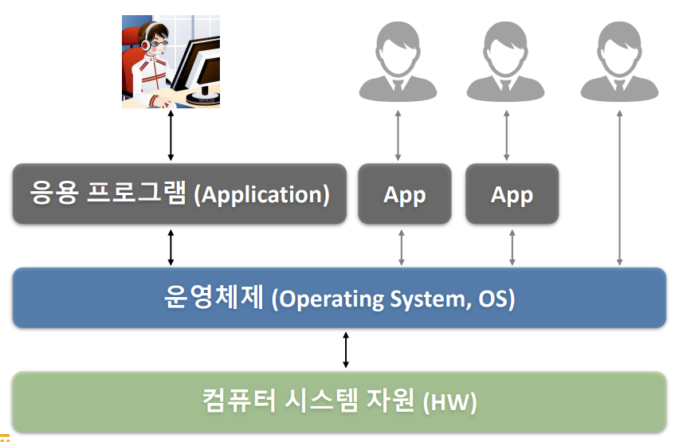
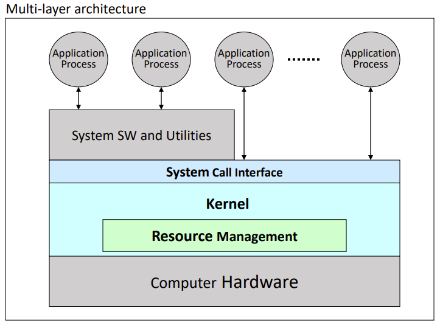
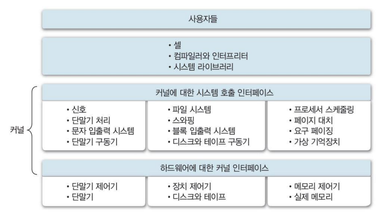
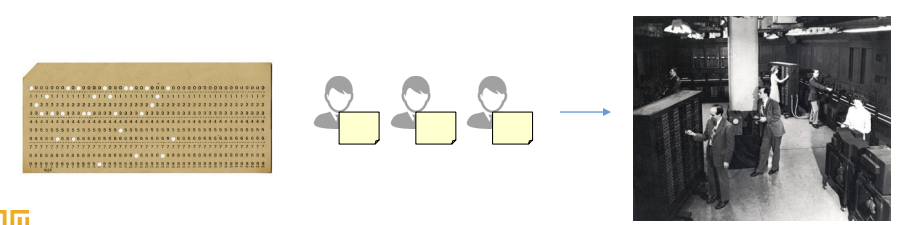
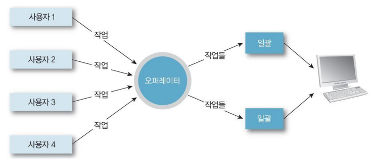
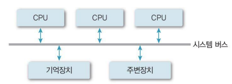
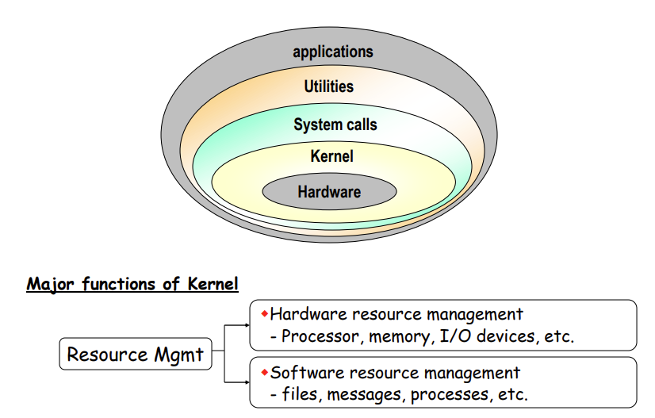
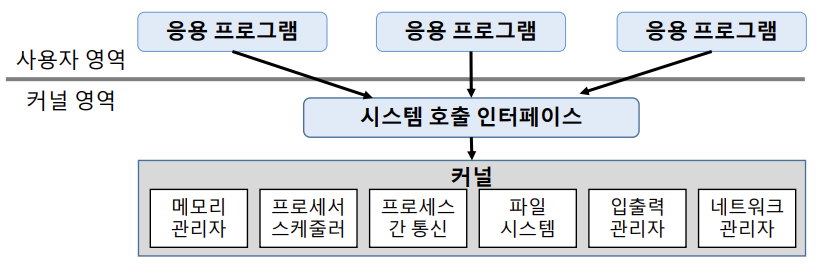
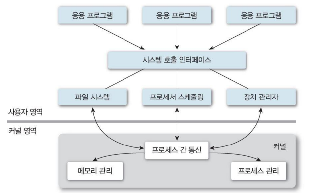
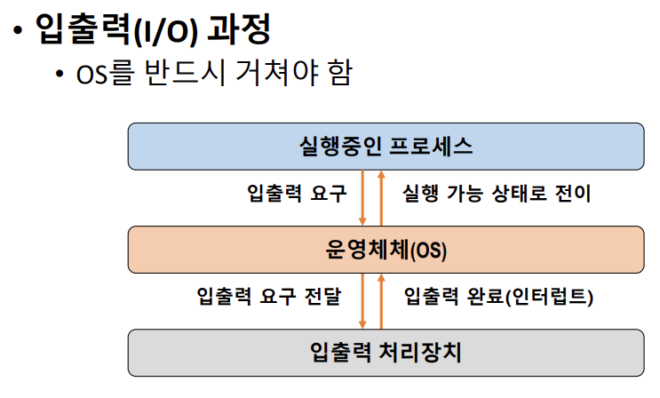

# 운영체제 개요 (Operating Systems overview)

## 운영체제의 역할

* User Interface (편리성)
  * CUI (Character user interface) => 글
  * GUI (Graphical User interface) => 그림
  * EUCI (End-User Comfortable Interface) => 특별 목적
* Resource management (효율성)
  * HW resource (processor, memory, I/O devices, Etc.)
  * SW resource (file, application, message, signal, Etc.)
* Process and Thread management

> 프로세스(실행 주체) 쓰레드(가벼운 프로세스) 관리

* System management(시스템 보호)

> 점점 더 중요해짐
>
> 사용자가 불법적으로 사용하려 할 때 보호

## 컴퓨터 시스템의 구성

> System Call Interface + Kernel => 운영체제
>
> System Call Interface => 필요한 기능 있으면 직접 조작이 아닌 OS에 요청하는 통로
>
> => Kernel 제공 기능 중 사용자가 사용할 수 있는 기능들 모아놓은 것

## 운영체제의 구분

* 동시 사용자 수
  * 단일 사용자 (Single-user system)
    * 한 명의 사용자만 시스템 사용 가능
      * 한 명의 사용자가 모든 시스템 자원 독점
      * 자원관리 및 시스템 보호 방식이 간단 함
    * 개인용 장비(PC, mobile)등에 사용
      * Window, android, MS-DOS 등
  * 다중 사용자 (Multi-user system)
    * 동시에 여러 사용자들이 시스템 사용
      * 각종 시스템 자원(파일 등)들에 대한 소유 권한 관리 필요
      * 기본적으로 Multi-tasking 기능 필요
      * OS의 기능 및 구조가 복잡
    * 서버, 클러스터(cluster) 장비 등에 사용
      * Unix, Linux, Windows server 등

* 동시 실행 프로세스 수
  * 단일 작업(Signle-tasking system)
    * 시스템 내에 하나의 작업(프로세스)만 존재
      * 하나의 프로그램 실행을 마친 뒤에 다른 프로그램의 실행
    * 운영체제의 구조가 간단
    * 예) MS-DOS (cmd 창)
  * 다중 작업(Multi-tasking system)
    * 동시에 여러 작업(프로세스)의 순행 가능
      * 작업들 사이의 동시 수행, 동기화 등을 관리해야 함
    * 운영체제의 기능 및 구조가 복잡
    * 예) Unix/Linux, Windows 등

* 작업 수행 방식 (사용자가 느끼는 사용 환경)
  * Batch processing system
    * 일괄처리 시스템
  * Time-sharing systemn
    * 시분할 시스템
  * Distributed processing system
    * 분산 처리 시스템
  * Real-time system
    * 실시간 시스템

* 순차 처리 (No OS, ~1940s)
  * 운영체제 개념 존재하지 않음
    * 사용자가 기계어로 직접 프로그램 구성
    * 컴퓨터에 필요한 모든 작업 프로그램에 포함
      * 프로세서에는 명령어 저장 방법, 계산 대상, 결과 저장 위치와 방법, 출력 시점, 위치 등
  * 실행하는 작업 별 순차 처리
    * 각각의 작업에 대한 준비 시간이 소요

* Batch Systems(1950s ~ 1960s)
  * 모든 시스템을 중앙(전자계산소 등)에서 관리 및 운영
  * 사용자의 요청 작업 (천공카드 등)을 일정 시간 모아 두었다가 한번에 처리

> 기다렸다 처리하니 너무 오래 걸리더라
>
> 모았다가 한번에 처리 하자
>
> ex : C가 100개 모이면 한번에 처리하자~

* 시스템 지향적 (System-oriented)

> 시스템이 처리 편함

* 장점
  * 많은 사용자가 시스템 자원 공유
  * 처리 호율(troughput) 향상
* 단점
  * 생산성(productivity) 저하
    * 같은 유형의 작업들이 모이기를 기다려야 함
  * 긴 응답시간(turnaround time)
    * 약 6시간 (작업 제출에서 결과 출력까지의 시간)

* Time Sharing Systems (1960s ~ 1970s)
  * 여러 사용자가 자원을 동시에 사용
    * OS가 파일 시스템 및 가상 메모리 관리
  * 사용자 지향적 (User-oriented)
    * 대화형(conversational, interactive) 시스템
    * 단말기(CRT terminal) 사용
  * 장점
    * 응답시간(response time) 단축 (약 5초)
    * 생산성(productivity) 향상
      * 프로세서 유휴 시간 감소
  * 단점
    * 통신 비용 증가
      * 통신선 비용, 보안 문제 등
    * 개인 사용자 체감 속도 저하
      * 동시 사용자 수 증가 => 시스템 부하 증가 => 느려짐 (개인 관점)

* Personal Computing
  * 개인이 시스템 전체 독점
  * CPU 활용률(utilization)이 고려의 대상이 아님
  * OS가 상대적으로 단순함
    * 하지만, 다양한 사용자 지원 기능 지원

> CPU 얼마나 쓰는지가 중요한게 아니라 사용자가 얼마나 편하냐가 중요해짐

* 장점
  * 빠른 응답시간
* 단점
  * 성능(performance)이 낮음

* Parallel Processing System
  * 단일 시스템 내에서 둘 이상의 프로세서 사용
    * 동시에 둘 이상의 프로세스 지원
  * 메모리 등의 자원 공유(Tightly-coupled system)
* 사용 목적
  * 성능 향상
  * 신뢰성 향상( 하나가 고장나도 정상 동작 가능)
* 프로세서간 관계 및 역할 관리 필요

* Distributed Processing Systems
  * 네트워크를 기반으로 구축된 병렬처리 시스템(Loosely-coupled system)
    * 물리적인 분산, 통신망 이용한 상호 연결
    * 각각 운영체제 탑재한 다수의 범용 시스템으로 구성
    * 사용자는 분산운영체제를 통해 하나의 프로그램, 자원처럼 사용 가능(은폐성, transparency)
    * 각 구성 요소들간의 독립성유지, 공동작업 가능
    * Cluster system, client-server system, P2P 등
  * 장점
    * 자원 공유를 통한 높은 성능
    * 고신뢰성, 높은 확정성
  * 단점
    * 구축 및 관리가 어려움

* Real-time Systems (실시간 시스템)
  * 작업 처리에 제한 시간(deadline)을 갖는 시스템
    * 제한 시간 내에 서비스를 제공하는것이 자원 활용 효율보다 중요
  * 작업(task)의 종류
    * Hard real-time task
      * 시간 제약을 지키지 못하는 경우 시스템에 치명적 영향
      * 예, 발전소 제어, 무기 제어 등
    * Soft real-time task
      * 동영상 재생 등
    * Non real-time task

> 동영상 재생 정도는 사회적으로 엄청 큰 문제는 아님

## 운영체제의 구조

* 커널(kernel)

  * OS의 핵심 부분 (메모리 상주)
    * 가장 빈번하게 사용되는 기능들 담당
      * 시스템 관리(processor, memory, Etc) 등
    * 동의어
      * 핵(neucleus), 관리자 (supervisor) 프로그램, 상주 프로그램 (resident program), 제어 프로그램(control program) 등

* 유틸리티 (Utility)

  * 비상주 프로그램

  * UI등 서비스 프로그램

* 단일 구조
  * 장점
    * 커널 내 모듈간 직접 통신
      * 효율적 자원 관리 및 사용
  * 단점
    * 커널의 거대화
      * 오류 및 버그, 추가 기능 구현 등 유지보수가 어려움
      * 동일 메모리에 모든 기능이 있어, 한 모듈의 문제가 전체 시스템에 영향(예, 악성 코드 등)

* 계층 구조
  * 장점
    * 모듈화
      * 계층간 검증 및 수정 용의
    * 설계 및 구현의 단순화
  * 단점
    * 단일구조 대비 성능 저하
      * 원하는 기능 수행을 위해 여러 계층을 거쳐야 함

* 마이크로 커널 구조
  * 커널의 크기 최소화
    * 필수 기능만 포함
    * 기타 기능은 사용자 영역에서 수행

## 운영체제의 기능

* 프로세스(Process)
  * 커널에 등록된 실행 단위(실행 중인 프로그램)
  * 사용자 요청/프로그램의 수행 주체(entity)
* OS의 프로세스 관리 기능
  * 생성/삭제, 상태 관리
  * 자원 할당
  * 프로세스 간 통신 및 동기화(synchronization)
  * 교착상태(deadlock) 해결
* 프로세스 정보 관리
  * PCB (Process Control Bloc)
* 중앙 처리 장치(CPU)
  * 프로그램을 실행하는 핵심 자원
* 프로세스 스케줄링(Scheduling)
  * 시스템 내의 프로세스 처리 순서 결정
* 프로세서 할당 관리
  * 프로세스들에 대한 프로세서 할당
    * 한 번에 하나의 프로세스만 사용 가능
* 주기억장치
  * 작업을 위한 프로그램 및 데이터를 올려 놓는 공간
* Multi-user, Multi-tasking 시스템
  * 프로세스에 대한 메모리 할당 및 회수
  * 메모리 여유 공간 관리
  * 각 프로세스의 할당 메모리 영역 접근 보호
* 메모리 할당 방법(scheme)
  * 전체 적재
  * 일부 적재
* 파일 : 논리적 데이터 저장 단위
  * 사용자 및 시스템의 파일 관리
  * 디렉토리(driectory) 구조 지원
  * 파일 관리 기능
* 입출력(I/O) 관리

* 보조 기억 장치 및 기타 주변장치 관리 등