# 프로세스 관리

## Job vs Process

* 작업 (Job) / 프로그램 (Program)
  * 실행 할 프로그램 + 데이터
  * 컴퓨터 시스템에 실행 요청 전의 상태
* 프로세스 (Process)
  * 실행을 위해 시스템(커널)에 등록된 작업
  * 시스템 성능 향상을 위해 커널에 의해 관리 됨

> 운영체제의 역활 : 시스템을 효율적으로 활용한다!

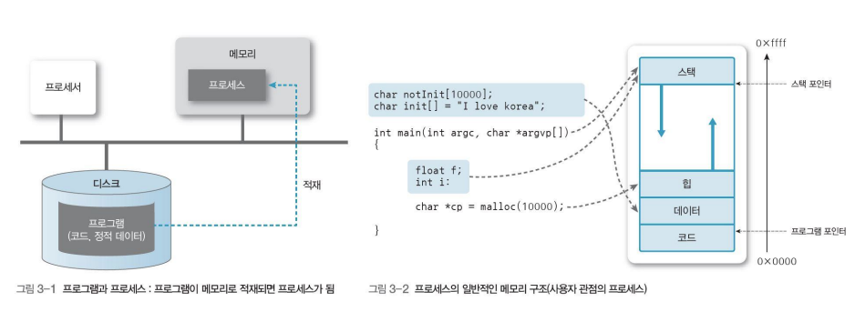

> 아직 디스크에 있는걸 잡, 프로그램
>
> 시스템 등록돼서 메모리를 할당 받았을 때 프로세스

### 프로세스의 정의

* 실행중인 프로그램
  * 커널에 등록되고 커널의 관리하에 있는 작업
  * 각종 자원들을 요청하고 할당 받을 수 있는 개체
  * 프로세스 관리 블록(PCB)을 할당 받은 개체
  * 능동적인 개체(active entity)
    * 실행 중에 각종 자원을 요구, 할당, 반납하며 진행
* Process contorl block(PCB)

### 프로세스의 종류

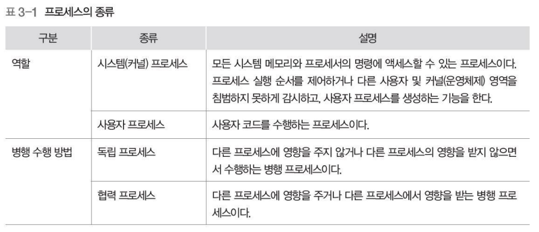

### 자원의 개념

* 커널의 관리 하에 프로세스에게 할당/반납 되는 수동적 개체(passvie entity)

* 자원의 분류
  * H/W resources
    * Processor, memory, disk, monitor, keyboard, Etc.
  * S/W resources
    * Message, signal, files, installed SWs, Etc.

### Process Control Block (PCB)

* OS가 프로세스 관리에 필요한 정보 저장
* 프로세스 생성 시, 생성 됨

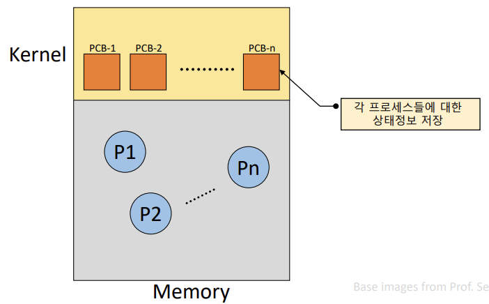

### PCB가 관리하는 정보

* PID : Process Identification Number
  * 프로세스 고유 식별 번호
* 스케줄링 정보
  * 프로세스 우선순위 등과 같은 스케줄링 관련 정보들
* 프로세스 상태
  * 자원 할당, 요청 정보 등
* 메모리 관리 정보
  * Page table, segment table 등
* 입출력 상태 정보
  * 할당 받은 입출력 장치, 파일 등에 대한 정보 등
* 문맥 저장 영역 (context save area)
  * 프로세스의 레지스터 상태를 저장하는 공간 등
* 계정 정보
  * 자원 사용 시간 등을 관리

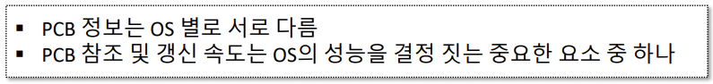

### 프로세스의 상태

* 프로세스 - 자원 간의 상호작용에 의해 결정
* 프로세스 상태 및 특성

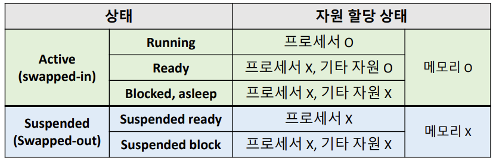

### Process State Transition Diagram

### Created State

* 작업(Job)을 커널에 등록
* PCB 할당 및 프로세스 생성
* 커널
  * 가용 메모리 공간 체크 및 프로세스 상태 전이
    * Ready or Suspended ready

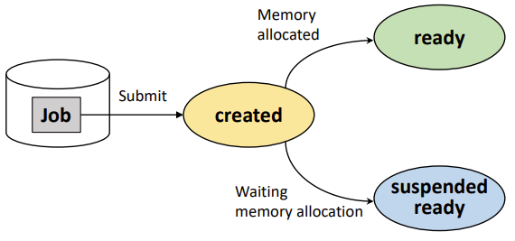

### Ready State

* 프로세서 외에 다른 모든 자원을 할당 받은 상태
  * 프로세서(CPU로 알고 있으면 됨) 할당 대기 상태
  * 즉시 실행 가능 상태
* Dispatch (or Schedule)
  * Ready state => running state

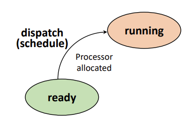

> 프로세서를 할당 받아서 running state 가면 실행 되는거

### Running State

* 프로세서와 필요한 자원을 모두 할당 받은 상태
* Preemption
  * Running state => ready states
  * 프로세서 스케줄링 (e.g, time-out, priority chagnes)

> 프로세서 뺏길 때
>
> 타임 슬롯 끝날 때 등등

* Block/sleep
  * Running state => asleep state
  * I/O 등 자원 할당 요청

> IO 기다리고 있는 상태

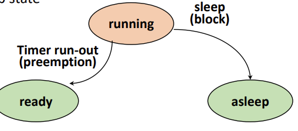

### Blocked/ Asleep State

* 프로세서 외에 다른 자원을 기다리는 상태
  * 자원 할당은 System call에 의해 이루어짐
* Wake-up
  * Asleep state => ready state

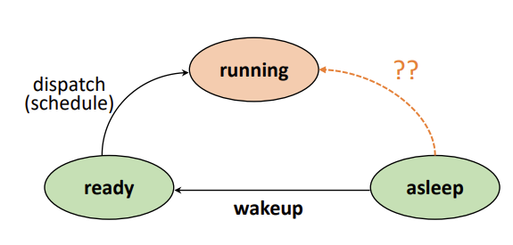

### Suspended State

* 메모리를 할당 받지 못한(빼앗긴) 상태
  * Memory image를 swap device에 보관
    * Swap device: 프로그램 정보 저장을 위한 특별한 파일 시스템
  * 커널 또는 사용자에 의해 발생
* Swap-out(suspended), Swap-in(resume)

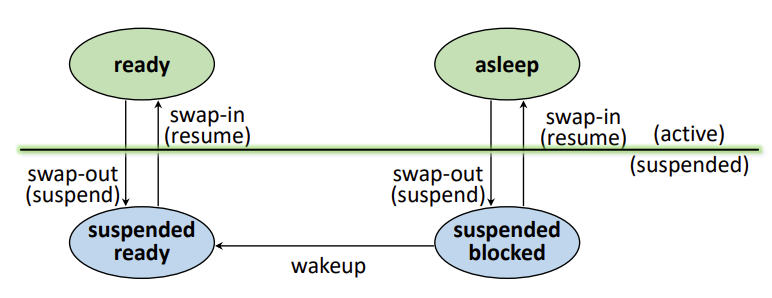

> 자기 하던 일 적어 놨는데 다른 애가 써서 지워짐
>
> 다시 할당 받아서 일 하려 했는데 내가 어디까지 했는지 모름
>
> => 그래서 일 진행 상태 swap device(하드디스크 같은 거)에 보관 (swap-out)
>
> 다시 복구하는 것 (swap-in) 

### Terminated/Zombie State

* 프로세스 수행이 끝난 상태
* 모든 자원 반납 후,
* 커널 내에 일부 PCB 정보만 남아 있는 상태
  * 이후 프로세스 관리를 위해 정보 수집

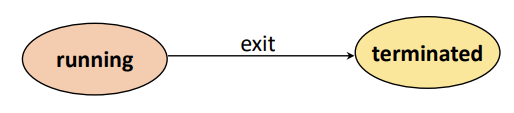

> 소멸 전에 terminated state 들렸다 감
>
> 커널이 PCB 정보 수집하기 위해 잠시 들리는 곳

### 프로세스 관리를 위한 자료구조

* Ready Queue
* I/O Queue
* Device Queue

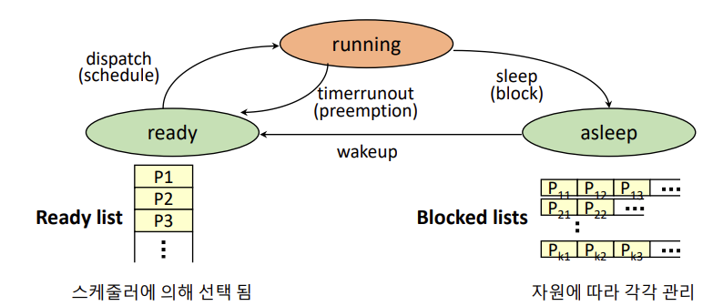

> asleep : 다른 자원 요청 (자원에 따라 따로 관리)

## 인터럽트(Interrupt)

* 예상치 못한, 외부에서 발생한 이벤트
  * Unexpected, external events
* 인터럽트의 종류
  * I/O interrupt (프로세스가 예상치 못한 순간에 마우스 클릭(외부 이벤트)하면 알려주는 거)
  * Clock interrupt
  * Console interrupt : 콘솔 창 입력
  * Program check interrupt : 프로그램에 문제 있을 때
  * Machine check interrupt : 하드웨어 문제
  * Inter-process interrupt :  다른 프로세스가 건드리는거
  * System call interrupt

### 인터럽트 처리 과정

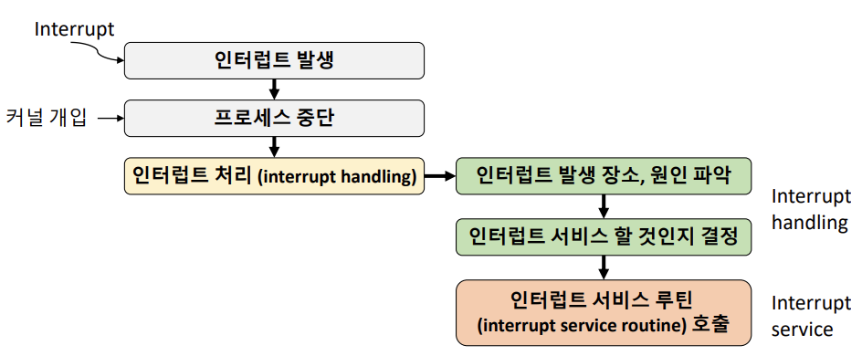

> 1. Interrupt handling
>    1. 어디서 발생했는지, 왜 발생 했는지
> 2. Interrupt service
>    1. 행동 취하기

### 인터럽트 처리 과정

> 커널이 개입해서 중단
>
> Context saving : 책갈피 꽂아 넣는 것처럼 흐름을 PCB에 저장
>
> 커널 개입하면 interrupt handling(어디서, 왜 발생했는지 원인 파악)
>
> 처리하기 위해 어떤 service routine 호출 할건지 결정
>
> Interrupt service(program)을 processor에 넣어줌
>
> 서비스 끝나면 비어있는 processor에 ready 상태에서 기다리던 애 중 하나를 넣어줌
>
> Pi가 다시 들어올 수 도 있지만 Pj가 들어갈 수 도 있음
>
> 책갈피 복구해서 자신의 일 수행

### Context Switching (문맥 교환)

* Context
  * 프로세스와 관련된 정보들의 집합
    * CPU register context => in CPU
    * Code & data, Stack, PCB => in memory
* Context saving
  * 현재 프로세스의 Register context를 저장 하는 작업
* Context restoring
  * Register context를 프로세스로 복구하는 작업
* Context switching ~= Process switching
  * 실행 중인 프로세스의 context를 저장하고, 앞으로 실행 할 프로세스의 context를 복구 하는 일
    * 커널의 개입으로 이루어짐

> context switching : context가 바뀌는거

### Context Switch Overhead

* Context switching에 소요되는 비용
  * OS마다 다름
  * OS의 성능에 큰 영향을 줌

> context switch는 자주 발생함

* 불필요한 Context switching을 줄이는 것이 중요
  * ex, thread 사용 등