# Computer System Overview

## 운영체제(Operating System)이란?

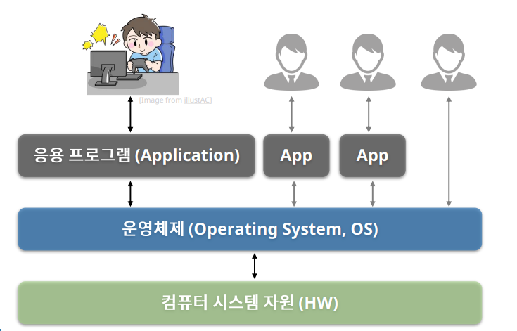

✔ 컴퓨팅 자원(hardware)를 효율적으로 관리해서 사용자 혹은 응용프로그램에게 서비스를 제공하는 소프트웨어

## 컴퓨터 하드웨어(Hardware)

✔ 프로세서(Pocessor): 계산, 연산을 담당

- CPU
- 그래픽 카드(GPU)
- 응용 전용 처리 장치 등

✔ 메모리(Memory): 저장을 담당

- 주 기억장치
- 보조 기억 장치 등

✔ 주변장치

- 키보드 / 마우스
- 모니터, 프린터
- 네트워크 모뎀 등

## 프로세서(Processor)

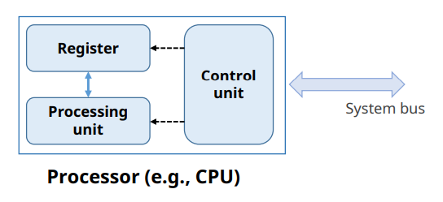

✔ 연산수행  
✔ 컴퓨터의 모든 장치의 동작 제어

### 레지스터 (Register)

✔ **프로세서 내부**에 있는 메모리
- 프로세서가 사용할 데이터 저장
- 컴퓨터에서 **가장 빠른** 메모리

✔ 레지스터의 종류

1. 용도에 따른 분류: 전용레지스터, 범용레지스터
2. 사용자가 정보 변경 가능 여부에 따른 분류: 사용자 가시 레지스터, 사용자 불가시 레지스터
3. 저장하는 정보의 종류에 따른 분류: 데이터 레지스터, 주소 레지스터, 상태 레지스터

#### 가시 레지스터 예시

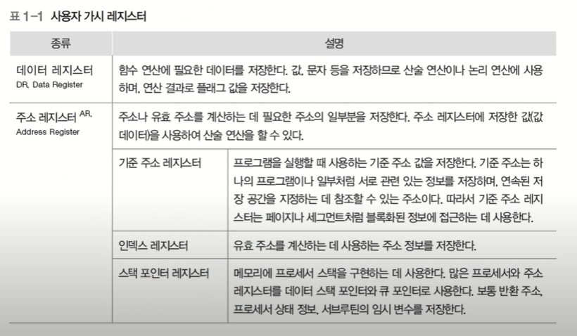

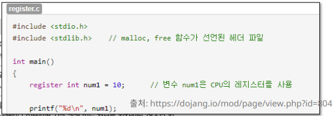

✔ C언어에서 가시적으로 명시 

#### 불가시 레지스터 예시

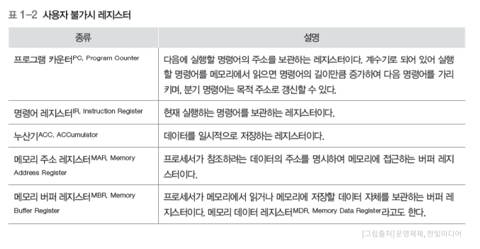

### 운영체제와 프로세서

✔ 운영체제는 프로세서에게 처리할 작업을 할당하고 관리한다 (프로세스(Process) 생성 및 관리)

✔ 운영체제는 프로그램의 프로세서 사용을 제어한다 (사용 시간 등 조율)

## 메모리(Memory)

✔ 데이터를 저장하는 장치 (기억장치)
- 프로그램(os, 사용자 sw 등), 사용자 데이터

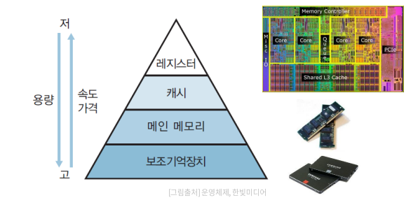

✔ 메모리의 종류가 계층적 구조를 이루고 있다

### 주 기억 장치 (Main memory)

✔ 프로세서가 수행할 프로그램과 데이터 저장  
✔ DRAM을 주로 사용 (용량이 크고, 가격이 저렴하다)

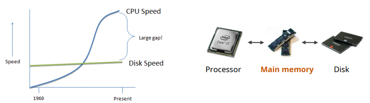

✔ **디스크 입출력 병목 현상(I/O bottleneck) 해소**

### 캐시(Cache)

✔ 프로세서 내부에 있는 메모리(L1, L2 캐시 등)  
✔ 속도가 빠르고 가격이 비싸다

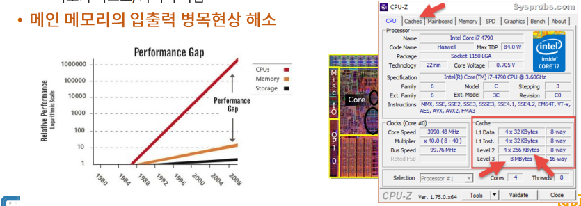

✔ **메인 메모리의 입출력 병목 현상 해소**

#### 캐시의 동작

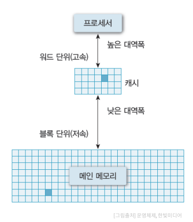

✔ 일반적으로 하드웨어적으로 관리 된다.

✔ **캐시 히트(Cache hit)** 
- 필요한 데이터 블록이 캐시 존재

✔ **캐시 미스(Cache miss)**
- 필요한 데이터 블록이 없는 경우

캐시의 용량이 매우 작은데 어떻게 효율적으로 관리 할까...?

#### 지역성 (Locality)

1. 공간적 지역성 (Spatial locality)
- 참조한 주소와 인접한 주소를 참조하는 특성 (ex: 순차적 프로그램 수행)

2. 시간적 지역성 (Temporal locality)
- 한 번 참조한 주소를 곧 다시 참조하는 특성 (ex: for문 등의 순환문)

✔ **지역성은 캐시 적중률(cache hit ration)와 밀접!**

### 보조 기억 장치 (Auxiliary memory / Secondary memory / Storage)

✔ 프로그램과 데이터를 저장  
✔ 프로세서가 직접 접근할 수 없음 (주변 장치)

- 주 기억 장치를 거쳐서 접근
- 프로그램/데이터 > 주기억장치인 경우는 가상 메모리 사용!

✔ 용량이 크고 가격이 저렵하다. 

### 메모리와 운영체제

✔ 메모리 할당 및 관리

- 프로그램의 요청에 따른 메모리 할당 및 회수
- 할당된 메모리 관리

✔ 가상 메모리 관리

- 가상 메모리 생성 및 관리
- 논리 주소 -> 물리 주소 변환

## 시스템 버스 (System Bus)

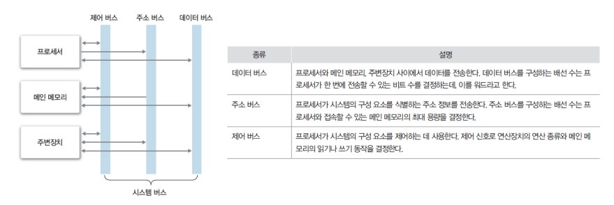

✔ 하드웨어들이 데이터 및 신호를 주고 받는 물리적인 통로

## 주변 장치

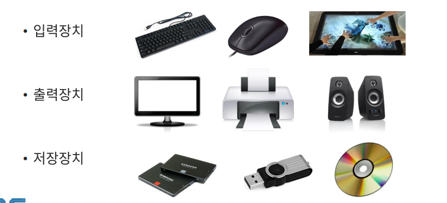

✔ 프로세서와 메모리를 제외한 하드웨어

### 주변장체와 운영체제

✔ 장치 드라이버 관리
- 주변 장치 사용을 위한 인터페이스 제공

✔ 인터럽트 (Interrupt) 처리
- 주변 장치의 요청 처리

✔ 파일 및 디스크 관리
- 파일 생성 및 삭제
- 디스크 공간 관리