# OS Overview 

## 운영체제의 역할

1. **User Interface (편리성)**
- CUI (Character User Interface)
- GUI (Graphical User Interface)
- EUCI (End-User Comfortable Interface)

2. **Resource Management (효율성)**
- HW resource
- SW resource

3. **Process and Thread Management**

4. **System Management**

## 컴퓨터 시스템의 구성

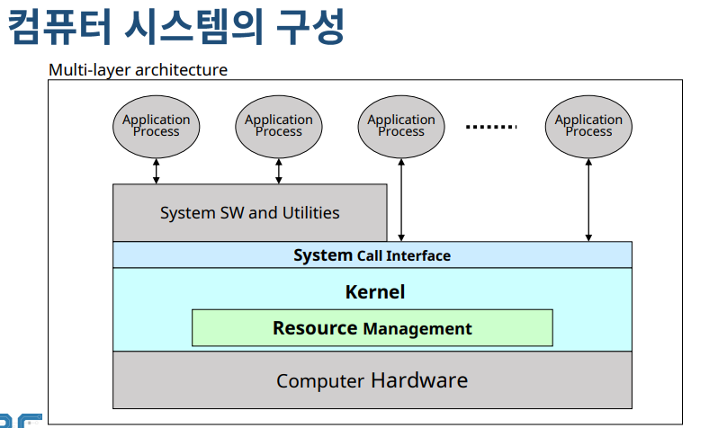

✔ 운영체제: System Call Interface + Kernel 

✔ System Call Interface: 사용자가 직접 Kernel을 제어하는 것이 아니라 필요한 기능만 요청하도록 하는 인터페이스  

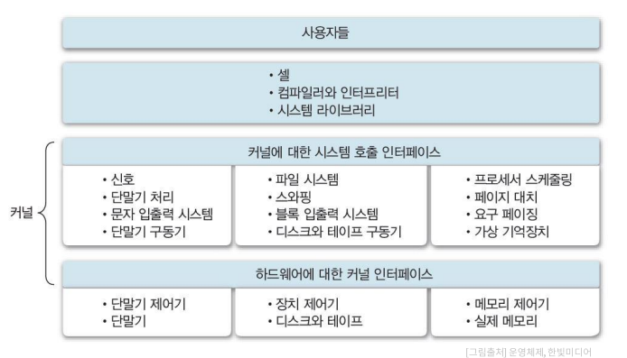

## 운영체제의 구분

1. 동시 사용자 수
- Single User System
- Multi User System

2. 동시 실행 프로세스 수
- Single Tasking System
- Multi Tasking System

3. 작업 수행 방식 (사용자가 느끼는 사용 환경)
- Batch Processing System
- Time-Sharing System
- Distributed Processing System
- Real-Time System

### 1. 동시 사용자 수

#### 단일 사용자 (Single user system)

✔ 한 명의 사용자만 시스템 사용 가능
- 한 명의 사용자가 모든 시스템 자원 독점
- 자원 관리 및 시스템 보호 방식이 간단

✔ 개인용 장비(PC, Mobile) 등에 사용

#### 다중 사용자 (Multi user system)

✔ 동시에 여러 사용자들이 시스템 사용
- 각종 시스템 자원(파일 등)에 대한 소유 권한 관리 필요
- 기본적으로 Multi Tasking 기능 필요
- OS의 기능 및 구조가 복잡

✔ 서버, 클러스터(cluster) 장비 등에 사용
- Unix, Linux, Windows Server 등

### 2. 동시 실행 프로세스 수

#### 단일작업 (single tasking system)

✔ 시스템에 하나의 작업(프로세스)만 존재
- 하나의 프로그램 실행을 마친 뒤 다른 프로그램 실행

✔ 운영 체제 구조가 간단  
✔ ex) MS - DOS

#### 다중 작업 (multi tasking system)

✔ 동시에 여러 작업(프로세스)의 수행 가능
- 작업들 사이의 동시 수행, 동기화 등을 관리해야함

✔ 운영체제의 기능 및 구조가 복잡  
✔ ex) Unix/Linux, Windows 등

### 3. 작업 수행 방식

#### Batch Processing System (일괄 처리 시스템)

#### Time-Sharing System (시분할 시스템)

#### Distributed Processing System (분산처리 시스템)

#### Real-Time System (실시간 시스템)

### 작업 수행 방식의 역사

#### 순차 처리 (No OS ~ 1940s)

✔ **운영체제 개념 존재하지 않음**
- 사용자가 기계어로 직접 프로그램 작성
- 컴퓨터에 필요한 모든 작업 프로그램에 포함

✔ 실행하는 작업 별 순차 처리
- **각각의 작업에 대한 준비 시간 소요**

#### Batch systems (1950s ~ 1960s)

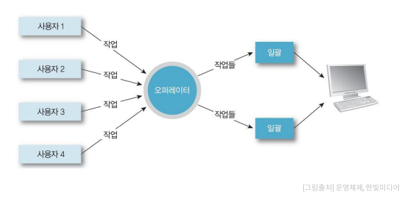

✔ 모든 시스템을 **중앙(전자계산소 등)에서 관리 및 운영**  
✔ 사용자의 **요청 작업(천공카드 등)을 일정 시간 모아두었다가 한번에 처리**

✔ **시스템 지향적 (System-oriented)**

✔ **장점**
- 많은 사용자가 시스템 자원 공유
- 처리 효율(throughput) 향상

✔ **단점**
- 생산성(productivity) 저하: 같은 유형의 작업이 모이기를 기다려야 한다
- 긴 응답 시간 (turnaround time): 약 6시간(작업 제출에서 결과 출력까지)

#### Time Sharing System (1960 ~ 1970)

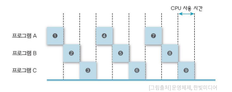

✔ 여러 사용자가 자원들 동시에 사용
- OS가 파일 시스템 및 가상 메모리 관리

✔ 사용자 지향적 (User-Oriented)
- 대화형 (conversational, interactive) 시스템
- 단말기 (CRT terminal) 사용

✔ **장점**
- 응담시간 (response time) 단축 (약 5초)
- 생산성 향상

✔ **단점**
- 통신 비용 증가: 통신선 비용, 보안 문제 등
- 개인 사용자 체감 속도 저하: 동시 사용자 수 증가로 인한 시스템 부하

#### Personal Computing

✔ **개인이 시스템 전체 독점**  
✔ **CPU 활용률(utilization)이 고려 대상이 아니다**  
✔ **OS가 상대적으로 단순** (하지만 다양한 사용자 기능 지원)

✔ 장점
- 빠른 응답시간

✔ 단점
- 성능(performance)이 낮음  

#### Parallel Processing System

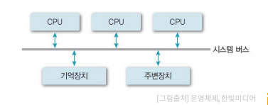

✔ **단일 시스템 내에서 둘 이상의 프로세서 사용**  
✔ **메모리 등의 자원 공유 (Tightly-coupled system)**  
✔ 사용 목적
- 성능 향상
- 신뢰성 향상 (하나가 고장해도 정상 동작 가능)

✔ 프로세서 간 관계 및 역할 관리 필요

#### Distributed Processing Systems

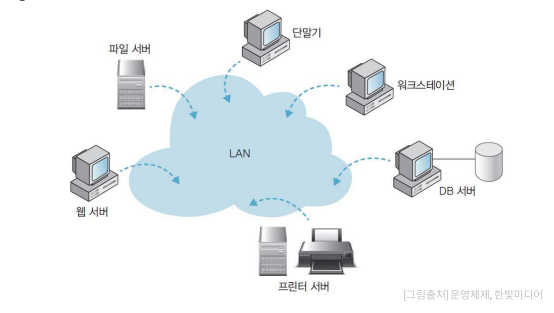

✔ **네트워크를 기반으로 구축된 병쳘처리 시스템** (Loosely-coupled system)
- 물리적인 분산, 통신망 이용 상호 연결
- 각각 운영체제를 탑재한 다수의 범용 시스템으로 구성
- 각 구성요소 들 간의 독립성 유지, 공동 작업 가능
- 사용자는 **분산 운영 체제**를 통해 하나의 프로그램, 자원처럼 사용 가능

✔ ex: Cluster system, client-server system, P2P system

✔ 장점
- 자원 공유를 통한 높은 성능
- 고신뢰성, 높은 확장성

✔ 단점
- 구축 및 관리가 어렵다

#### Real-time Systems

✔ 작업 처리에 **제한 시간(deadline)을** 갖는 시스템
- 제한 시간 내에 서비를 제공하는 것이 자원 활용 효율보다 중요!

✔ 작업(task)의 종류
- **Hard real-time task** (발전소 제어, 무기 제어 등)
- **soft real-time task** (동영상 재생 등)
- **Non real-time task**

## 운영체제의 구조

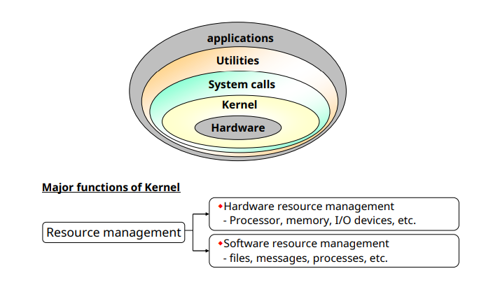

✔ **커널(Kernel)**
- **OS의 핵심 부분 (메모리 상주)**: 시스템 관리 등 가장 빈번하게 사용되는 기능들을 담당한다.  

✔ **유틸리티 (Utility)**
- 비상주 프로그램
- UI 등 서비스 프로그램

### 단일 구조

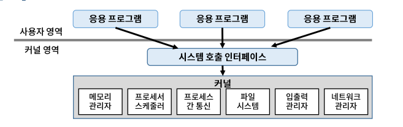

✔ 장점
- **커널 내 모듈 간 직접 통신**: 효율적 자원 관리 및 사용

✔ 단점
- **커널의 거대화**
- 오류 및 버그, 추가 기능 구현 등 유지보수가 어려움
- 동일 메모리에 모든 기능이 있어, 한 모듈의 문제가 전체 시스템에 영향 (ex: 악성 코드)

### 계층 구조

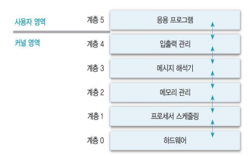

✔ 장점
- 모듈화: 계층 간 검증 및 수정 용의
- 설계 및 구현의 단순화

✔ 단점
- 단일 구조 대비 성능 저하: 원하는 기능 수행을 위해 여러 계층을 거쳐야 한다.

### 마이크로 커널 구조

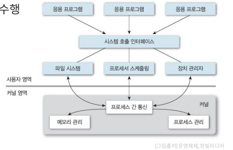

✔ **커널의 크기 최소화**
- 필수 기능만 포함
- 기나 기능은 사용자 영역에서 수행

## 운영체제의 기능

✔ 프로세스 **관리**  
✔ 프로세서 **관리**  
✔ 메모리 **관리**  
✔ 파일 **관리**  
✔ 입출력 **관리**  
✔ 보조 기억 장치 및 기타 주변 장치 **관리** 등  

### Process Management

#### 프로세스 (Process)

✔ 커널에 등록된 실행 단위 (실행 중인 프로그램)  
✔ 사용자 요청/프로그램의 수행 주체(entity) 

#### OS의 프로세스 관리 기능

✔ 생성/삭제, 상태 관리  
✔ 자원 할당  
✔ 프로세스 간 통신 및 동기화  
✔ 교착상태(deadlock) 해결  

#### 프로세스 정보 관리

✔ PCB (Process Control Block)

### Processor Management

#### 중앙 처리 장치 (CPU)

✔ 프로그램을 실행하는 핵심 자원

#### 프로세스 스케줄링

✔ 시스템 내의 프로세스 처리 순서 결정

#### 프로세서 할당 관리

✔ 프로세스들에 대한 프로세서 할당
- 한 번에 하나의 프로세스만 사용 가능

### Memory Management

#### 주기억장치

✔ 작업을 위한 프로그램 및 데이터를 올려 놓는 공간

#### Multi-user, Multi-tasking 시스템

✔ 프로세스에 대한 메모리 할당 및 회수  
✔ 메모리 여유 공간 관리  
✔ 각 프로세스의 할당 메모리 영역 접근 보호  

#### 메모리 할당 방법 (scheme)

✔ 전체 적재
- 장점: 구현이 간단
- 단점: 제한적 공간

✔ 일부 적재 (virtual memory concept)
- 프로그램 및 데이터의 일부만 적재
- 장점: 메모리 효율적 활용
- 단점: 보조 기억 장치 접근 필요

### File Management

✔ **파일**: 논리적 데이터 저장 단위  
✔ 사용자 및 시스템의 파일 관리  
✔ 디렉토리 구조 지원  
✔ 파일 관리 기능  

### I/O Management

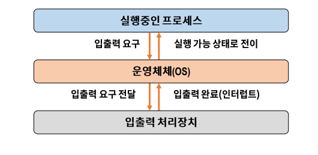

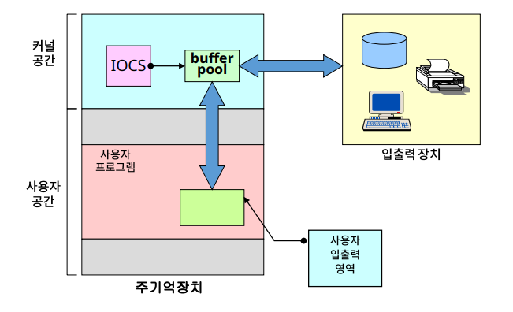

✔ 반드시 OS를 거쳐야 한다

### Others

✔ Disk  
✔ Networking  
✔ Security and Protection System  
✔ Command and Interpreter System  
✔ System Call Interface  