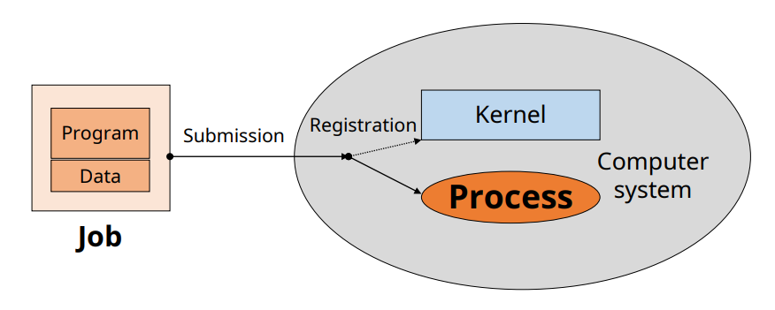
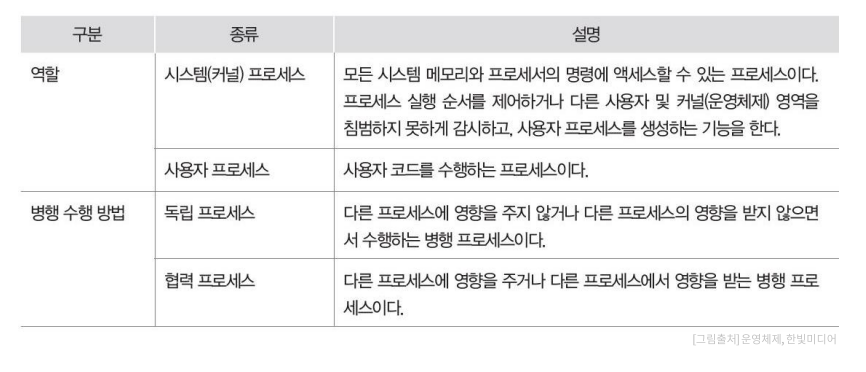
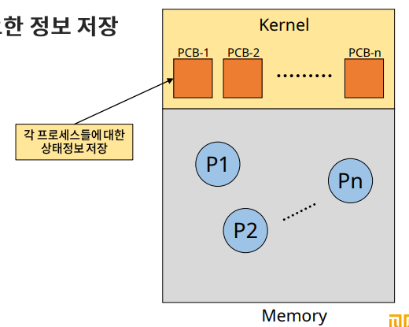
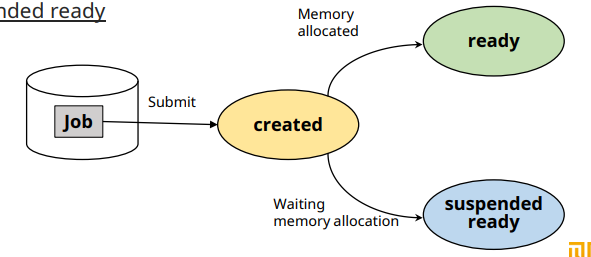
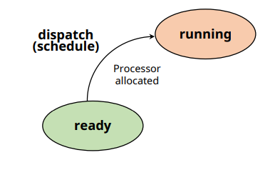
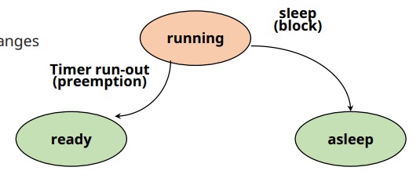
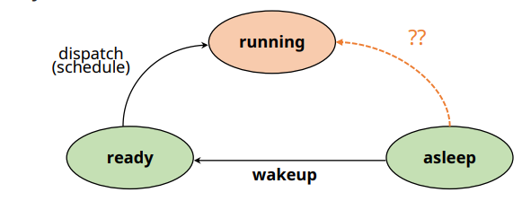
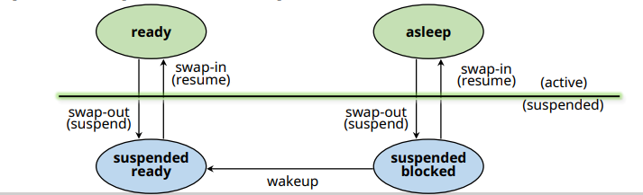
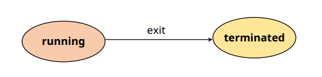
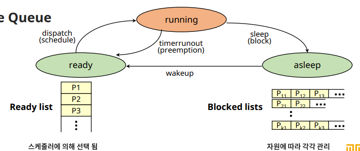

# Process Management

## Job vs Process

✔ 작업(job) / 프로그램 (Program)
- 실행 할 프로그램 + 데이터
- 컴퓨터 시스템에 실행 요청 전의 상태

✔ **프로세스(Process)**
- 실행을 위해 **시스템 커널**에 등록된 작업
- 시스템 성능 향상을 위해 커털에 의해 관리됨

## 프로세스의 정의

✔ **실행중인 프로그램**
- 커널에 등록되고 커널의 관리 하에 있는 작업
- 각종 자원들을 요청하고 할당 받을 수 있는 개체
- 프로세스 관리 블록 (PCB)을 할당 받은 개체
- 능동적인 개체(active entity): 실행 중에 각종 자원을 요구, 할당, 반납하며 진행

✔ **Process Control Block(PCB)**
- 커널 공간 (kernel space) 내에 존재
- 각 프로세스들에 대한 정보 관리 

## 프로세스의 종류

## 자원 (Resource)

✔ **커널의 관리 하에 프로세스에게 할당/반납되는 수동적 개체(passive entity)**  
✔ 자원의 분류
- **H/W resources**: Processor, memory, disk, monitor...
- **S/W resources**: Message, signal, files, installed SWs ...

## Process Control Block (PCB)

✔ OS가 프로세스 관리에 필요한 정보 저장  
✔ 프로세스 생성 시 생성

### PCB가 관리하는 정보

✔ **PID: Process Identification Number**
- 프로세스 고유 식별 번호

✔ **스케줄링 정보**
- 프로세스 우선순위 등과 같은 스케줄링 관련 정보

✔ **프로세스 상태**
- 자원 할당, 요청 정보 등

✔ **메모리 관리 정보**
- Page table, segment table 등

✔ **입출력 상태 정보**
- 할당 받은 입출력 장치, 파일 등에 대한 정보 등

✔ **문맥 저장 영역(context save area)**
- 프로세스의 레지스터 상태를 저장하는 공간 등

✔ **계정 정보**
- 자원 사용 시간 등을 관리

## 프로세스의 상태 (Process States)

✔ 프로세스 - 자원 간의 상호 작용에 의해 결정  
✔ 프로세스 상태 및 특성

### Process State Transition Diagram

### Created State

✔ **작업(job)를 커널에 등록**  
✔ PCB 할당 및 프로세스 셍성  
✔ 커널: **가용 메모리 공간** 체크 및 프로세스 상태 전이
- Ready or Suspended ready

### Ready State

✔ **프로세서 외에 다른 모든 자원을 할당 받은 상태**
- 프로세서 할당 대기 상태
- 즉시 실행 가능 상태

✔ **Dispatch** (or Shedule)
- Ready -> running

### Running State

✔ **프로세서와 필요한 자원을 모두 할당 받은 상태**  

✔ **Preemption**
- running -> ready
- 프로세서 스케줄링

✔ **Block/sleep**
- running -> asleep
- I/O 등 **자원 할당 요청**

### Blocked/Asleep State

✔ **프로세서 외에 다른 자원을 기다리는 상태**
- 자원 할당은 System Call에 의해 이루어진다

✔ **Wake-up**
- Alseep -> Ready

### Suspended State

✔ **메모리를 할당 받지 못한(빼앗긴) 상태**

- Memory image(메모리의 상태)를 swap device에 보관
- *Swap Device: 프로그램 정보 저장을 위해 특별한 파일 시스템*
- 커널 또는 사용자에 의해 발생

✔ **Swap-out(suspended), Swap-in(resume)**

### Terminated/Zombie State

✔ **프로세스 수행이 끝난 상태**  
✔ 모든 자원 반납 후, **커널 내에 일부 PCB 정보만 남아 있는 상태**
- 이후 프로세스 관리를 위해 정보 수집

## 프로세스 관리를 위한 자료 구조

✔ Ready Queue  
✔ I/O Queue  
✔ Device Queue