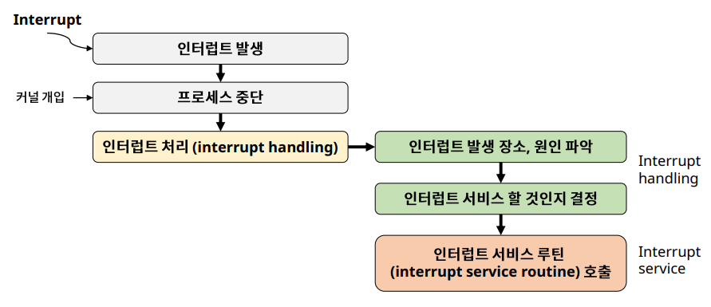
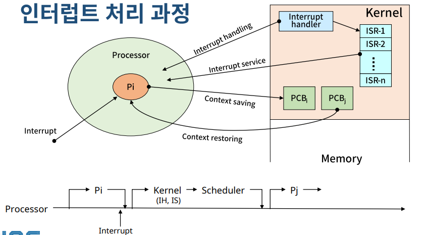

# Process Management: Interrupt, Context Switching

## 인터럽트 (Interrupt)

✔ **예상치 못한, 외부에서 발생한 이벤트**
- Unexpected, external events

✔ 인터럽트의 종류
- I/O interrupt (키보드, 마우스 입력)
- Clock interrupt (CPU의 클락)
- Console interrupt 
- Program Check interrupt
- Machine Check interrupt
- Inter-process interrupt
- System Call interrupt

### 인터럽트 처리 과정

✔ 인터럽트가 발생했을 때 일단 **커널이 개입**해서 **프로세스를 중단**하고 **인터럽트를 처리**한다!  
✔ 인터럽트 처리(interrupt handling): 인터럽트 분석해서 실행할지 결정!  

✔ **Context Saving**: 진행상황 PCB에 저장  
✔ Interrupt handling 이후 Interrupt service  
✔ **Context Restroring**: interrupt 이후 반드시 직전 프로세스가 다시 들어오는 게 아니라 **ready 상태에 있던 프로세스가** processor에 들어와서 작업을 진행한다

## Context Switching (문맥 교환)

✔ **Context**: 프로세스와 관련된 정보들의 집합 
- CPU register context -> in **CPU**
- Code & data, Stack, PCB -> in **memory**

✔ **Context saving**: 현재 프로세스의 Register context를 **memory에 저장**하는 작업

✔ **Context restoring**: Register context를 프로세스로 복구하는 작업

✔ **Context Switching (Process Switching)**: 실행 중인 프로세스의 context를 저장하고, 앞으로 실행 할 프로세스의 context를 복구하는 일
- 커널의 개입으로 이루어진다  

### Context Switch Overhead

✔ Context Switching에 소요되는 비용
- OS마다 다르다
- OS의 성능에 큰 영향을 준다

✔ 불필요한 Context Switching을 줄이는 것이 중요
- thread 사용 등