# 스레드(Thread)

## 프로세스(Process)와 스레드(Trhead)

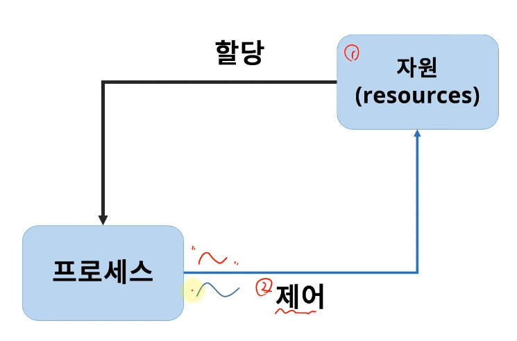

>  제어 부분이 쓰레드, 여러개일 수 있음

## 스레드(Thread)의 개념

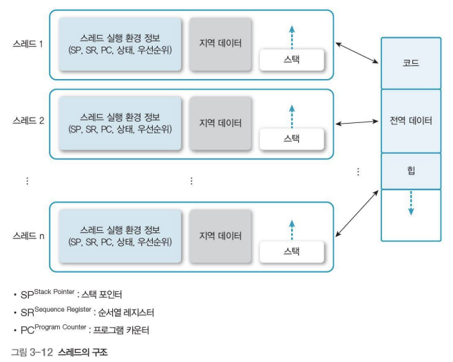

> 프로세스는 제어와 리소스로 나뉨
>
> 제어부분이 Thread, 여러개 존재 가능
>
> 프로세스가 할당 받은 자원은 공유함, 이를 제어하는건 여러개 일 수 있는 거임

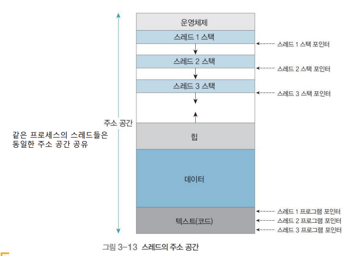

> 각 스레드마다 스택 영역을 가짐
>
> 코드에서 프로그램 카운터로 흐름 제어

* Light Weight Process (LWP)

> 자원은 공유하고 제어부분만 가지고 있으므로

* 프로세서(e.g, CPU) 활용의 기본 단위

> CPU를 활용하는 기본단위가 스레드

* 구성요소
  * Thread ID
  * Register set (PC등)
  * Stack(i.e. local data)
* 제어 요소 외 코드, 데이터 및 자원들은 프로세스의 다른 스레드 들과 공유
* 전통적 프로세스 = 단일 스레드 프로세스

## Single-Thread vs Multi-threads

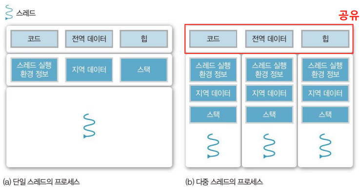

## 스레드의 장점

* 사용자 응답성 (Responsiveness)
  * 일부 스레드의 처리가 자연되어도, 다른 스레드는 작업 계속 처리 가능
* 자원 공유 (Resource sharing)
  * 자원을 고유해서 효율성 증가(커널의 개입을 피할 수 있음)
    * 예)동일 address space에서 스레드 여러 개

> 프로세스는 context switch 발생 => 비싼 연산
>
> 스레드면 동시에 사용할 수 있어서 context switch 발생 X

* 경제성 (Economy)
  * 프로세스의 생성, context switch에 비해 효율적
* 멀티 프로세서(multi-processor) 활용
  * 병렬처리를 통해 성능 향상

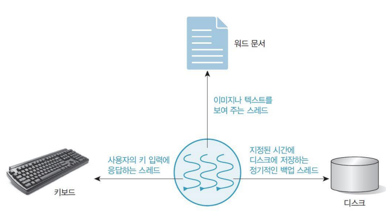

> IO 발생하면 run => block으로,
>
> 스레드 하나로만 하면 하나의 작업을 하는 중에 다른 애들을 할 수 없음

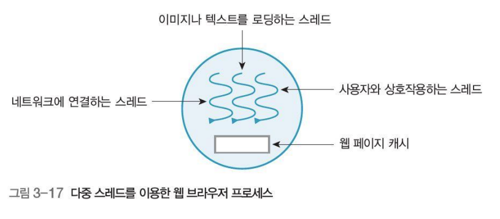

## 스레드(Thread)의 구현

### 사용자 수준 스레드(User Thread)

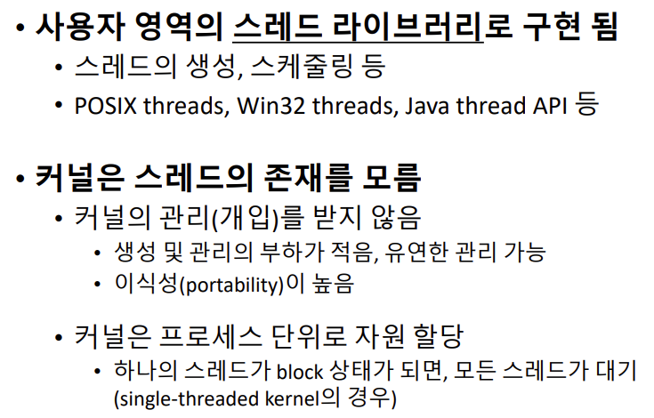

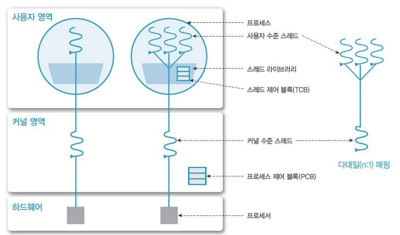

### 커널 수준 스레드 (Kernel Threads)

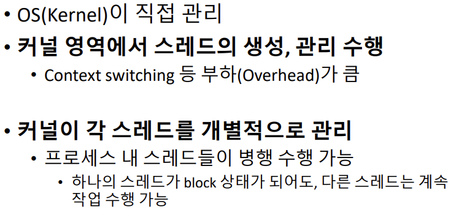

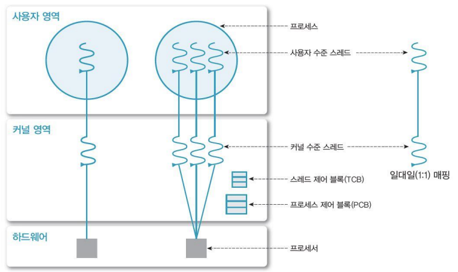

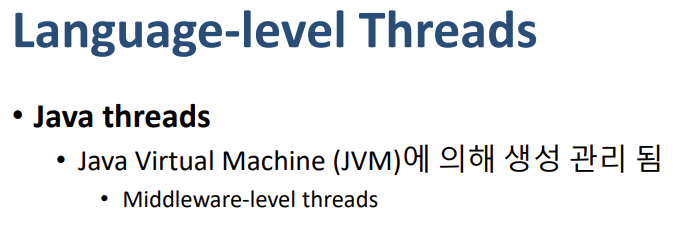

### Multi-Threading Model

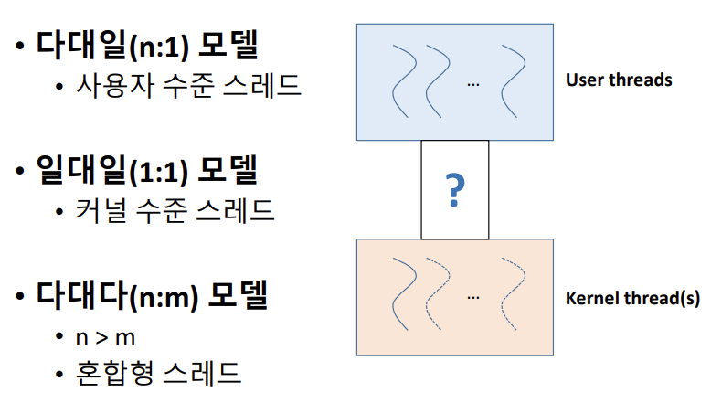

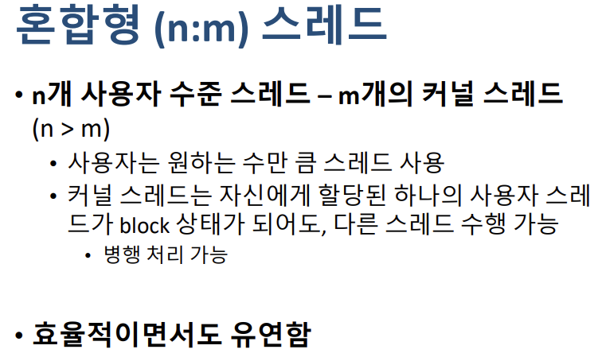

> 사용자, 커널 중심 스레드 다 취함

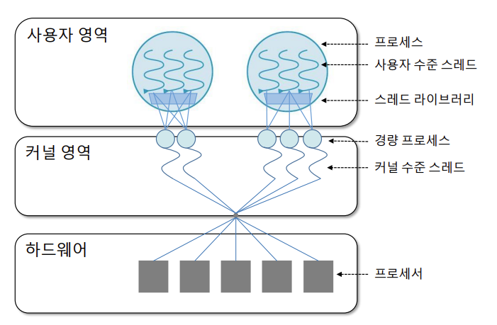

> 실제로 OS들이 사용하는 모델

