# 프로세스 스케줄링

## 다중프로그래밍 (Multi-programming)

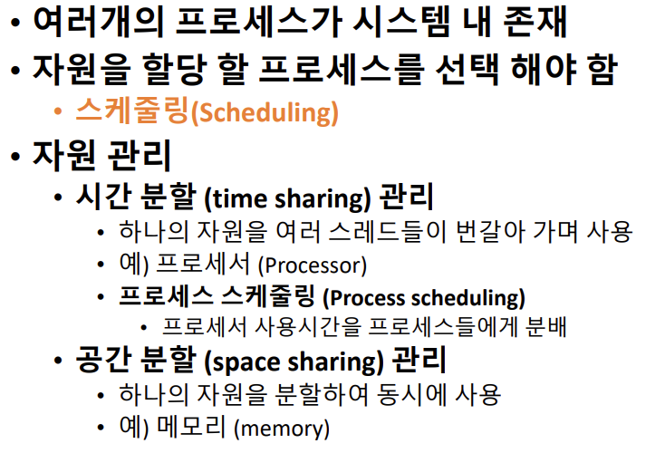

## 스케줄링 (Scheduling)의 목적

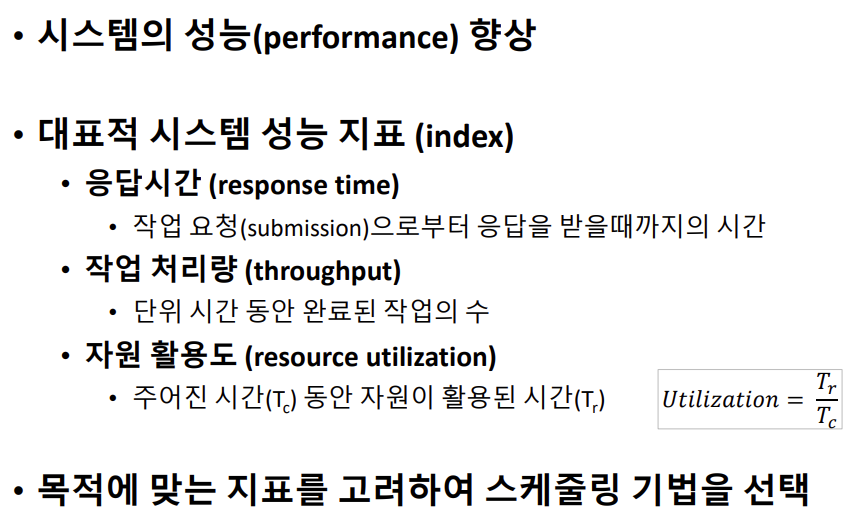

> 대화형 시스템, 리얼 타임 : 응답시간
>
> batch system : 작업 처리량
>
> 비싼 장비 쓸 때 : 자원 활용도

## 시스템 성능 지표들

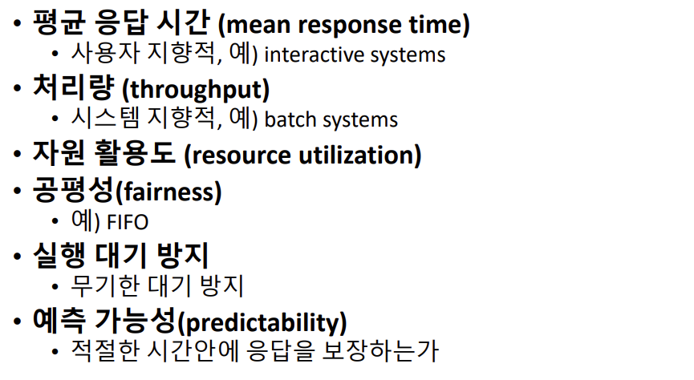

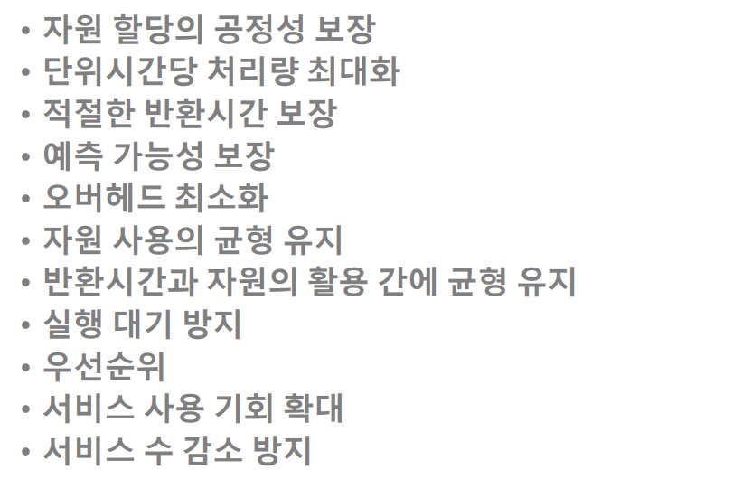

## 대기시간, 응답시간, 반환시간

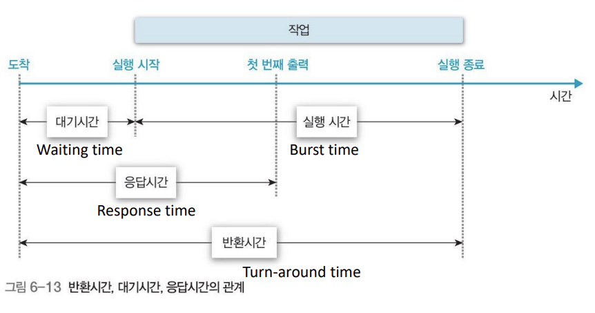

## 스케줄링 기준(Criteria)

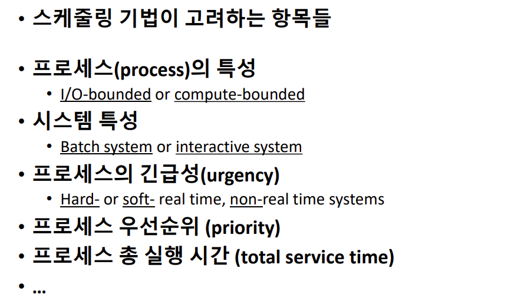

> 시스템 특성(목적이 다른니깐)
>
> 긴급성 ( 누가 더 급한지)
>
> 우선순위 ( 누가 우선순위 갖느냐)

## CPU burst vs I/O burst

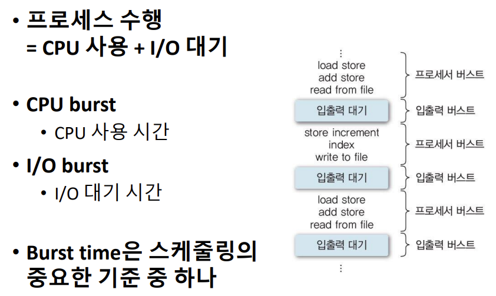

> CPU, I/O 중 뭘 떠 많이 쓰는지에 따라

## 스케줄링의 단계(Level)

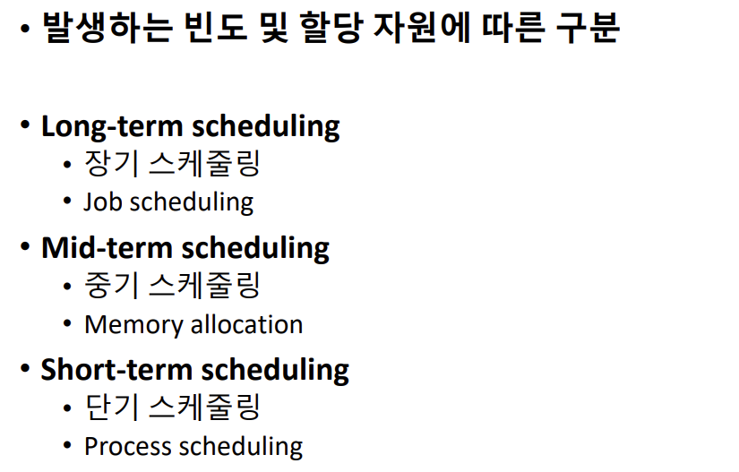

> long : 가끔
>
> Mid : 종종
>
> short: 자주

## Long-term Scheduling

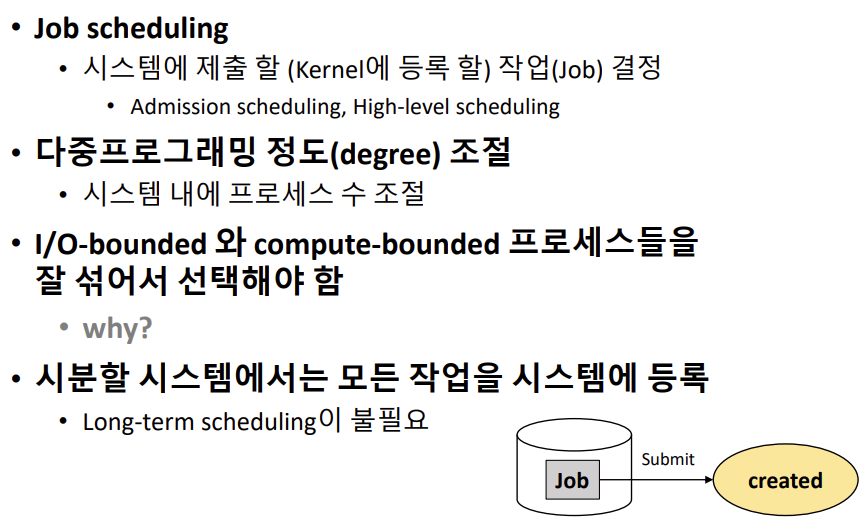

> 하나만 열심히 만들면 나머지가 놀게됨 => 비효율적
>
> cpu와 I/O device를 잘 섞어야 함 => 효율 up

## Mid-term Scheduling

> 누가한테 메모리를 줄 지
>
> job scheduling보다 자주 일어남

## Short-term Scheduling

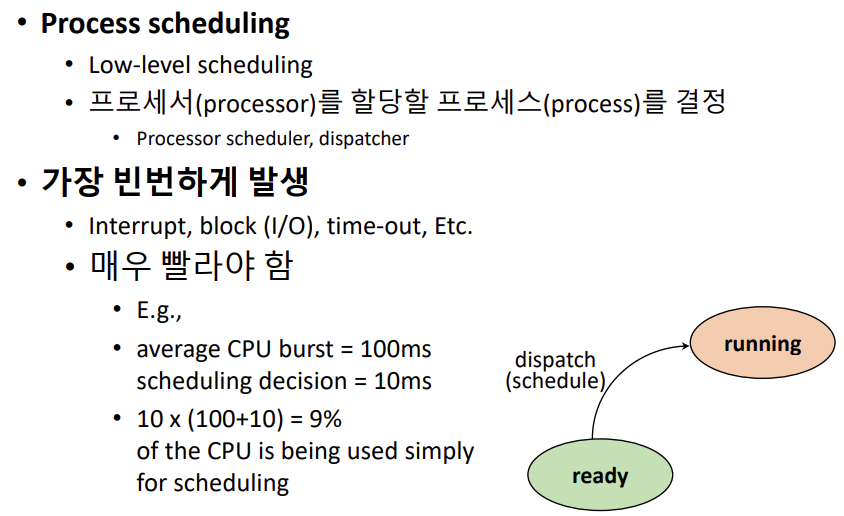

> CPU할당 해주는게 가장 자주 일어남

## 스케줄링의 단계(Level)

## 스케줄링 정책 (Policy)

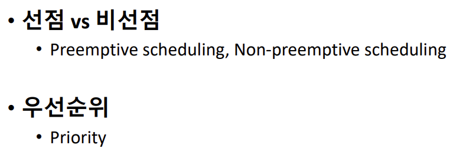

> 스케줄링을 어떤 방법으로 할 것인가

Non-Preemptive

> 선점 : 누가 와서 내껄 뺏을 수 있다.
>
> 자원을 스스로 반납할 때 까지는 사용

Preemptive

> 응답성 높아짐, 급한일 들어오면 먼저 할 수 있음
>
> system overhead 발생할 수 있음

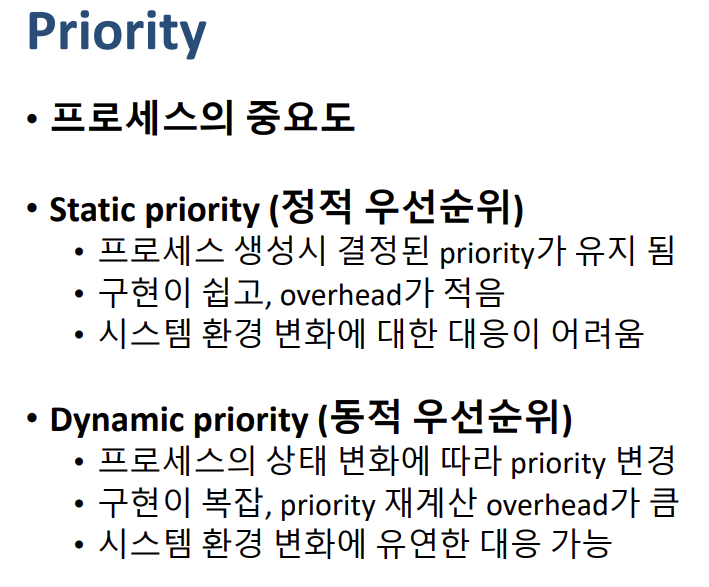

static

> 한번 결정되면 유지

dynamic

> 변할 때

# 기본 스케줄링 알고리즘

> 선착순 알고리즘
>
> 먼저 오는애한테 먼저 할당
>
> 누가 ready queue에 먼저 도착 했는가
>
> why? scheduling over head 없음 (cpu가 계속 일할 수 있음)
>
> 일괄에 적합, 대화형에 부적합

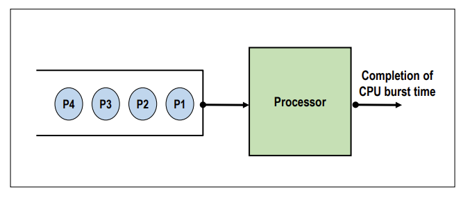

>  프로세스들이 들어오는대로

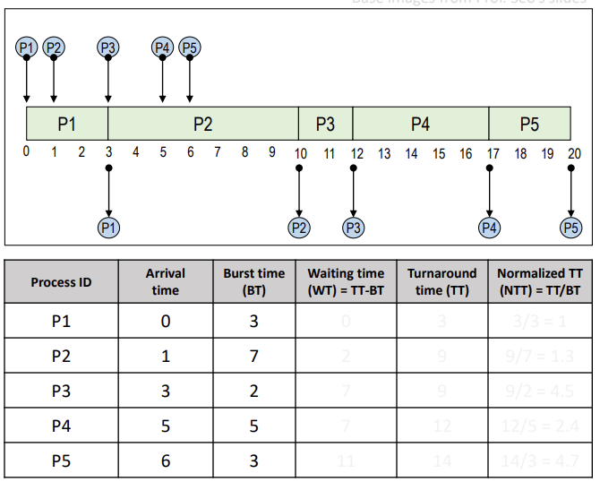

> 체감 커짐
>
> 2번 하나 때문에 나머지 애들이 엄청 오래 기다림(Normalized TT)

> 돌아가면서 쓰자
>
> 먼저 도착한애 먼저 일을 주는 건 같음
>
> 자원 사용 제한 시간 주는게 다름
>
> context switch 비싼건데 자주 써야됨

> 제한 시간 무한대로 트면 FCFS
>
> 매우 짧으면 동시에 쓰는거 같은 느낌(단점일수도, context swtich 증가)

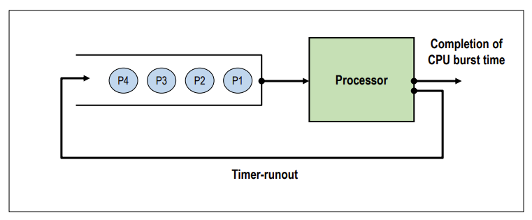

> 제한시간 끝나면 맨 뒤에 줄 섬

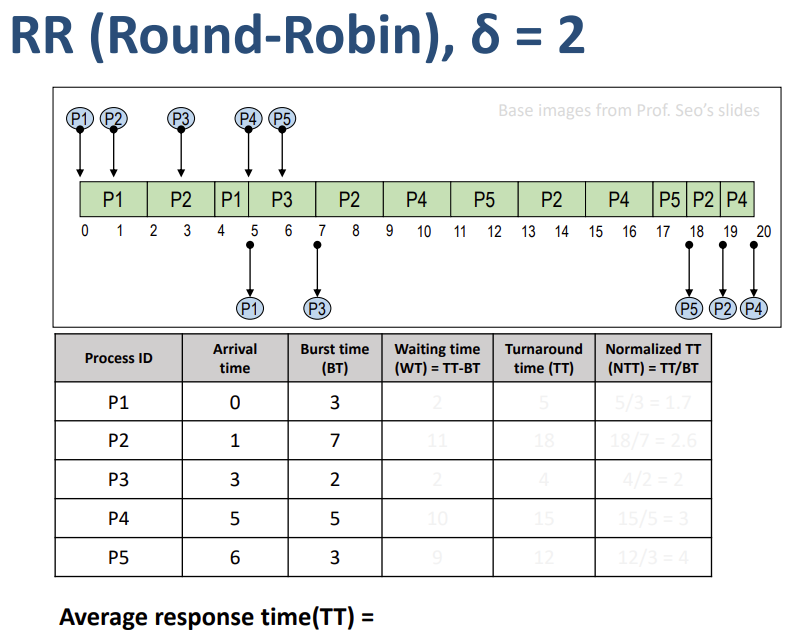

> Normalized TT 균등 해짐
>
> Trunaround time = Response time, 10.8 정도 나옴

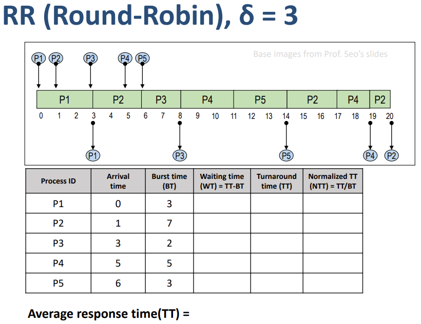

> responsetime(TT) = 9.8 나옴
>
> 앞에 비해 평균 응답시간 줄었음, 그래도 줄었음

> 짧은애를 먼저 빼주자
>
> 휴지 하나 결제하면 되는데 빨리 빼주면 안됨?
>
> 소량 결제 애들은 빨리 빼주자

> 아무래도 부하 적음
>
> 오래 걸리는 애들은 계속 기다릴 수 있음(Starvation)
>
> birth time 알아야됨(알 수 없음), 예측은 가능

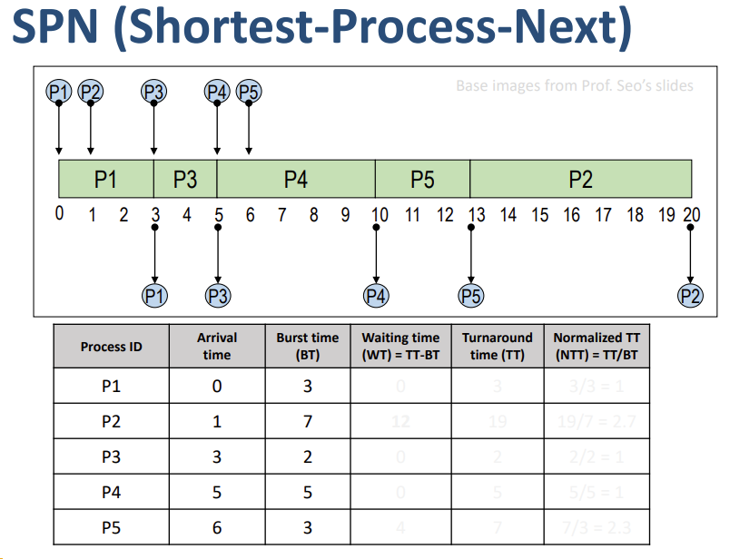

> 2번 입장에서는 불합리함

> 남은 시간이 가장 적은애 먼저 처리
>
> 잔여 시간 계속 계산해야함,, 부하 발생

> 나이 많은 사람 배려, 대기시간 고려
>
> Resopnse ratio: hrrn 스케줄링 기준
>
> = 내가 필요한 시간대비, 내가 얼마나 기다렸는가

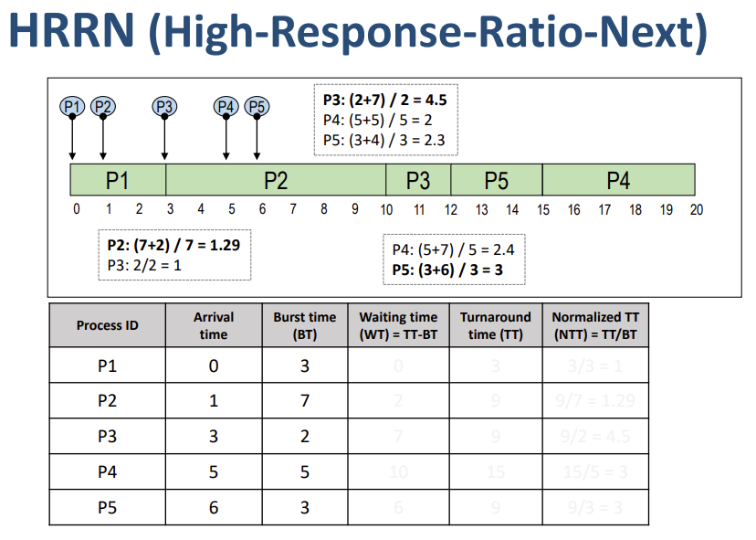

> spn 장점 평균 대기시간 최소화됨

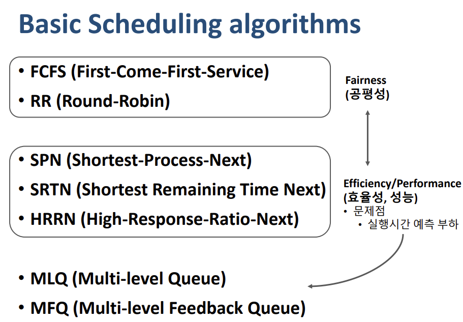

> 공평성 vs 성능(실행시간 예측해야하는 문제)
>
> MLQ, MFQ가 이를 해결 목적
>
> => 예측 없이 비슷한 성능 내기

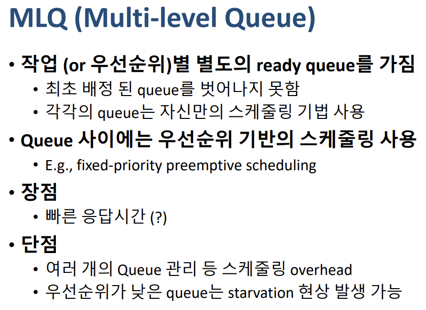

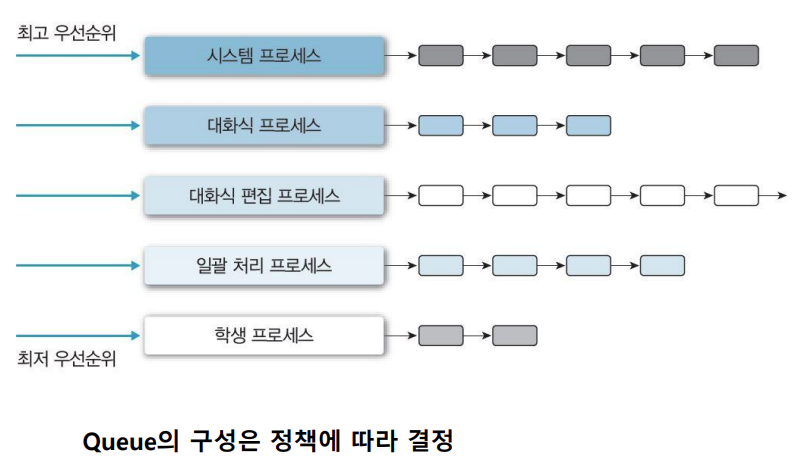

> 아래 층 애들이 적응 못할 수 있는 상황 발생 할 수도
>
> MFQ는 이동 허용해서 처리

> BT 예상 안하고도 비슷한 효과

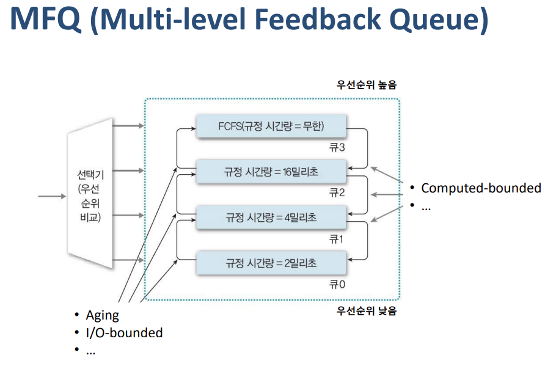

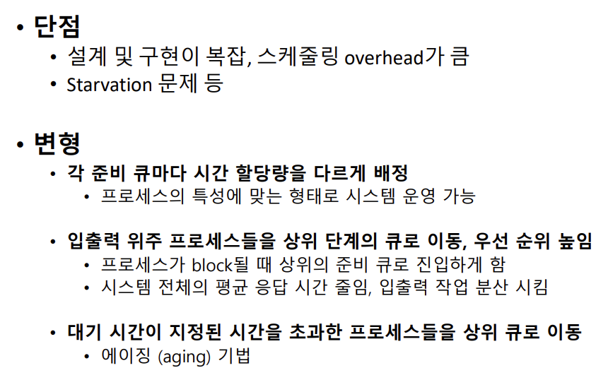

> 누가 올라갈 지 어떻게 정함
>
> ex) I/O bounded는 시스템 잠깐만 쓰고 옴

