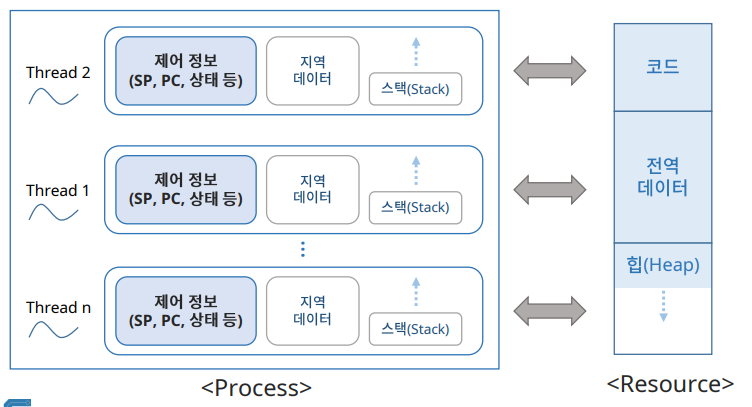
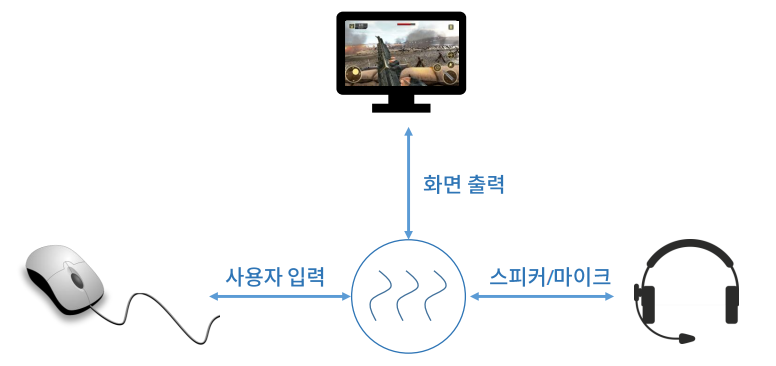
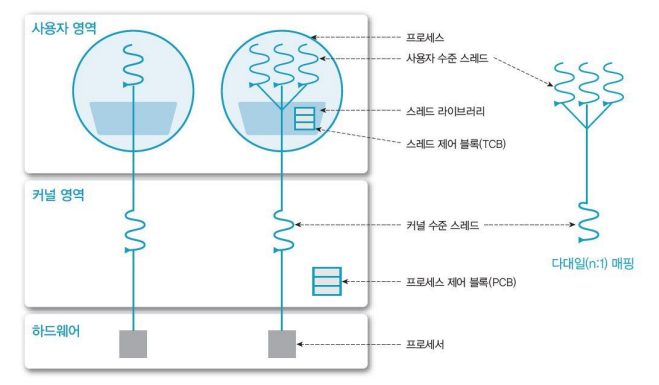
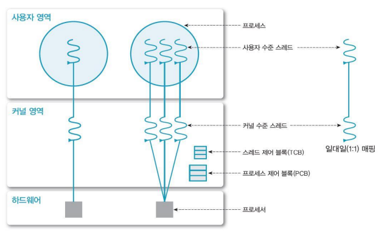
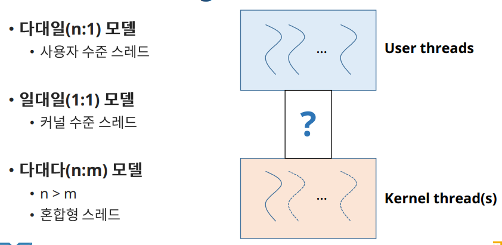
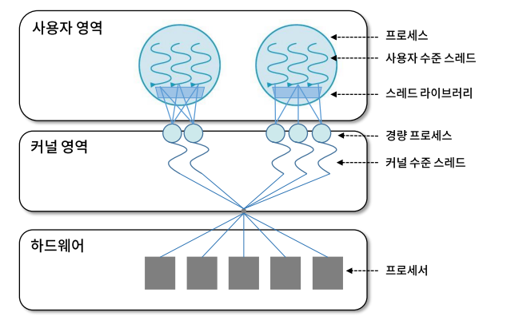

# Thread Management

## 프로세스(Process)와 스레드(Thread)

✔ 프로세스는 자원을 **할당**받아 목표를 이루기 위해 할당받은 자원을 **제어**한다.  

✔ **자원의 제어 과정**을 **스레드(Thread)**라고 부른다  
✔ 스레드는 여러 개가 존재 할 수 있다(여러 개의 자원을 할당받아 각각 제어할 수 있음)

## 스레드(Thread)의 개념

✔ SP: stack pointer   
✔ PC: program counter  

✔ 지역 데이터: 제어를 위해 사용 (특정 지역에서만 유효한 데이터)  
✔ 스택(Stack): 지역 데이터 저장  

✔ Resource는 공유한다
- **하나의 resource를 제어하는 여러 개의 process가 존재**할 수 있다

✔ 각 thread마다 자기만의 작업 영역(Stack)을 할당받는다  
✔ 각자의 PC(program counter)를 통해 작업의 흐름 제어  

### Thread란

✔ Light Weight Process (LWP): 자원은 공유하고 **제어부분**만 가지고 있다.  
✔ 프로세서(e.g, CPU) 활용의 기본 단위  
✔ 구성요소
- Thread ID
- Register set (PC, SP 등)
- Stack (i.e. local data)

✔ 제어 요소 외 코드, **데이터 및 자원들은 프로세스 내 다른 스레드들과 공유**  
✔ **전통적 프로세스 = 단일 스레드 프로세스**

### Single-thread vs Multi-threads

#### single

#### multi

### 스레드의 장점

✔ **사용자 응답성(Responsiveness)**
- 일부 스레드의 처리가 지연되어도, 다른 스레드는 작업을 계속 처리 가능  

✔ **자원 공유 (Resource Sharing)**
- 자원을 공유해서 효율성 증가(커널의 개입을 피할 수 있다)
  - ex) 동일 address space에서 여러 개 스레드
  - 자원을 공유하지 못하면 context switching을 해야 한다.(비용 ↑)

✔ **경제성 (Economy)**
- 프로세스의 생성, context switch에 비해 효율적

✔ **멀티 프로세서(multi-processor) 활용**
- 병렬처리를 통해 성능 향상

### 스레드 사용의 예

✔ 하나의 게임에 대해서 화면출력, 사용자 입력, 스피커/마이크에 대한 각각의 스레드 사용  

## 스레드의 구현

### 사용자 수준 스레드 (User Thread)

✔ 사용자 영역의 **스레드 라이브러리**로 구현
- 스레드의 생성, 스케줄링 등
- POSIX threads, Win32 threads, Java thread API...

✔ 다대일 매핑: 커널 수준 스레드는 하나인데 사용자 수준 스레드는 여러 개이다.

✔ **커널은 스레드의 존재를 모른다**
- 장점: 커널의 관리(개입) x
  - 생성 및 관리의 부하가 적음, 유연한 관리
  - 이식성 (portability) 높음: 해당 라이브러리만 있으면 해당 멀티스레드 프로그램 그대로 사용 가능 (ex: JVM)
- 단점: 커널은 프로세스 단위로 자원 할당
  - 하나의 스레드가 block 상태가 되면, 모든 스레드가 대기한다.(single threaded kernel)

### 커널 수준 스레드 (Kernel Threads)

✔ **OS(Kernel)이 직접 관리**  
✔ **커널 영역에서 스레드의 생성, 관리 수행**
- (스레드 사이의)Context switching 등 부하(Overhead)가 크다

✔ **커널이 각 스레드를 개별적으로 관리**
- 프로세스 내 스레드들이 **병행 수행 가능**

### Multi-Threading Model

✔ 다대다 모델을 통해 절충!

### 혼합형 (N:M) 스레드

✔ **n개 사용자 수준 스레드 - m개의 커널 스레드 (n > m)**
- 사용자는 원하는 수만큼 스레드 사용
- 커널 스레드는 자신에게 할당된 하나의 사용자 스레드가 block 상태가 되어도 다른 스레드 수행 가능 (병행 처리)

✔ **효율적이면서도 유연**