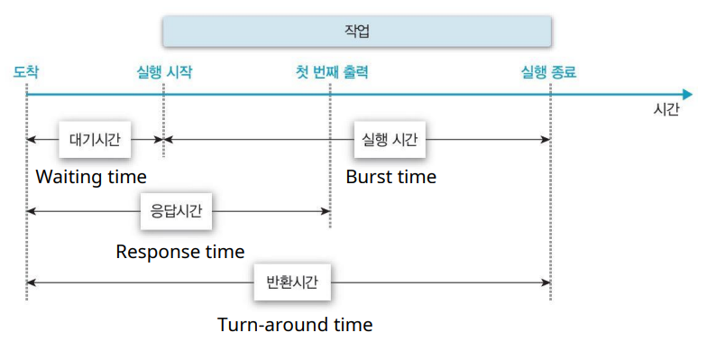
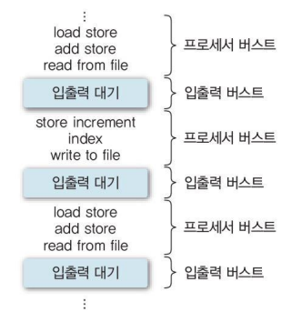
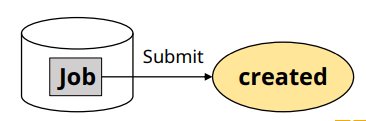
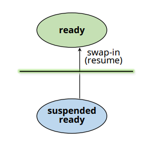
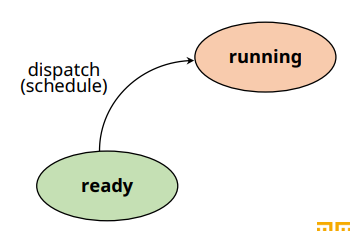
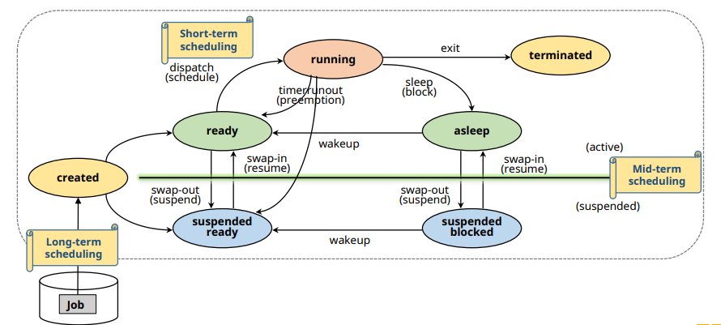

# 프로세스 스케줄링

## 다중 프로그래밍(Multi - Programming)

✔ 여러 개의 프로세스가 시스템 내에 존재  
✔ **스케줄링(Scheduling)**: 자원을 할당할 프로세스 선택 

✔ 자원 관리
- 시간분할(time sharing)관리
  - 하나의 자원을 여러 스레드들이 번갈아 가며 사용
  - **프로세스 스케줄링(Process Sheduling)**

- 공간분할(space sharing)관리
  - 하나의 자원을 분할하여 동시에 사용
  - ex: 메모리

## 스케줄링의 목적

✔ 시스템의 성능(Performance) 향상  

✔ 시스템 성능 지표(idx)  
- **응답시간** (response time)
  - 작업 요청(submission)으로부터 응답을 받을 때까지의 시간
  - interactive system, real-time system
- **작업 처리량**(throughput)
  - 단위 시간 동안 완료된 작업의 수
  - batch system
- **자원 활용도**(resource utilization)
  - 주어진 시간 동안 자원이 활용된 시간

✔ **목적에** 맞는 지표 고려하여 스케줄링 기법 선택

### 시스템 성능 지표들

✔ 평균 응답 시간(mean response time)  
✔ 처리량(throughput)  
✔ 자원 활용도(resource utilization)  
✔ 공평성(fairness)  
✔ 실행 대기 방지  
✔ 예측 가능성(predictability)  
... 

### 대기시간, 응답시간, 반환시간

## 스케줄링 기준 (Criteria)

✔ 스케줄링 기법이 고려하는 항목들

✔ **프로세스의 특성**
- I/O-bounded or compute-bounded  
  
✔ 시스템 특성
- Batch system or interactive system

✔ 프로세스의 긴급성 (urgency)

✔ 프로세스 우선순위(priority)

✔ 프로세스 총 실행 시간(total service time)

### CPU burst vs I/O burst

✔ 프로세스 수행 = **CPU 사용 + I/O 대기**

✔ **CPU burst**: CPU 사용시간  
✔ **I/O burst**: I/O 대기시간 

✔ Burst time은 스케줄링의 중요한 기준 중 하나

## 스케줄링의 단계 (Level)

✔ **발생하는 빈도 및 할당 자원**에 따른 구분

✔ Long-term scheduling
- Job scheduling

✔ Mid-term scheduling
- Memory allocation
  
✔ Short-term scheduling
- Process scheduling

### Long-term Scheduling

✔ **Job scheduling**
- 시스템에 제출 할 (kernerl에 등록 할) 작업 (Job) 결정

✔ 다중 프로그래밍의 정도(degree) 조절
- 시스템 내에 프로세스의 수 조절

✔ I/O bounded와 compted-bounded 프로세스들을 잘 섞어서 선택
- 작업의 효율성

✔ 시분할 시스템에서는 모든 작업을 시스템에 등록
- Long term scheduling 불필요 (중요도 ↓)

### Mid-term Scheduling

✔ **메모리 할당 결정 (memory allocation)**
- Intermediate-level scheduling
- Swapping (swap-in / swap-out)

### Short-term Scheduling

✔ **Process scheduling**
- 프로세서를 할당할 프로세스 결정

✔ 가장 빈번하게 발생
- 매우 빨라야한다

### 그림으로 보는 스케줄링의 단계

## 스케줄링 정책(Policy)

✔ **선점(Preemptive) vs 비선점(Non-Preemptive)**  
✔ **우선순위(Priority)**

### Preemptive/Non-preemptive scheduling

✔ **Non-preemptive schduling**
- **할당 받은 자원을 스스로 반납할 때까지 사용**
  - ex) system call, I/O
- 장점: context switch overhead가 적음
- 단점: 잦은 우선순위 역전, 평균 응답시간 증가

✔ **Preemptive scheduling**
- **타의에 의해 자원을 뺴앗길 수 있음**
  - ex) 할당 시간 종료, 우선순위가 높은 프로세스 등장
- 장점: 응답성 증가 (Time-shraing, real-time system에 적합)
- 단점: context switch overhead가 큼

### Priority

✔ **프로세스의 중요도**

✔ **static priority(정적 우선순위)**
- 프로세스 생성 시 결정된 priority 유지
- 구현이 쉽고, overhead가 적음
- 시스템 환경 변화에 대한 대응 어려움

✔ **dynamic priority(동적 우선순위)**
- 프로세스 상태 변화에 따라 priority 변경
- 구현이 복잡, priority 재계산 overhead가 큼
- 시스템 환경 변화에 유연한 대응 가능

