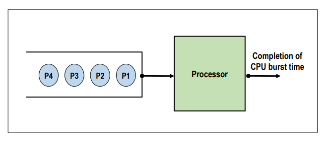
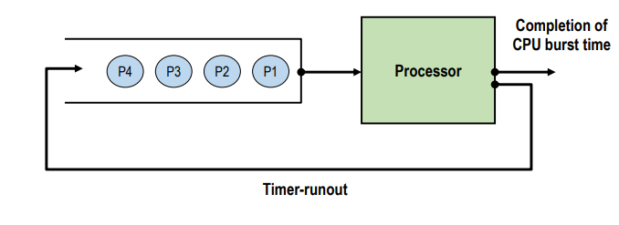

## 스케줄링 알고리즘

### FCFS (First-Come-First-Service)

✔ Non-preemptive scheduling 

✔ 스케줄링 기준
- **도착시간** (ready queue 기준)
- 먼저 도착한 프로세스를 먼저 처리

✔ 자원을 효율적으로 사용 가능 (high resource utilization): scheduling overhead가 적음  
✔ Batch system에 적합, interactive system에 부적합

✔ 단점
- **Convouy effect**: 하나의 수행 시간이 긴 프로세스에 의해 다른 프로세스들이 긴 대기시간을 갖게 되는 현상(대기시간 >> 실행시간)
- **긴 평균 응답시간(response time)**

## RR (Round Robin)

✔ Preemptive scheduling

✔ 스케줄링 기준
- **도착시간** (ready queue 기준)
- 먼저 도착한 프로세스를 먼저 처리

✔ **자원 사용 제한 시간(time quantum)이 있다**
- system parameter (δ)
- 프로세스는 할당된 시간이 지나면 자원 반납 (time-runout)
- 특정 프로세스의 자원 독점 방지
- context switch overhead가 크다

✔ **대화형, 시분할 시스템에 적합**

✔ **Time quantum이 시스템 성능을 결정하는 핵심 요소**
- very large(infinite) -> FCFS
- very small -> process sharing
  - 체감 프로세서 속도 = 실제 프로세서 성능의 1/n
  - high context switch overhead

✔ 제한 시간이 끝나면 다시 ready queue의 **맨 뒤**에 가서 줄을 선다

## SPN (Shortest-Process-Next)

✔ Non-preemptive scheduling

✔ 스케줄링 기준
- **실행시간 (burst time)**
- busrt time이 가장 작은 프로세스 먼저 처리
- SJF(Shortest Job First) scheduling 

✔ 장점
- **평균 대기시간(WT) 최소화**
- 시스템 내 프로세스 수 최소화
  - 스케줄링 부하 감소, 메모리 절약 -> 시스템 효율 향상
- 많은 프로세스들에게 빠른 응답 시간 제공

✔ 단점
- **Starvation(무한 대기)**gustkd qkftod
  - BT가 긴 프로세스는 자원을 할당 받지 못할 수 있음
  - Aging 등으로 해결 (HRRN)
- 정확한 실행시간을 알 수 없음
  - 실행시간 예측 기법 필요

## SRTN (Shortest Remaining Time Next)

✔ **SPN의 변형**

✔ Preemptive scheduling
- 잔여 실행 시간이 더 적은 프로세스가 ready 상태가 되면 선점

✔ 장점
- SPN의 장점 극대화

✔ 단점
- 프로세스 생성 시, 총 실행 시간 예측 필요
- 잔여 실행을 계속 추적해야함 -> overhead

✔ **구현 및 사용이 비현실적**

## HRRN (High-Response-Ratio-Next)

✔ **SPN의 변형**
- SPN + **Aging concepts**, Non-preemptive

✔ **Aging**
- **프로세스 대기 시간(WT)를 고려하여 기회 제공**

✔ 스케줄링 기준
- Response ratio가 높은 프로세스 우선

✔ Response ratio = $WT+BT \over BT$(응답률)
- SPN의 장점 + Starvation 방지
- 실행 시간 예측 기법 필요 (overhead)

## MLQ (Multi-level Queue)

✔ **작업(or 우선순위)별 별도의 ready queue를 가짐**  
- 최초 배정된 queue를 벗어나지 못한다
- 각각의 queue는 자신만의 스케줄링 기법 사용

✔ **queue 사이에는 우선순위 기반의 스케줄링 사용**

✔ 장점
- 우선순위가 높은 작업들에 대해 빠른 응답시간

✔ 단점
- 여러 개의 queue 관리 등 스케줄링 overhead
- 우선순위가 낮은 queue는 starvation 현상

✔ Queue의 구성은 정책에 따라 결정

## MFQ (Multi-level Feedback Queue)

✔ **프로세스의 queue간 이동이 허용된 MLQ**  
✔ **Feedback을 통해 우선순위 조정**
- 현재까지의 프로세서 사용 정보(패턴)을 활용

✔ 특성
- Dynamic priority
- Preemptive scheduling
- Favor short burst time processes
- Favor I/O bounded processes
- Improve adaptability

✔ **프로세스에 대한 사전 정보 없이 SPN SRTN, HRRN 기법의 효과를 볼 수 있음**

✔ 단점
- 설게 및 구현이 복잡, 스케줄링 overhead
- Starvation 문제 등

✔ 변형
- **각 준비 큐마다 시간 할당량 다르게 배정**
  - 프로세스의 특성에 맞는 형태로 시스템 운영 가능
- **입출력 위주 프로세스들을 상위 단계 큐로 이동, 우선순위 높임**
  - 프로세스가 block 될 때 상위의 준비 큐로 진입하게 함
  - 시스템 전체의 평균 응답 시간 줄임, 입출력 작업 분산
- **대기 시간이 지정된 시간을 초과한 프로세스들을 상위큐로 이동** 
  - 에이징(Aging) 기법