# 프로세스 동기화 & 상호배제

## Process Synchronization (동기화)

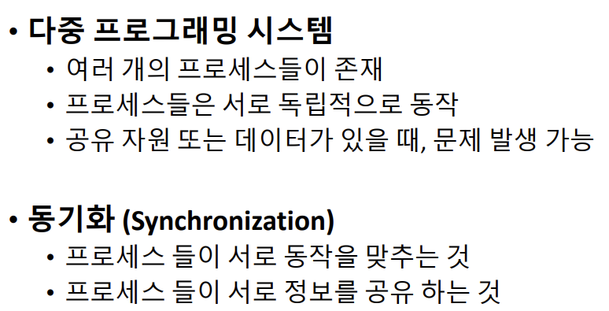

> A, B가 동시에 그림을 그리려 하면 원하지 않는 결과 발생할 수 있음
>
> => 서로 대화를 나눠야함 == 동기화(Synchronization) => 기본적으로 대화를 나누는 것임

## Asynchronous and Concurrent P's

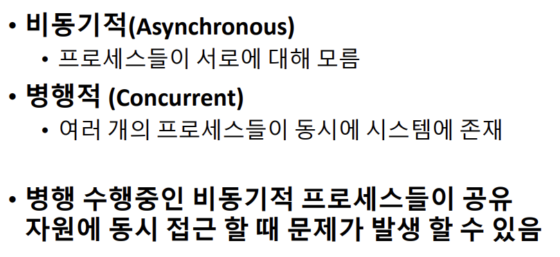

## Terminologies

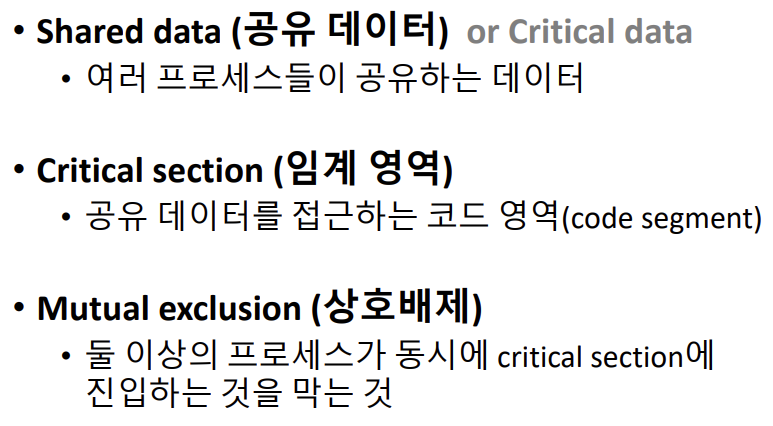

> 공유할 때 잘 못 건드리면 문제 생기니깐 critical data라고도 함

## Critical Section (example)

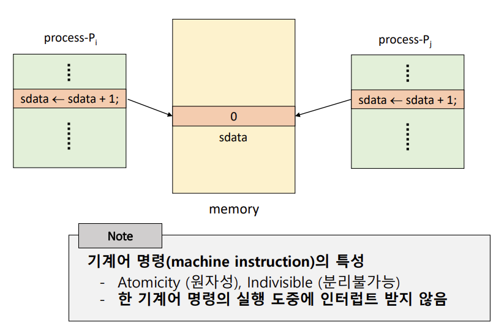

> 2를 기대하겠지만 2가 아닐 수 도 있음
>
> 기계어를 한벙 수행하면 중간에 방해할 수 없다!

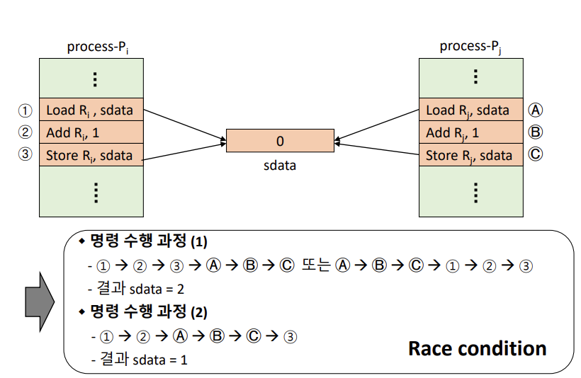

> 상황에 따라 결과가 다를 수 있음
>
> running => ready 일때 preemption 발생 가능 (2)의 과정에서는 이 때문에 결과가 1임
>
> 달리는 순서에 따라 결과가 달라질 수 있음 : Race condition
>
> 원하는 결과 도출하려면? Mutual Exclusion

## Mutual Exclusion (상호배제)

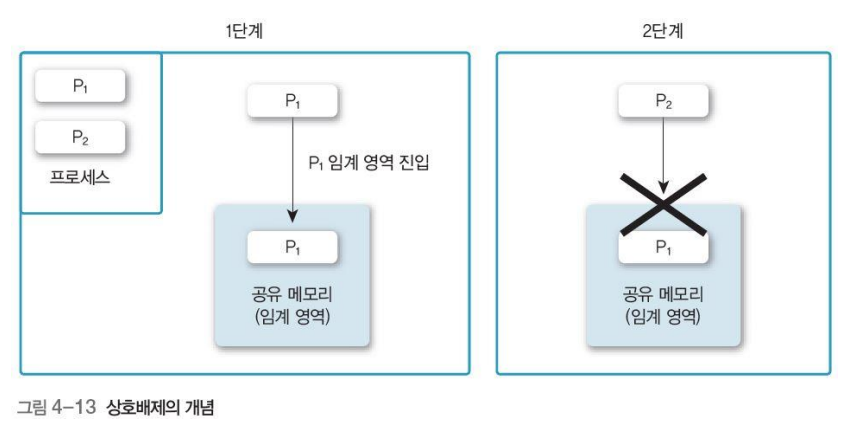

> 한명이 하고 있으면 다른애가 못들어오게 막아라

## Mutual Exclusion Methods

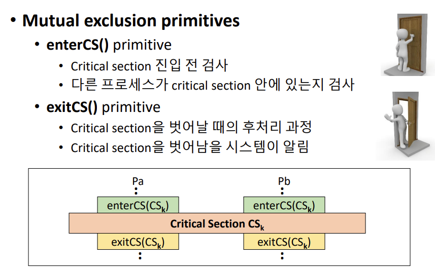

> primitive : 가장 기본이 되는 연산

## Requirements for ME primitives

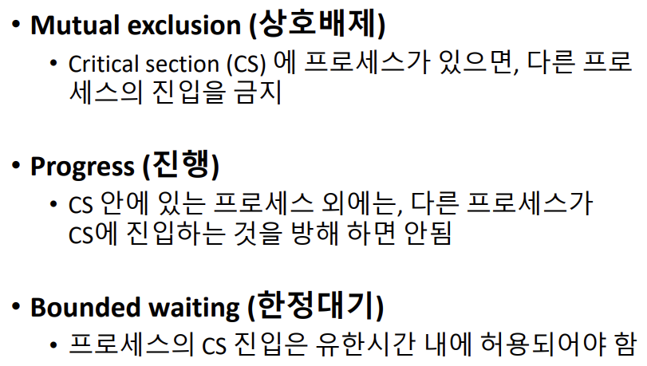

## Two Process Mutual Exclusion

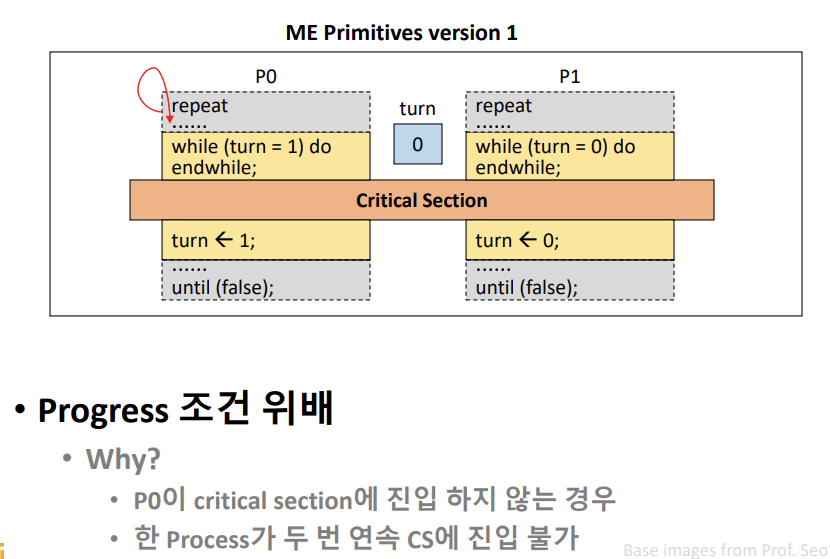

> 내 턴이면 들어간다
>
> 조건 위배가 있음

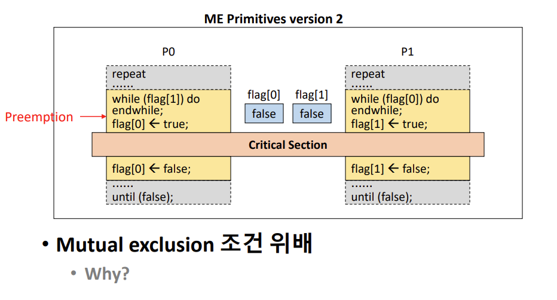

> 턴으로 하니깐 문제 생기니 flag로
>
> 깃발이 들려 있으면 누군가 들어가 있음
>
> p0가 들어가기 전에 preemption하고 다른애 오면 동시에 들어감

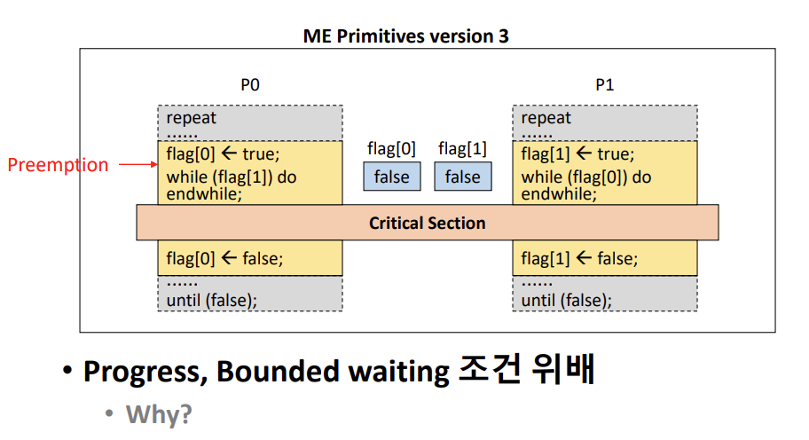

> 비어 있는데 계속 못 들어감

## Mutual Exclusion Solutions

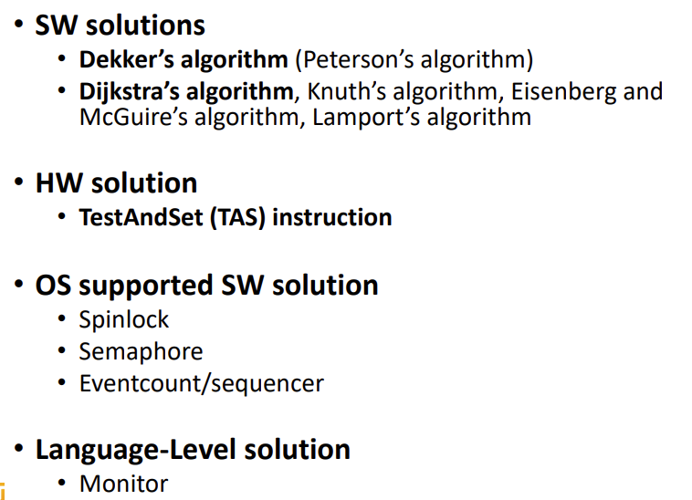

## Dekker's Algorithm

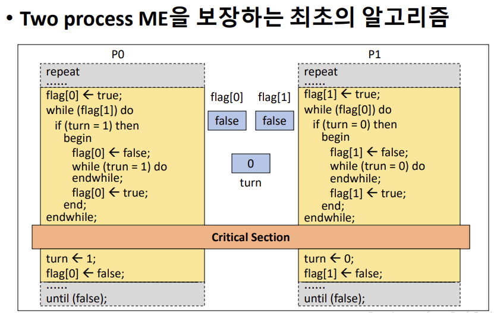

> 상대가 깃발 안들고 있으면 바로 들어감
>
> 상대가 들고 있으면 turn을 봄
>
> 상대 turn 끝나면 들어감
>
> => 이전의 문제 해결됨

## Peterson's Algorithm

> 양보 하는게 다름(turn)

## N-Process Mutual Exclusion

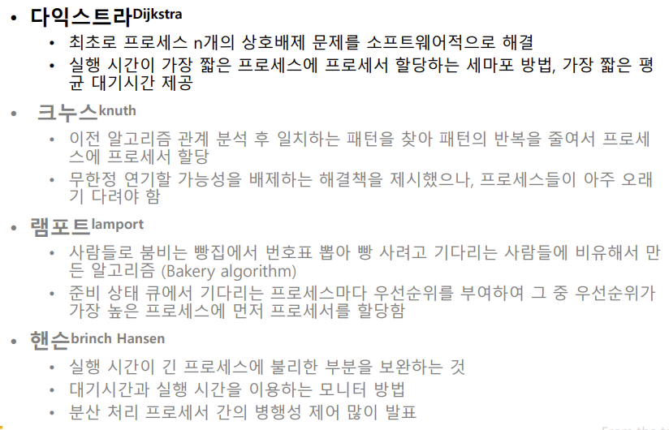

## Dijkstra's Algorithm

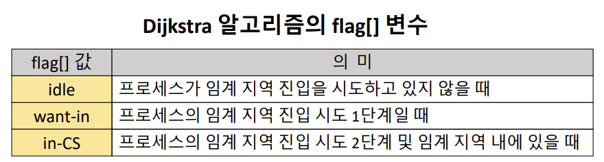

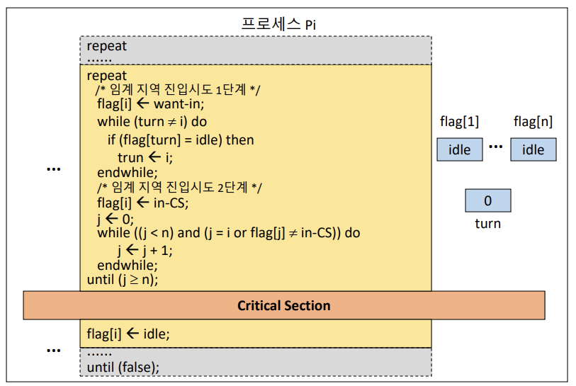

> 1단계 의사 밝히기
>
> 턴이 내가 아니면 기다림
>
> 현재 턴의 일이 끝날때 까지 기다림
>
> 2단계
>
> 깃발 들고 나 2단계야
>
> 방에 나 말고 있으면 빠져나옴
>
> 뺑뺑 돌 순 있지만 둘이 들어갈 일은 없음
>
> 언젠간 들어감

## SW Solutions

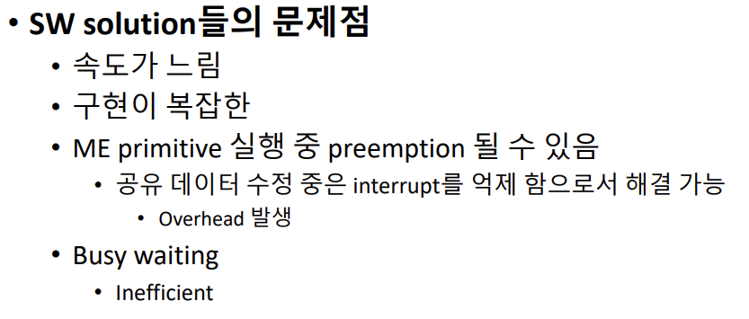

> 서로 만났을 때 뺑뺑 도는 등 비효율적인 점이 있음
>
> 구현도 복잡함

##  Synchronization Hardware

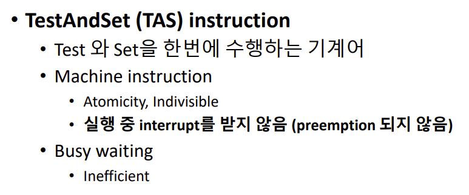

## TAS Instruction

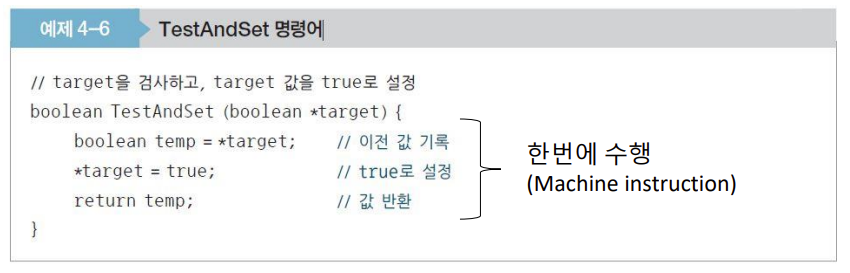

## ME with TAS Instruction

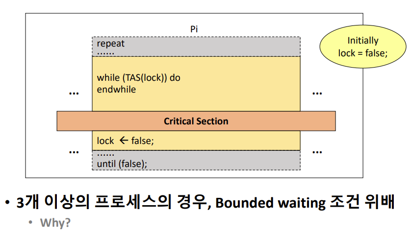

> TAS 수행하면 true, false를 return
>
> 하드웨어가 한번에 수행하는걸 보장해서 간단히 수행
>
> but 한명이 일을 하고 있는데 2, 3번이 뺑뺑 돌다
>
> 1번이 나가면서 false로 바꾸고 2번말고 3번이 들어가면 2번은 4, 5, 번 계속 반복돼서 못들어갈 수도

> 기다리는 애 있으면 해당 애 waiting false로 품
>
> 나까지 없으면 풀고 나감

## HW Solution

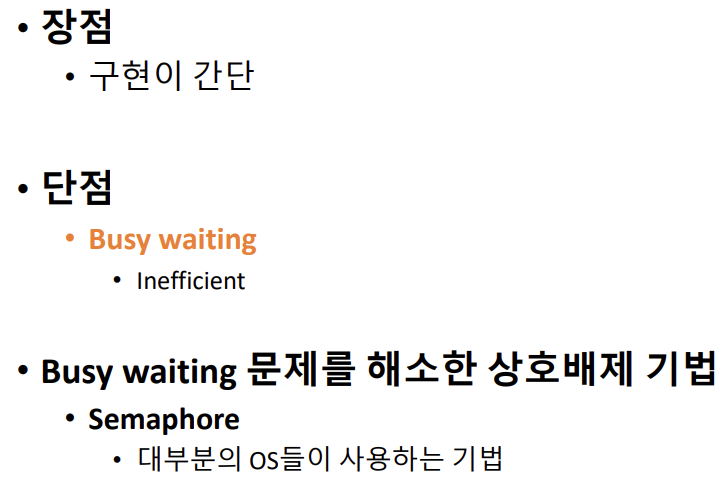

## Spinlock

> OS가 실행 되는 동안 끝까지 연산하도록 보장
>
> S 물건의 개수 (자물쇠 푸는 것)
>
> P 물건 꺼내는 것 (자물쇠 거는 것)
>
> V 물건 넣는 것

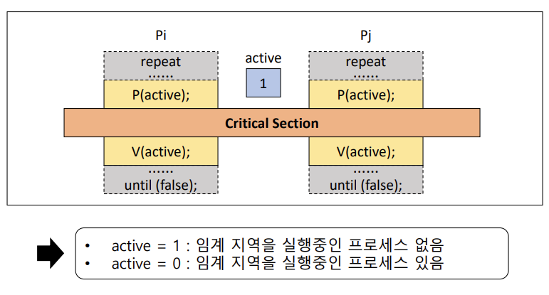

> 들어가기전에 문 잠그고 나올때 문 염
>
> 1이면 물건이 있음 P연산 들어감
>
> 없으면 못들어가고 대기
>
> i가 반납하면 j가 기다리다 들어감
>
> OS가 도와주니 간단히 해결됨

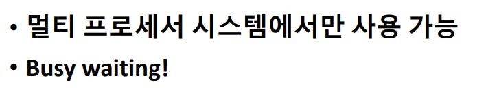

> CPU 하나이면 preemptive일 때 계속 뺑뺑 돌고 있음, i도 못들어감
>
> P에서 여전히 Busy waiting

## Sempahore

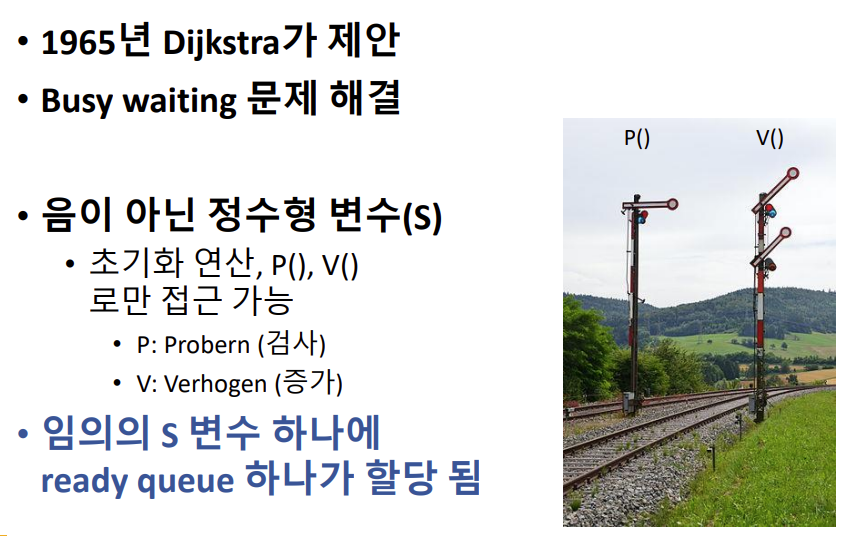

> sempahore 변수 하나마다 ready queue가 할당된다는게 spin lock과 다른 점

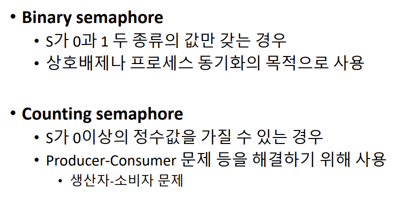

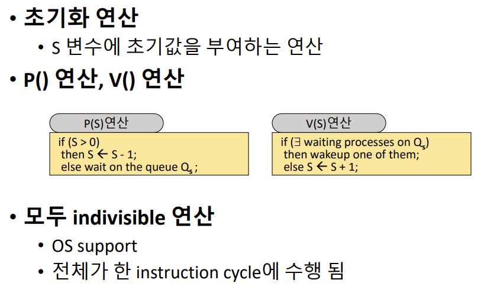

> p에서 물건이 있으면 꺼내가고 안으로 들어감
>
> 물건이 없으면 (spinlock에서는 뺑뺑 돌면서 기다렸음) s에 할당된 Q에서 기다림
>
> ready Q : 대기실
>
> V에서 나갈 때 대기실에 기다리는 애가 있으면, 기다리는 애 하나 깨우고 나옴
>
> 기다리는 애 없으면 물곤 돌려놓고 그냥 나가면 됨

## Sempahore in OSs

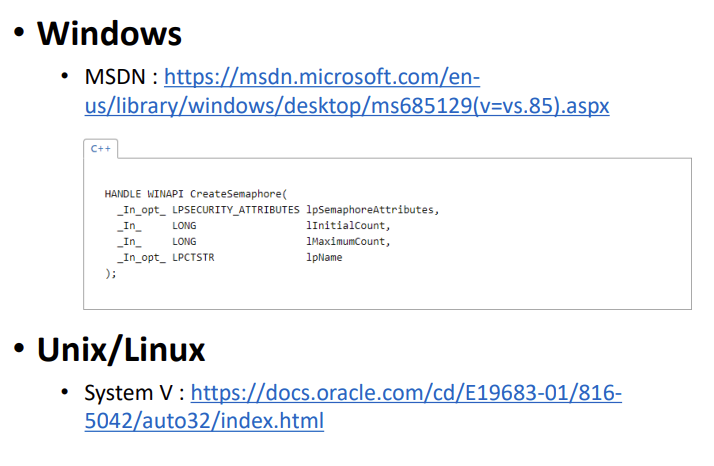

> 실제 OS에서 지원 함!

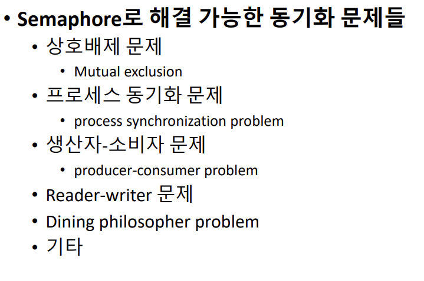

> Mutual exclusion 문제 해결

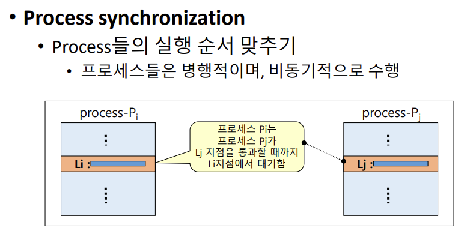

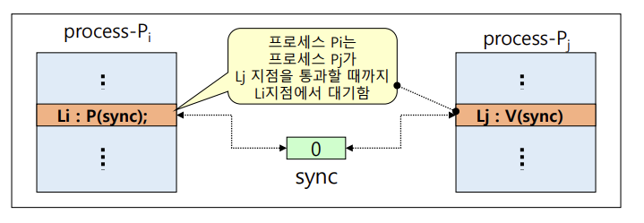

> sync 지날 때 반납, 가져오기

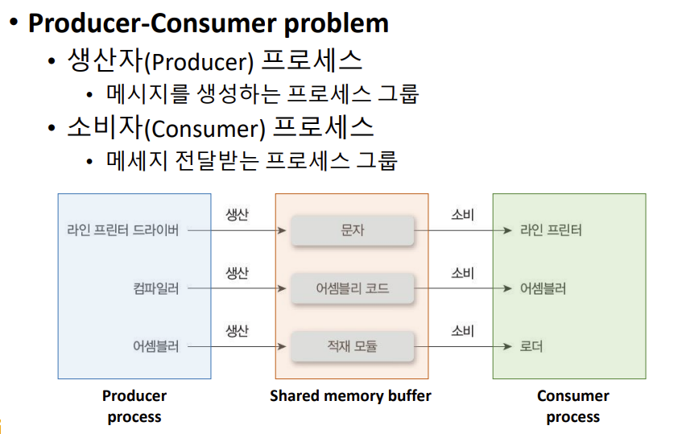

> 생산자 : 컴파일러, 라인 프린터 등등
>
> buffer에 서로 일하는 중 못건드리게 동기화 필요

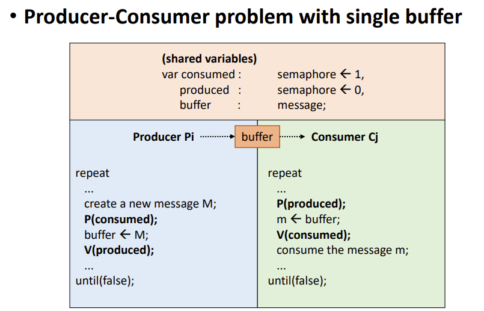

> buffer에는 한번에 한명만 접근해야함
>
> 생산해서 넣으려 할 때 buffer 비었는가 확인
>
> consumed 1인지 체크, 1이면 0으로 바꾸고 물건 놓기
>
> 내가 생산했음 알리기

> 소비자는 물건 있는지 체크
>
> 생산 안됐으면 대기실에서 기다림
>
> 생산 됐으면 대기실 와서 누가 깨워줌
>
> 소비하고 소비했음 표시

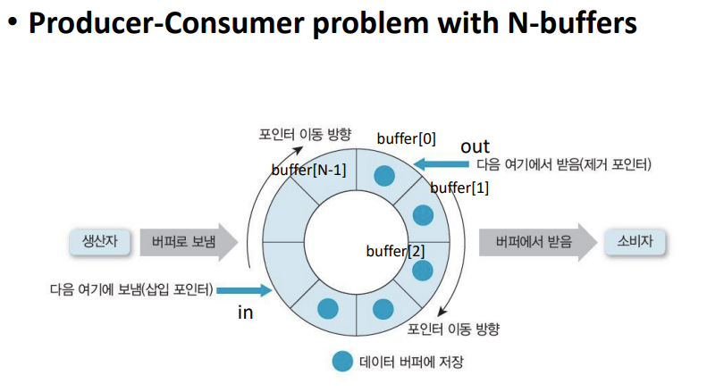

> 버퍼 크기가 N인 경우

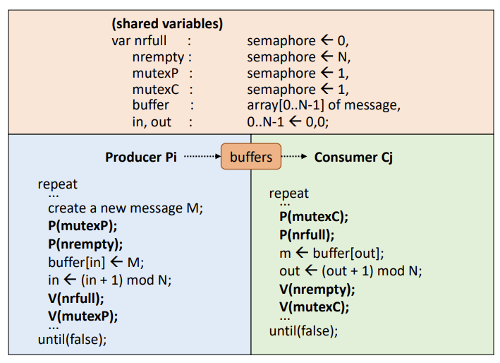

> mutexP 한번에 한명만 일할 수 있어!
>
> nrfull, nrempty : 채워지고 빈 buffer의 수

> 생산자 오면 공간 있는지 확인
>
> 없으면 공간 생길 때 까지 대기
>
> P(nrempty) 0보다 크면 들어감
>
> 물건 놓고 다음 위치 갱신
>
> 물건 생산 했으니 물건 수 늘리고 나옴

> 소비자 오면
>
> 물건 있는지 확인(nrfull)
>
> 물건 하나 꺼내고 공간 하나 늘었음 표시하고 나옴

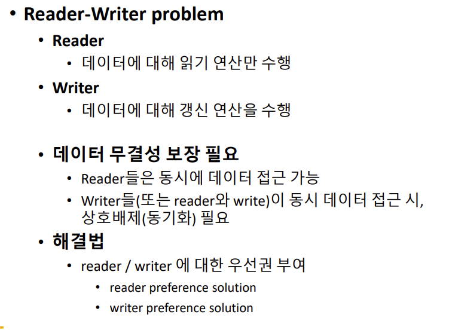

> 리더는 동시에 접근 가능
>
> 라이터는 동시 접근 X

> 리더가 우선권 갖는 경우
>
> mutex : 동시에 못들어가게
>
> readers : 리더 수
>
> 리더 여러명 읽을 수 있는데 왜 mutex?
>
> 읽는 건 여러 명이 할 수 있는데 사전, 사후 작업은 리더 중에 한명만 할 수 있음

> 리더 수 체크, 0명이면 writer mutex 작업(읽을 꺼니까 쓰지마)
>
> 리더 수 증가 (여기 까지 critical section)

> 다 읽은 애가 나갈 때 사후 작업
>
> 한명만 작업!(CS)
>
> 내가 마지막이었으면 writer 쓰라 하고 나가기
>
> (nreaders가 0이 아니면 풀면 안됨)

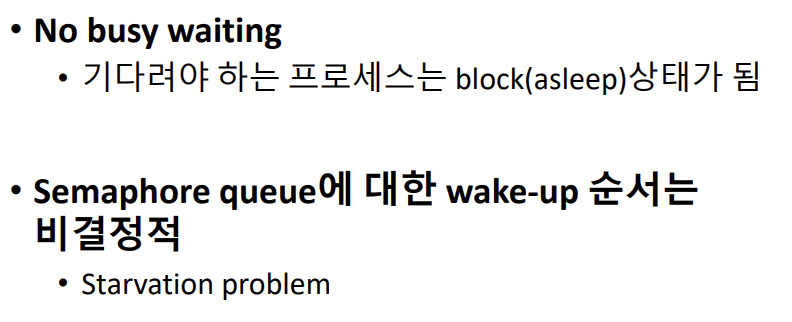

> Semaphore는 대기실 이 있으니 busy waiting 해결!
>
> V 연산에서 누군가 기다리고 있으면 wakeup one of them(누가 깨어날 지 모름ㅠㅠ)
>
> 들어오는 대로 깨우는게 좋긴 할 것임

## Eventcount / Sequencer

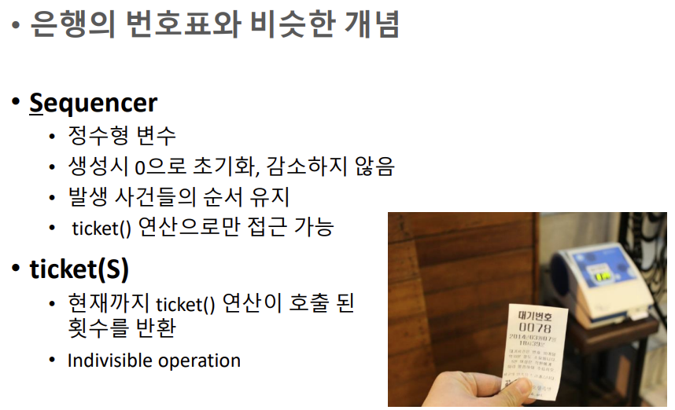

> sequencer : 번호 뽑는 기계

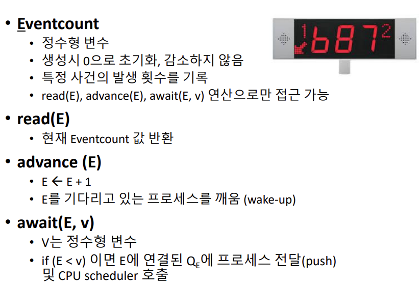

> Eventcount : 번호로 부르는 것

> 첫 sequencer에 0
>
> 0 => 1
>
> envet counter 0
>
> 0 == 0 이니깐 cs로 들어감
>
> 1번도 번호 뽑고
>
> s 1 => 2
>
> 아직 e 0 이니깐 1이 되기를 Q에서 기다림
>
> p가 일 끝내면
>
> event count 1로 바꿈
>
> 그럼 기다리던 p2가 cs로 들어감
>
> => 순서대로 일 처리 됨, semahore에서 starvation 문제 해결됨

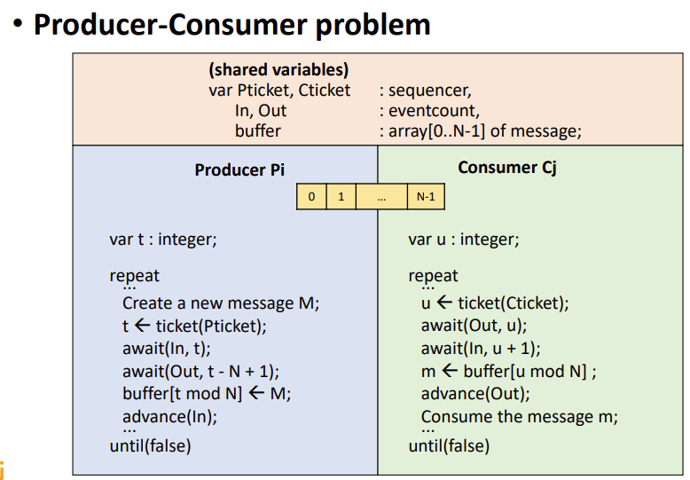

> 한명만 들어가는 cs
>
> 
>
> 생산자를 위한 번호표 ticket
>
> await(Out, t-N+1) : 공간 있니?
>
> 공간 >= 1
>
> 공간 = N-t+out
>
> out >= t-N+1
>
> out<t-N+1
>
> await : if(E<v)

> consumer는 물건이 있니?
>
> 물건 >=  1
>
> 물건 수 < 1 (기다려야 됨)
>
> u : 티켓 뽑은 만큼 물건 가져감
>
> IN - u < 1
>
> In < u + 1

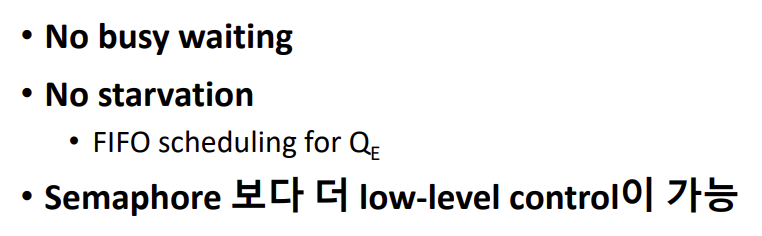

> 먼저 온 애가 먼저 가져갈 수 있고
>
> 순서 control

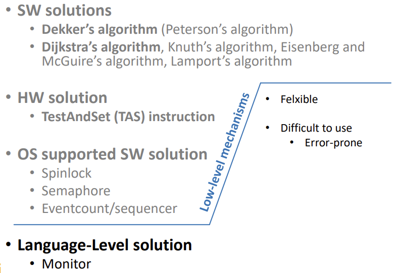

## High-level Mechanism

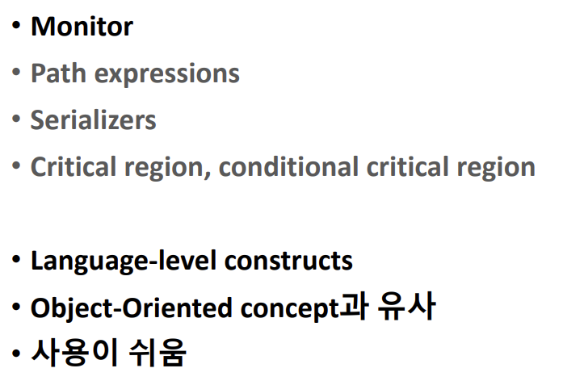

## Monitor

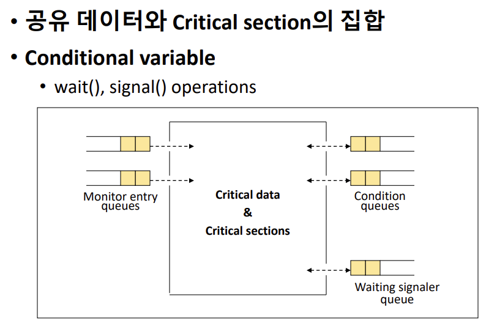

> 한번에 한명만 들어올 수 있는 책방
>
> Critical data : 읽으려는 책
>
> Critical sections 대출, 반납을 위한 영역
>
> 이를 하나로 모아 놓은게 monitor

## Monitor의 구조

> 왼쪽이 entry : 각각 function마다 하나씩
>
> mutual exclusion : language가 보장
>
> condition queue : 대기실
>
> signaler queue : 나와서 일해도 돼 전화하는 공간

## Monitor in Languages

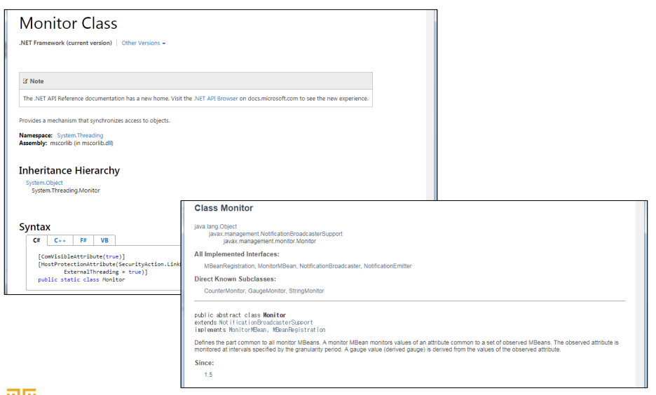

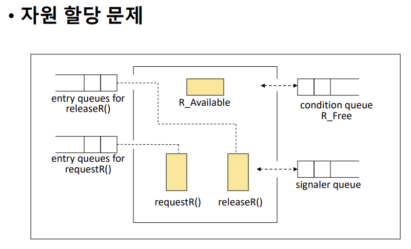

> 자원 요청 fucntion 1개
>
> 반납 fucntion 1개

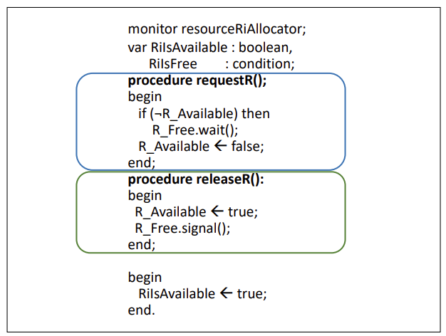

> 책이 있니?
>
> 없으면 기다려라
>
> 있으면 빌려감
>
>
> 반납
>
> 책 돌려 놓고
>
> 대기실 애 한명 깨우기

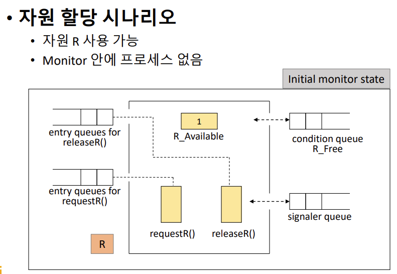

> 내부 동작

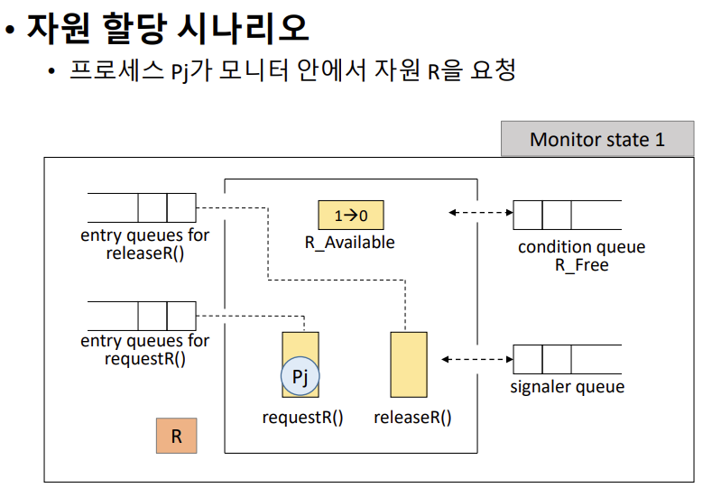

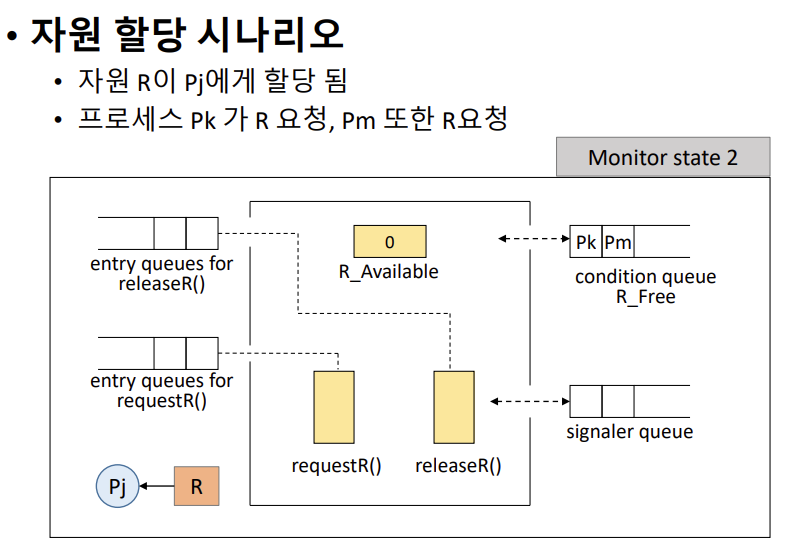

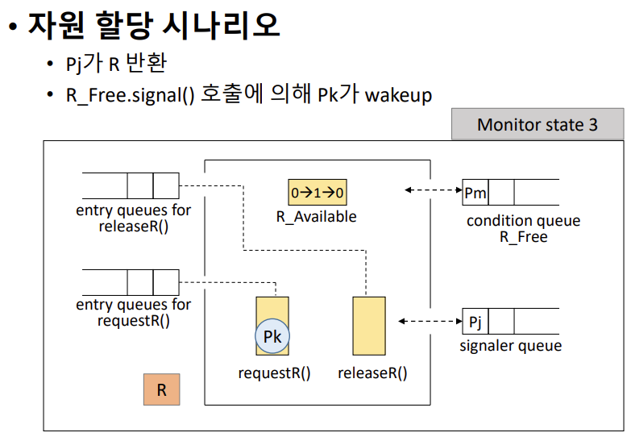

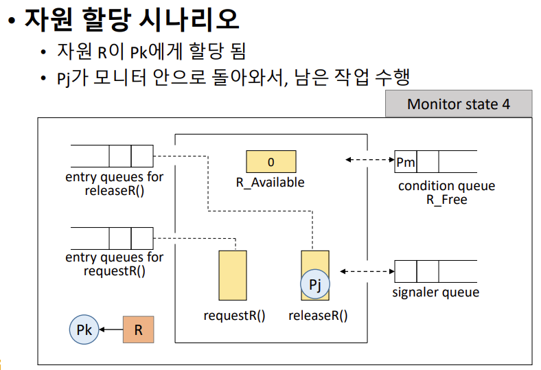

> language가 작업을 보장하니 좀 편하게 할 수 있음

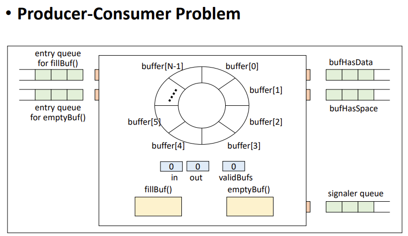

> validbufs 물건 개수

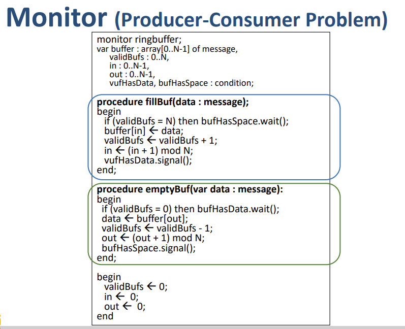

> validbufs = N => 다 찾음 => 기다리는 공간에서 기다림
>
> 공간 있으면 물건 놓고 증가
>
> 공간 위치 갱신
>
> signal 날리기
>
>
> emptybuf 
>
> 물건이 0개면 생길때 끼지 대기
>
> 생기면 -1
>
> 꺼낼 위치 갱신

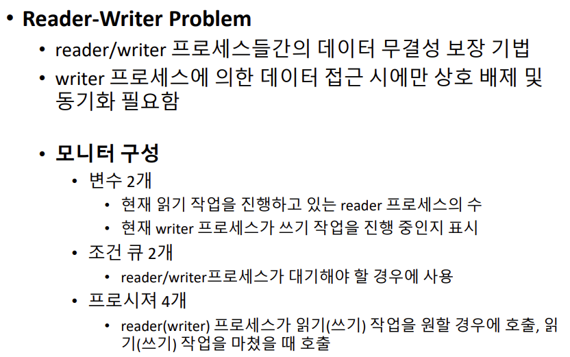

> HW

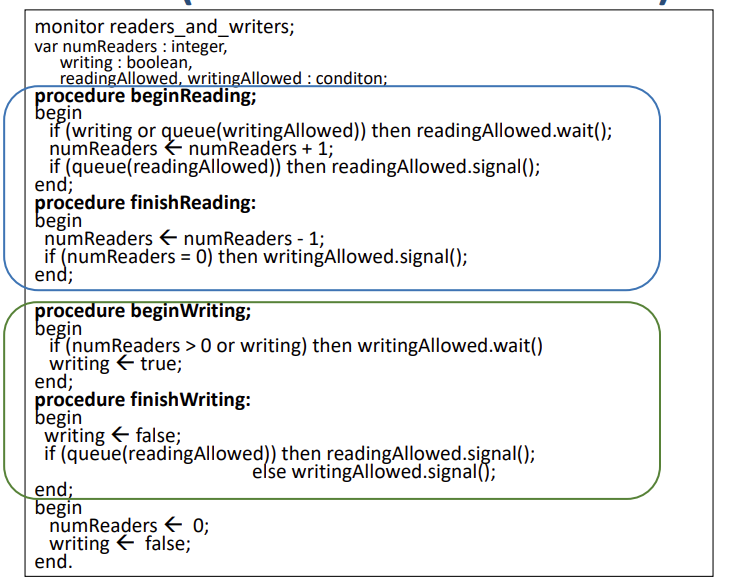

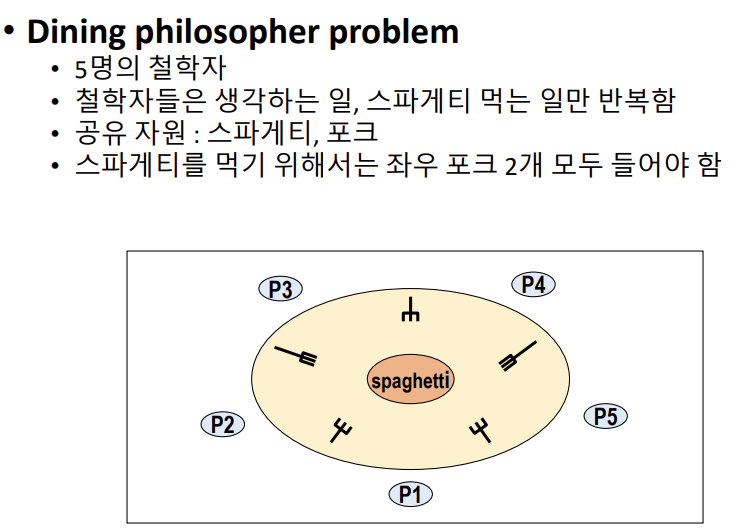

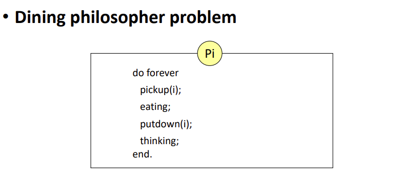

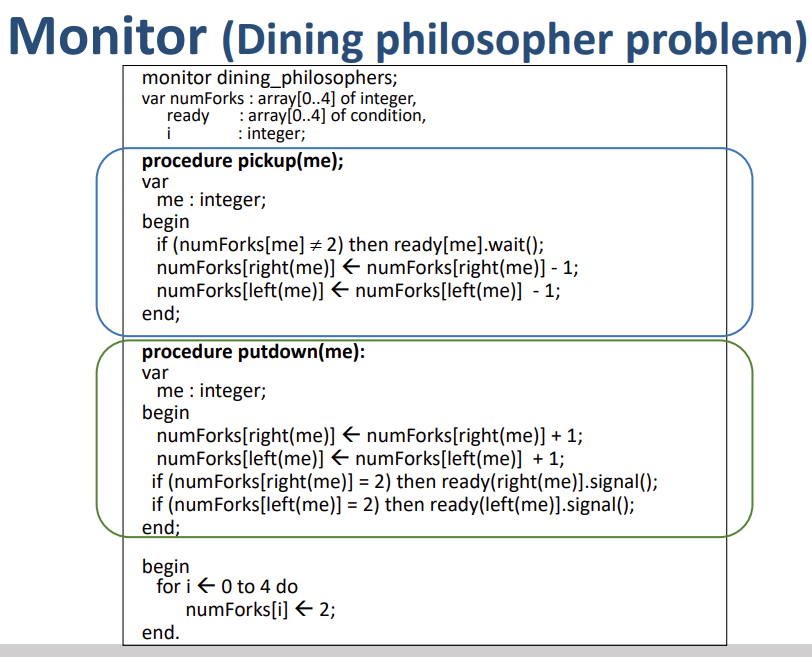

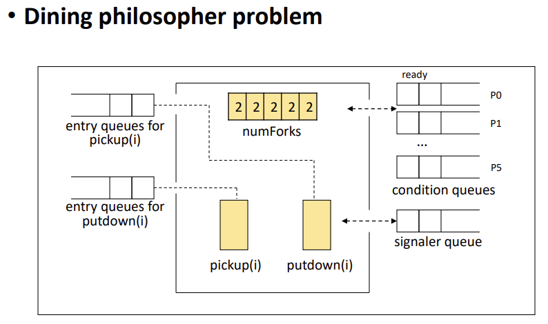

> 처음엔 모두 포크 2개씩 들 수 있음
>
> 포크 두개 없으면 기다려야 함
>
> 각 철학자들이 자기만의 방이 있음
>
> 포크가 있으면 집어서 왼쪽 오른쪽 하나씩 줄이고 나감
>
> monitor니깐 max1명씩 만 할 수 있음

> 포크 내려놓기
>
> 오른쪽 왼쪽 + 1
>
> 오른쪽 애가 포크 2개 기다리고 있었으면 깨우기
>
> 왼쪽도 동일

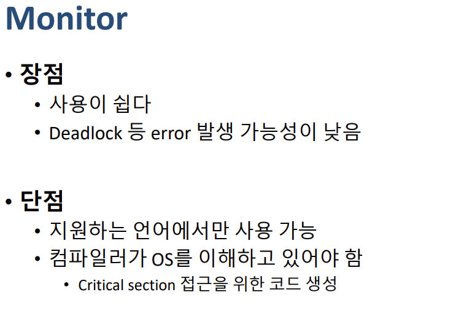