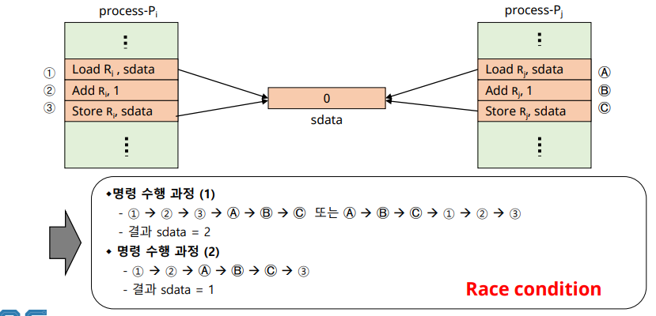
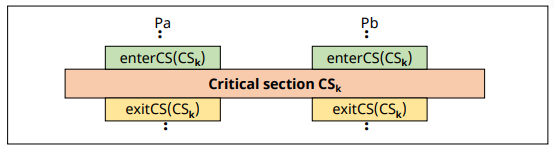
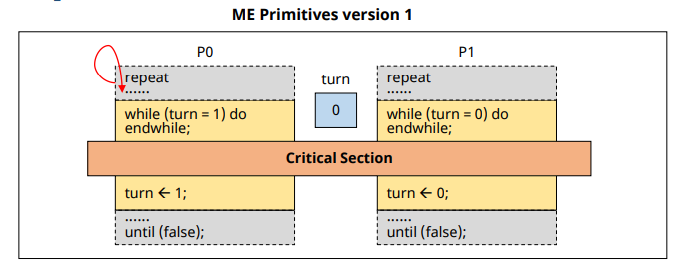
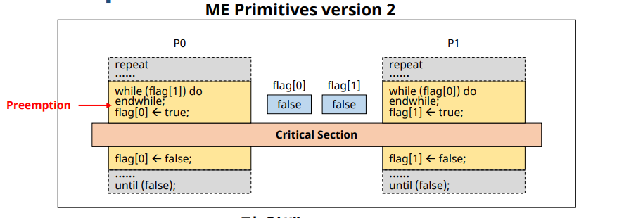
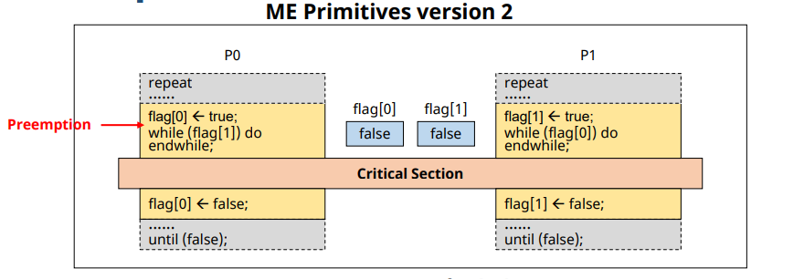

# 프로세스 동기화 & 상호배제 (Process Synchronization and Mutual Exclusion)

## Process Synchronization

✔ **다중 프로그래밍 시스템**
- 여러 개의 프로세스 존재
- 프로세스들은 서로 독립적으로 동작
- 공유 자원 또는 데이터가 있을 때, 문제 발생 가능

✔ **동기화(Synchronization)**
- 프로세스들이 서로 동작을 맞추는 것
- 프로세스들이 서로 정보를 공유하는 것

## Asynchronous and Concurrent P's

✔ **비동기적(Asynchronous)**
- 프로세스들이 서로에 대해 모름

✔ **병행적 (Concurrent)**
- 여러 개의 프로세스 들이 동시에 시스템에 존재

✔ **병행 수행중인 비동기적 프로세스들이 공유 자원에 동시 접근할 때 문제가 발생할 수 있음**

## Terminologies

✔ **shared data (공유 데이터)** or Critical data
- 여러 프로세스들이 공유하는 데이터
 
✔ **Critical section (임계 영역)**
- 공유 데이터를 접근하는 코드 영역 (code segment)

✔ **Mutual exclusion(상호 배제)**
- 둘 이상의 프로세스가 동시에 critical section에 진입하는 것을 막는 것 

### Critical section (example)

✔ sdata: shared data  

 

✔ 기계어 번역 결과  
✔ **Race condition**: 실행 순서에 따라서 값이 달라진다!

## Mutual Exclusion (상호 배제)

### Mutual Exclusion Methods

✔ **Mutual exclusion primitives(기본 연산)**

- **enterCS() primitive**
  - Critical section 진입 전 검사
  - 다른 프로세스가 critical section 안에 있는지 검사

- **exitCS() primitive**
  - Critical section을 벗어날 때의 후처리 과정
  - Critical section을 벗어남을 시스템이 알림

### Requirements for ME primitives

✔ **Mutual exclusion(상호 배제)**
- Critical section(CS)에 프로세스가 있으면, 다른 프로세스의 진입을 금지

✔ **Progress(진행)**
- CS 안에 있는 프로세스 외에는, 다른 프로세스가 CS에 진입하는 것을 방해 하면 안됨

✔ **Bounded waiting(한정 대기)**
- 프로세스의 CS 진입은 유한 시간 내에 허용되어야 함

### Two Process Mutual Exclusion

#### version 1

✔ turn 개념 활용

✔ **Progress 조건 위배!**
- P0이 critical section에 진입하지 않는 경우
- 한 Process가 두 번 연속 CS에 진입 불가

#### version 2

✔ flag 활용

✔ **Mutual exclusion 조건 위배**

#### version 3

✔ **Progress, Bounded waiting 조건 위배**

