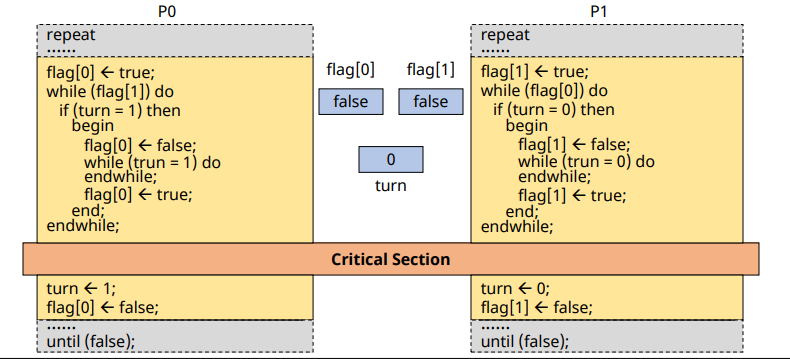
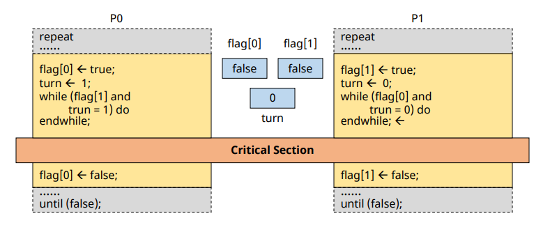
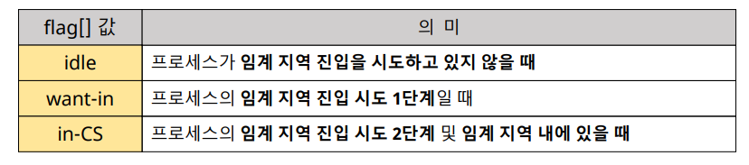
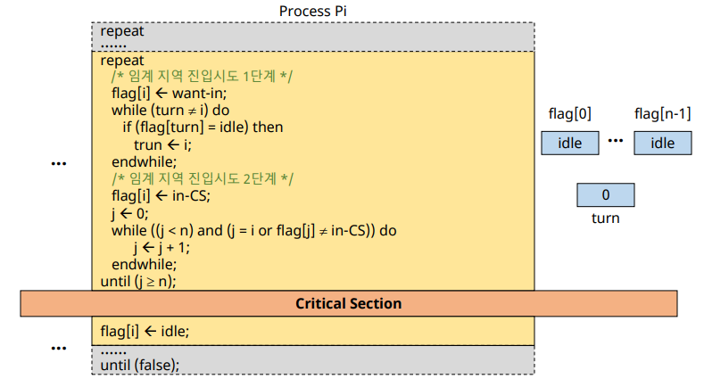
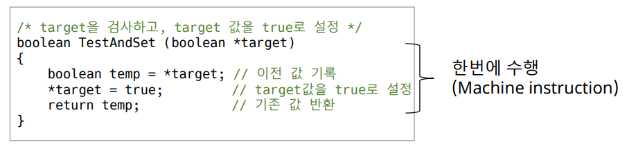
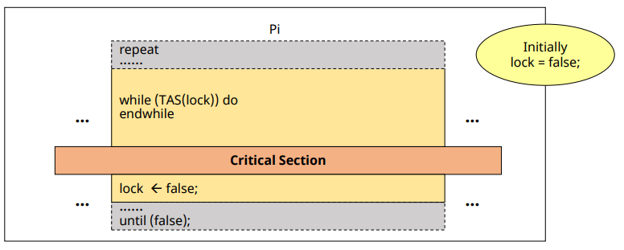
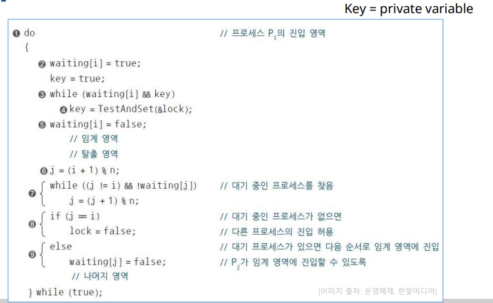

# Mutual Exclusion Solutions (SW & HW)

## SW Solutions

### Dekker's Algorithm

✔ Two process ME를 보장하는 최초의 알고리즘

✔ flag와 turn 둘다 활용  

### Petersen's Algorithm

✔ dekker's algorithm 보다 간단하게 구현

### N-Process Mutual Exclusion

✔ **다익스트라(Dijkstra)**
- 최초로 프로세스 n개의 상호배제 문제를 소프트웨어적으로 해결
- 실행시간이 가장 짧은 프로세스에 프로세서 할당하는 세마포 방법, 가장 짧은 평균 대기시간 제공

✔ 크누스(Knuth)  
✔ 램포트(lamport)  
✔ 핸슨(brinch Hansen)

### Dijkstra's Algorithm

  

✔ Dijkstra 알고리즘의 flag[] 변수  
✔ 3개의 경우로 나눠서 접근  

 

✔ 1단계에서 진입의사 표시 후 turn 확인하면서 대기

✔ 2단계에서 in-CS에 혼자 남을 떄까지 loop

### SW solutions의 문제점

✔ 속도가 느림  
✔ 구현이 복잡  
✔ ME primptive 실행 중 preemption 될 수 있다.  
- 공유 데이터 수정 중은 interrupt 억제를 통해 해결 가능(overhead)  
  
✔ Busy Waiting

## HW solution

### Synchronization Hardware

✔ **TestAndSet(TAS) instruction**
- Test와 Set을 한번에 수행하는 기계어
- Machine instruction
  - **실행 중 interrupt x (preemption 되지 않는다)**
- Busy waiting

### TAS instruction

✔ target의 현재값 반환하면서 target은 true로 변경  
✔ **한번에 수행**

### ME with TAS instruction

✔ 그러나 3개 이상의 프로세스의 경우, bounded waiting 조건 위배
- 순서에 따라서 어떤 프로세스는 계속 못들어갈 수 있다

✔ **N-Process mutual exclusion**  
✔ waiting을 활용해 대기중인 프로세스 탐색

### HW solution의 장단점

✔ 장점: 구현이 간단하다

✔ 단점: Busy waiting

✔ **Semaphore**: OS를 활용해 busy waiting 문제 해결