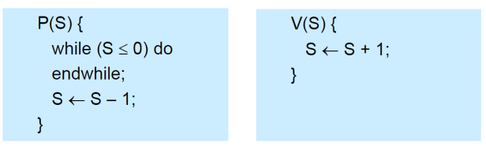
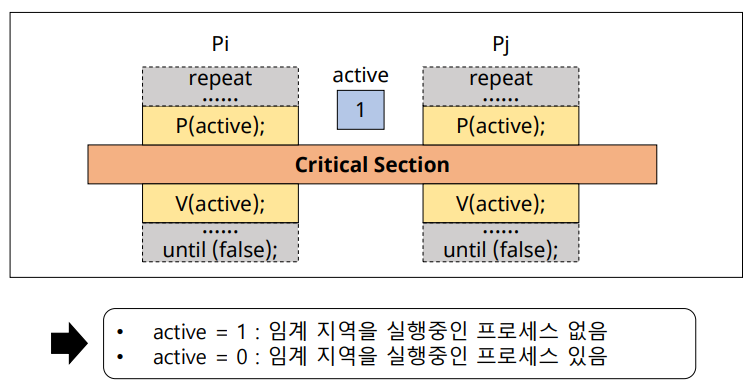
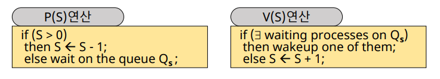
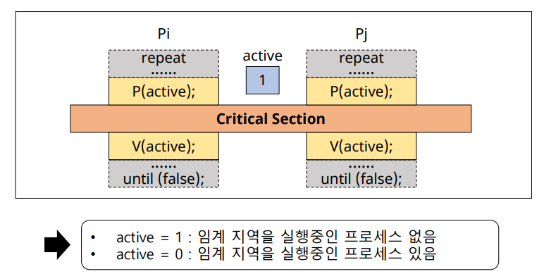
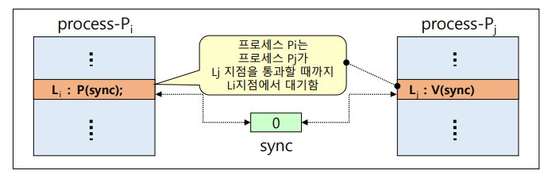
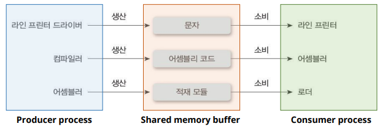
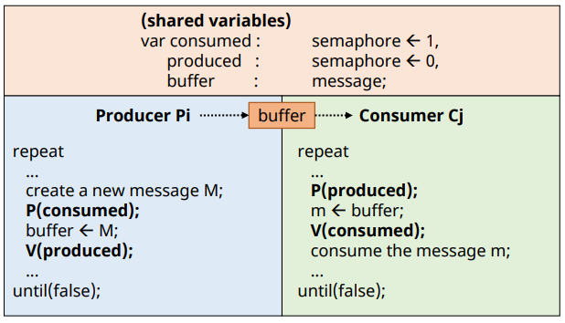
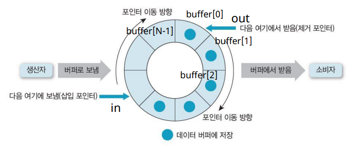
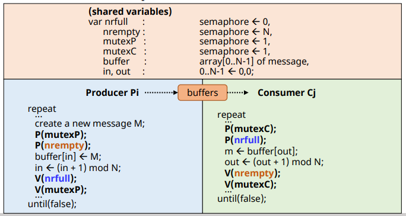
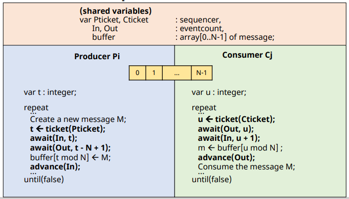

# Mutual Exclusion Solutions (OS supported SW solution)

## Spinlock

✔ **정수 변수**  
✔ 초기화, P(), V() 연산으로만 접근 가능
- 위 연산들은 indivisible (or atomic) 연산
  - OS support
  - **전체가 한 instruction cycle에 수행**됨

    

 

✔ P, V 연산을 통해 active 상태를 확인하고 임계영역에 진입한다  

### 특징

✔ 멀티 프로세스 시스템에서만 사용 가능    
✔ Busy waiting  
  - lock을 대기하는 동안 loop를 돌면서 busy waiting 상태로 대기

## Semaphore

✔ 1965년 Dijkstra가 제안  
✔ Busy waiting 문제 해결  

✔ **음이 아닌 정수형 변수(S)**
- 초기화 연산, P(), V()로만 접근 가능
  - P: Probern(검사)
  - V: Verhogen(증가)

✔ **임의의 S변수 하나에 ready queue 하나가 할당됨**  

### semaphore의 종류

✔ **Binary semaphore**
- S가 0과 1 두 종류의 값만 갖는 경우
- 상호배제나 프로세스 동기화의 목적으로 사용

✔ **Counting semaphore**
- S가 0 이상의 정수 값을 가질 수 있는 경우
- Producer-Consumer 문제 등을 해결하기 위해 사용
  - 생산자 - 소비자 문제

### 연산

✔ 초기화 연산: S변수에 초기값을 부여하는 연산

✔ P() 연산, V() 연산  

✔ 자원을 할당 받지 못하면 ready queue(대기실)에서 대기  
✔ 프로세스가 나갈 때 ready queue에 있는 프로세스 중 하나를 wake up 시킨다!

✔ 모두 indivisible 연산
  - OS support
  - 전체가 한 instruction cycle에 수행

### Semaphore로 해결할 수 있는 문제들

✔ 상호배제 문제 (Mutual exclusion)  
✔ 프로세스 동기화 문제 (process synchronization problem)  
✔ 생산자-소비자 문제 (producer-consumer problem)  
✔ Reader - writer problem  
✔ Dining philosopher problem  
✔ 기타  

### Mutual exclusion

### Process synchronization

✔ Process들의 실행 순서 맞추기
- 프로세스들은 병행적이며, 비동기적으로 수행

### Producer-Consumer problem

✔ 생산자 프로세스: 메세지를 생성하는 프로세스 그룹  
✔ 소비자 프로세스: 메세지를 전달받는 프로세스 그룹   

#### Producer-Consumer problem with Single Buffer

✔ 2개의 변수 생성 (consumed, produced)  

✔ producer는 buffer가 비어있는지 (consumed) 체크 후 buffer에 메세지(M) 넣기  
✔ 이후 produced 변수 0 -> 1

✔ consumer는 메세지가 있는지 (produced) 확인  
- 있으면 메세지 소비 후 cousumed 0 -> 1
- 없으면 깨워줄 때까지 ready queue에서 대기  

#### Producer-Consumer problem with N-Buffer

✔ buffer는 원형 큐 사용

  

✔ mutexP: producer / mutexC: consumer -> 상호배제 구현  

✔ nrfull: 차 있는 buffer의 수 / nrempty: 비어 있는 buffer의 수

✔ producer
- producer는 생산할 때 nrempty를 통해서 공간이 있는지(> 0) 확인
- 공간이 있으면 공간에 메세지를 넣고 원형큐의 위치 갱신 (없으면 ready queue)
- nrfull 변수 증가

✔ consumer
- 소비할 떄 nrfull을 통해 메세지가 있는지(> 0) 확인
- 메세지가 있으면 메세지를 가져가고 원형큐 위치 갱신(없으면 ready queue)
- nrempty 변수 증가

### Reader-Writer problem

✔ **Reader**
- 데이터에 대해 읽기 연산만 수행 

✔ **Writer**
- 데이터에 대해 갱신 연산을 수행 

✔ **데이터 무결성 보장 필요**
- reader들은 동시에 데이터 접근 가능
- writer들(또는 reader와 writer)이 동시 데이터 접근 시 상호배제(동기화) 필요

✔ 해결법
- reader/writer에 대한 **우선권** 부여
  - reader preference solution
  - writer preference solution

#### reader preference solution

✔ wmutex: writer / rmutex: reader  
✔ nreaders: reader의 수  

✔ Reader
- 자기가 처음 읽을 떄 writer 상호배제
- reader 수 증가
 

- 읽기는 여러 명이 해도 된다 (상호배제 x)
- 마지막으로 나갈 경우엔 writer 상호배제 해제

### 특징

✔ **No busy waiting**
- 대기하는 프로세스는 block(asleep) 상태가 된다  

✔ seamaphore queue에 대한 **wake-up 순서는 비결정적**
- starvation problem

## Eventcount / Sequencer

✔ 은행의 번호표와 비슷한 개념  

✔ **Sequencer**
- 정수형 변수
- 생성 시 0으로 초기화, 감소하지 않음
- 발생 사건들의 순서 유지
- ticket() 연산으로만 접근 가능

✔ **ticket(S)**
- 현재까지 ticket() 연산이 호출 된 횟수를 반환
- indivisible operation

✔ **Eventcount**
- 정수형 변수
- 생성 시 0으로 초기화, 감소하지 않음
- 특정 사건의 발생 횟수를 기록
- read(E), advance(E), await(E, v) 연산으로만 접근 가능

✔ **read(E)**
- 현재 Eventcount 값 반환

✔ **advance(E)**
- E <- E + 1
- E를 기다리고 있는 프로세스를 깨움 (wake-up)

✔ **await(E, v)**
- v는 정수형 변수
- if (E < v)이면 E에 연결된 Q_E에 프로세스 전달(push) 및 CPU scheduler 호출  

### Mutual exclusion

### producer-consumer problem

### 특징

✔ No busy waiting  
✔ **No starvation**
- FIFO scheduling for Q_E

✔ **Semaphore보다 더 low-level control(작업 순서) 가능**
