# Mutual Exclusion Solutions (Language-Level solution)

## High-level Mechanism

✔ **Monitor**  
✔ Path expressions  
✔ Serializers  
✔ Critical region, conditional critical region  

✔ **Language-level constructs**  
✔ Object-Oriented concept과 유사  
✔ 사용이 쉬움  

## Monitor

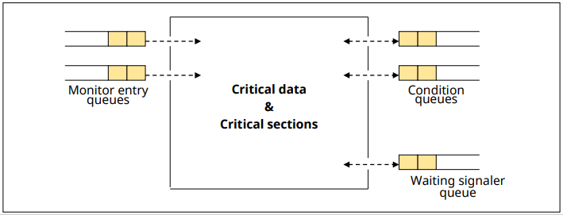

✔ **공유 데이터와 Critical section의 집합**  
✔ **Conditional variable**
    - wait(), signal(), operations

### Monitor의 구조

✔ **Entry queue(진입 큐)**
- 모니터 내의 proceure 수만큼 존재

✔ **Mutual exclusion**
- 모니터 내에는 항상 하나의 프로세스만 진입 가능

✔ **Information hiding(정보 은폐)**
- 공유 데이터는 모니터 내의 프로세스만 접근 가능

✔ **Condition queue(조건 큐)**
- 모니터 내의 특정 이벤트를 기다리는 프로세스가 대기  

✔ **Signaler queue(신호제공자 큐)**
- 모니터에 항상 하나의 신호제공자 큐가 존재
- signal() 명령을 실행한 프로세스가 임시 대기

### Monitor - 자원 할당 문제

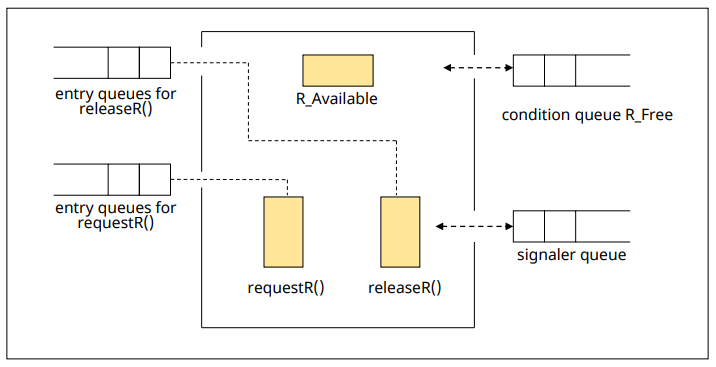

✔ 모듈 별로 ready queue 존재  
✔ 특정 이벤트 기다리는 condition queue  
✔ condition queue를 깨워줄(신호 제공) Signaler queue

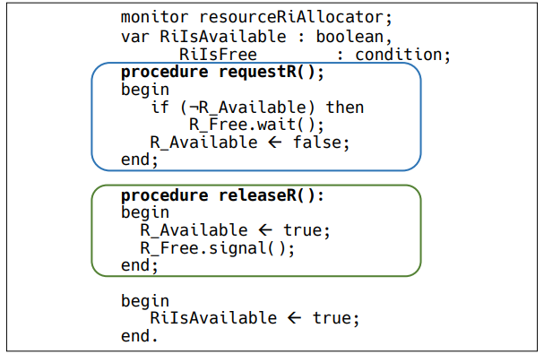

### 자원할당 시나리오

#### 초기 상태  

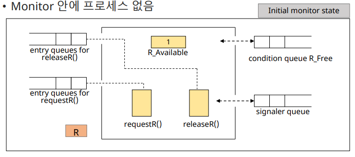  

✔ 자원 R 사용 가능  
✔ Monitor안에 프로세스 없음

#### state 1  
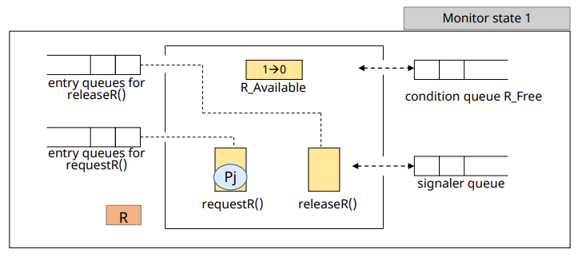

✔ 프로세스 P_j가 모니터 안에서 자원 R을 요청

#### state 2  

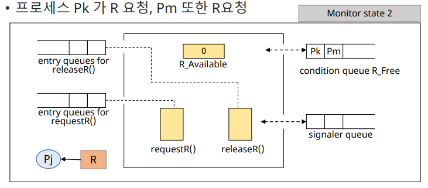

✔ 자원 R이 P_j에게 할당  
✔ 프로세스 P_k가 R 요청, P_m 또한 R 요청

#### state 3  

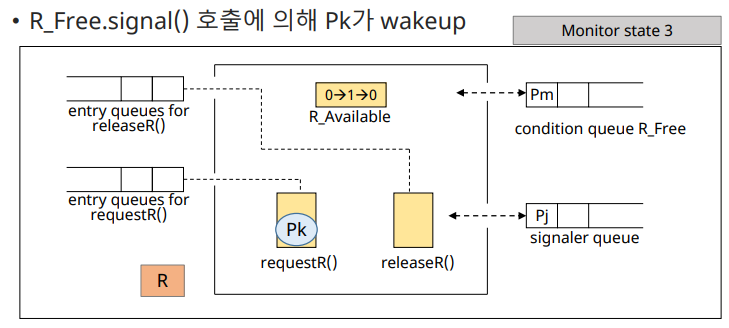

✔ P_j가 R반환  
✔ R_Free.signal() 호출에 의해 P_k가 wakeup

#### state 4  

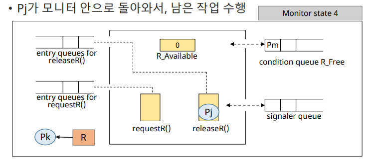

✔ 자원 R이 P_k에게 할당  
✔ P_j가 모니터 안으로 돌아와서, 남은 작업 수행

### Producer-Consumer problem

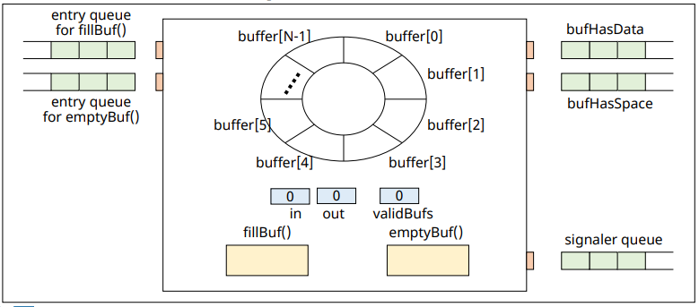

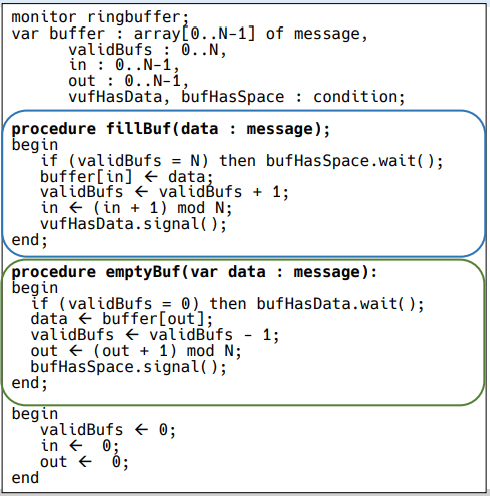

### Reader-Writer Problem

✔ reader/writer 프로세스들 간의 데이터 무결성 보장 기법  
✔ writer 프로세스에 의한 데이터 접근 시에만 상호 배제 및 동기화 필요  

✔ 모니터 구성
- 변수 2개
  - 현재 읽기 작업을 진행하고 있는 reader 프로세스의 수
  - 현재 writer 프로세스가 쓰기 작업을 진행 중인지 표시
- 조건 큐 2개
  - reader/writer 프로세스가 대기해야 할 경우에 사용
- 프로시져 4개
  - reader(writer) 프로세스가 읽기(쓰기) 작업을 원할 경우에 호출, 읽기(쓰기) 작업을 마쳤을 떄 호출

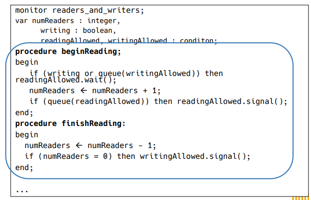

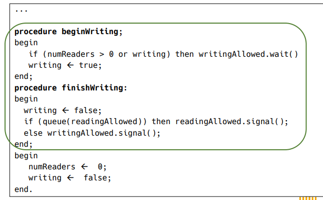

### Dining Philosopher Problem

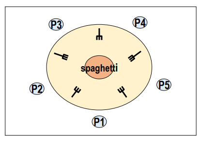

✔ 5명의 철학자  
✔ 철학자들은 두 가지 일만 반복: 생각하는 일/스파게티를 먹는 일  
✔ 공유자원: 스파게티, 포크  
✔ 스파게티를 먹기 위해서는 좌우 포크 2개 모두 들어야 한다  

---

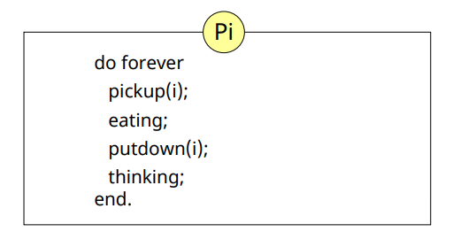

#### 코드로 구현

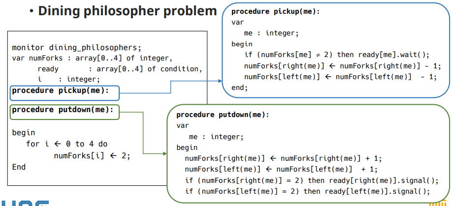

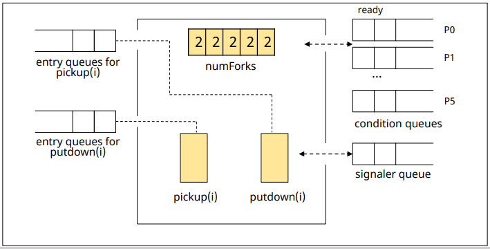

### 특징

✔ 장점
- 사용이 쉽다
- Deadlock 등 error 발생 가능성이 낮다  

✔ 단점
- 지원하는 언어에서만 사용 가능
- 컴파일러가 OS를 이해하고 있어야 한다
  - critical section 접근을 위한 코드 생성