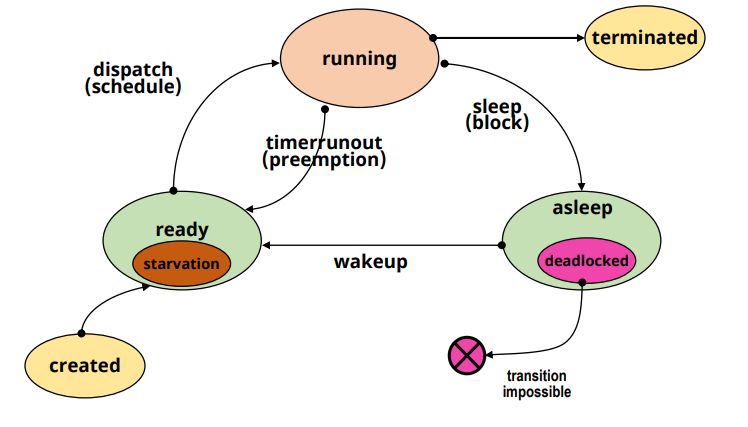

# Deadlock: Deadlock and Resource types

## Deadlock의 개념

✔ Blocked/Asleep state
- 프로세스가 특정 이벤트를 기다리는 상태
- 프로세스가 필요한 자원을 기다리는 상태

✔ **Deadlock state**
- **프로세스가 발생 가능성이 없는 이벤트를 기다리는 경우**
  - 프로세스가 deadlock 상태에 있음
- 시스템 내에 deadlock에 빠진 프로세스가 있는 경우
  - 시스템이 deadlock이 상태에 있음

✔ **starvation은 '운이 없어서' 프로세서를 할당받지 못한 상태일 뿐 발생 가능성이 없는 것은 아니다!!**

## 자원의 분류

✔ 일반적 분류: Hardware resources vs Software resources

✔ 다른 분류법(deadlock의 관점)
- **선점 가능 여부에 따른 분류**
- **할당 단위에 따른 분류**
- **동시 사용 가능 여부에 따른 분류**
- **재사용 가능 여부에 따른 분류**

### 선점 가능 여부에 따른 분류

✔ **Preemptible Resources**
- 선점 당한 후, 돌아와도 문제가 발생하지 않는 자원
- Processor, memory 등

✔ **Non-preemptible resources**
- 선점 당하면, 이후 진행에 문제가 발생하는 자원
  - Rollback, restart등 특별한 동작이 필요
- disk drive 등

### 할당 단위에 따른 분류

✔ **Total allocation resources**
- 자원 전체를 프로세스에게 할당
- Processor, disk drive 등

✔ **Partitioned allocation resources**
- 하나의 자원을 여러 조각으로 나누어, 여러 프로세스에게 할당
- Memory 등

### 동시 사용 가능 여부에 따른 분류

✔ **Exclusive allocation resources**
- 한 순간에 한 프로세스만 사용 가능한 자원
- Processor, memory, disk drive 등

✔ **Shared allocation resources**
- 여러 프로세스가 동시에 사용 가능한 자원
- Program(sw), shared data 등

### 재사용 가능 여부에 따른 분류

✔ **SR(Serially-reusable Resources)**
- 시스템 내에 항상 존재하는 자원
- 사용이 끝나면, 다른 프로세스가 사용 가능
- Processor, memory, disk drive, program 등

✔ **CR (Consumable Resources)**
- 한 프로세스가 사용한 후에 사라지는 자원
- signal, message 등

## Deadlock과 자원의 종류

✔ Deadlock을 발생시킬 수 있는 자원의 형태
- Non-preemptible resources
- Exclusive allocation resources
- Serially resusable resources
- 할당 단위는 영향을 미치지 않는다!

✔ CR을 대상으로 하는 Deadlock model
- 매우 복잡!