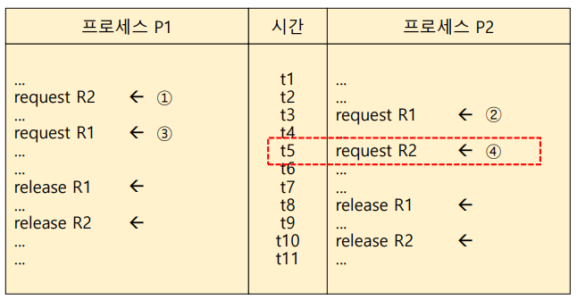
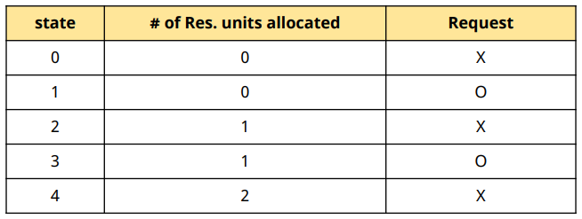
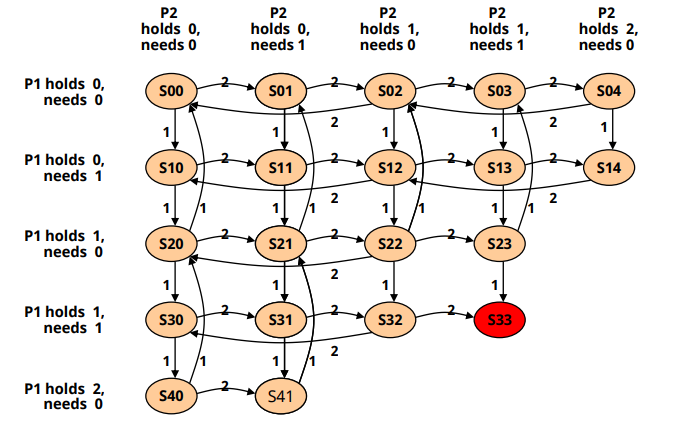

# Deadlock: Deadlock model

## Deadlock 발생의 예

✔ 2개의 프로세스(P1, P2)  
✔ 2개의 자원(R1, R2)

✔ P1은 P2가 가지고 있는 R1을, P2는 P1이 가지고 있는 R2를 요청하고 있다 -> 서로 발생 가능성이 없는 이벤트를 기다리고 있으므로 deadlock!

## Deadlock Model(표현법)

1. Graph Model
2. State Transition Model

### Graph Model

✔ Node
- 프로세스 노드(P1, P2), 자원 노드(R1, R2)

✔ Edge
- $R_j$ -> $P_i$: 자원 $R_j$이 프로세스 $P_i$에 **할당** 됨
- $P_i$ -> $R_j$: 프로세스 $P_i$가 자원 $R_j$을 **요청**(대기 중)

✔ **Cycle 생성 시 Deadlock!**

### State Transition Model

✔ 에제
- 2개의 프로세스와 Atype의 자원 2개(unit) 존재
- 프로세스는 한번에 자원 하나만 요청/반납 가능

✔ State: 프로세스가 1개일 때

✔ State: 프로세스가 2개일 때

## Deadlock 발생의 필요 조건

✔ **자원의 특성**
- Exclusive use of resources  
- Non - preemptible resources

✔ **프로세스의 특성**
- Hold and Wait(Partial allocation)
  - 자원을 하나 hold하고 다른 자원 요청
- Circular wait