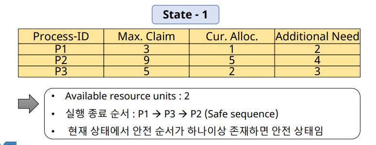
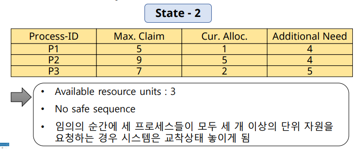
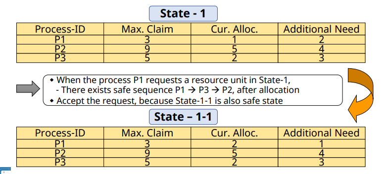
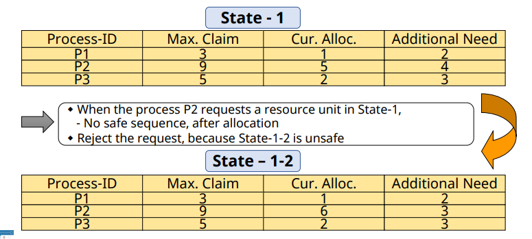
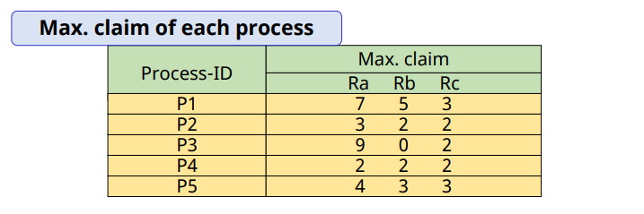
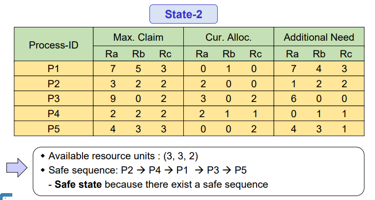
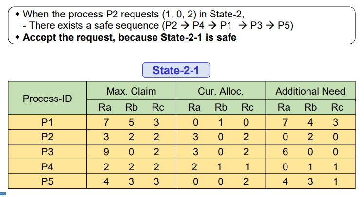
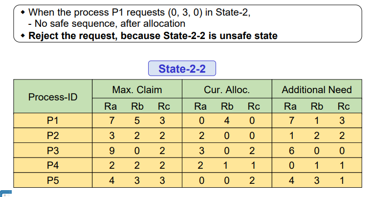

# Deadlock: Deadlock Avoidance

## Deadlock Avoidance: 개요

✔ 시스템의 상태를 계속 감시

✔ 시스템이 deadlock 상태가 될 가능성이 있는 자원 할당 요청 보류

✔ 시스템을 항상 **safe state**로 유지

### Safe State

✔ **Safe state**
- **모든 프로세스가 정상적 종료 가능한 상태**
- Safe sequence가 존재
  - Deadlock 상태가 되지 않을 수 있음을 보장

✔ **Unsafe state**
- Deadlock 상태가 될 가능성이 있음
- 반드시 발생한다는 의미는 아니다

### 가정

✔ 프로세스의 수가 고정됨  
✔ 자원의 종류와 수가 고정됨  
✔ 프로세스가 요구하는 자원 및 최대 수량을 알고 있음  
✔ 프로세스는 자원을 사용 후 반드시 반납  

✔ **Not practical**

### Algorithms

1. Dijkstra's algorithm (Banker's algorithm)
2. Habermann's algorithm

## Dijkstar's Banker's algorithm

✔ Deadlock avoidance를 위한 간단한 이론적 기법

✔ 가정: 한 종류의 자원이 여러 개

✔ 시스템을 항상 safe state로 유지

✔ 1 resource type R, 10 resource units, 3 processes

### safe state example

### unsafe state example

---

✔ 자원 요청 이후에도 safe state가 유지될 수 있으면 요청 승낙  

✔ 자원 요청 이후에 unsafe state가 되면 요청 거절  

## Habermann's algorithms

✔ Dijkstar's algorithm의 확장  
✔ 여러 종류의 자원 고려
- Multiple resource types
- Multiple resource units for each resource type

✔ **시스템을 항상 safe state로 유지**

### Example

✔ 3 types of resource: $R_a, R_b, R_c$  
✔ Number of resouce units for each type: (10, 5, 7)  
✔ 5 processes

---

✔ Dijkstra's algorithm과 기본 원리는 동일하다 (safe -> accept / unsafe -> reject)

## Deadlock Avoidance 정리

✔ Deadlock의 발생을 막을 수 있음  

✔ **High overhead**
- 시스템을 항상 감시하고 있어야 한다

✔ **Low resource utilization**
- Safe state 유지를 위해, 사용 되지 않는 자원이 존재

✔ **Not practical**
- 비현실적 가정
  - 프로세스 수, 자원 수가 고정
  - 필요한 최대 자원 수를 알고 있음

