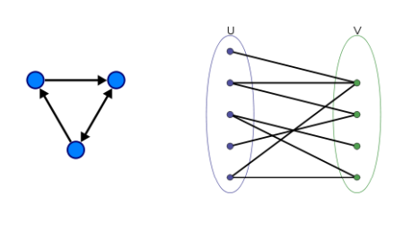
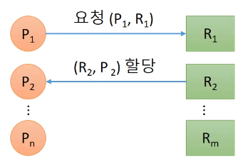
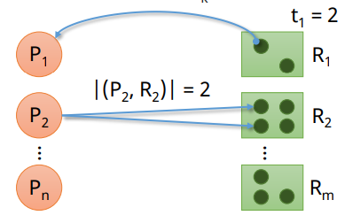
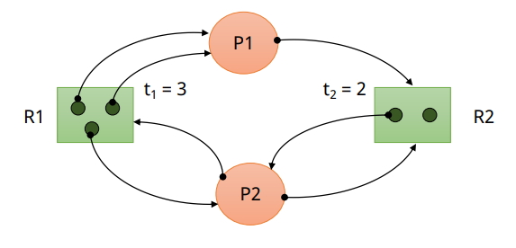
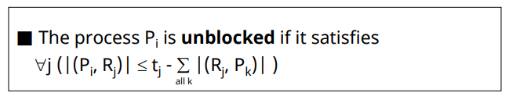
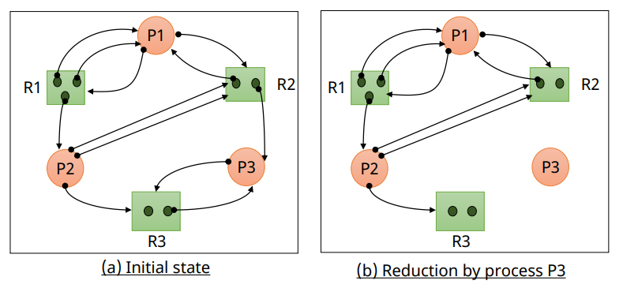
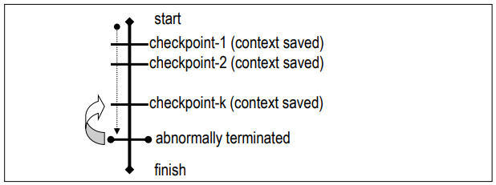

# Deadlock: Deadlock Detection and Recovery

## Deadlock Detection

✔ **Deadlock 방지를 위한 사전 작업을 하지 않음**
- Deadlock이 발생 가능

✔ **주기적으로 deadlock 발생 확인**
- 시스템이 deadlock 상태인가?
- 어떤 프로세스가 deadlock 상태인가?

✔ **Resource Allocation Graph(RAG) 사용**

### Resource Allocation Graph(RAG)

✔ Deadlock 검출을 위해 사용  
✔ Directed, Bipartite Graph

---

✔ Directed graph G = (N, E)
- N = $\{N_p, N_r\}$ where
  - $N_p$ is the set of processes = $\{P1, P2, ..., P_N\}$
  - and $N_r$ is the set of resources = $\{R1, R2, ..., R_m\}$

---

✔ Edge는 $N_p$와 $N_r$ 사이에만 존재
- $e = (P_i, R_j)$: 자원 요청
- $e = (R_j, P_i)$: 자원 할당

---

✔ $R_k$: k type의 자원  
✔ $t_k$: $R_k$의 단위 자원 수
- For each $R_k ∈ N_r, ∃ T_k$ which is the number of units of $R_k$

✔ |(a, b)|: (a, b) edge의 수

---

✔ RAG example

### Deadlock Detection Method

✔ **Graph reduction**
- 주어진 RAG에서 edge를 하나씩 지워가는 방법

- **Completely reduced**
  - 모든 edge가 제거 됨
  - Deadlock에 빠진 프로세스가 없음

- **Irreducible**
  - 지울 수 없는 edge가 존재
  - 하나 이상의 프로세스가 deadlock 상태

### Graph Reduction

✔ **Unblocked process**
- 필요한 자원을 모두 할당 받을 수 있는 프로세스
- $P_i$가 요청하는 모든 자원의 수가 해당 자원들의 현재 남아있는 수보다 적은 경우 unblocked

#### Graph Reduction Procedure

1. Unblocked process 에 연결된 모든 edge제거
2. 더 이상 unblocked process가 없을 때까지 1 반복

✔ 최종 graph에서...
1. 모든 edge가 제거 됨(Completely reduced)
   - 현재 상태에서 deadlock이 없음
2. 일부 edge가 남음(irreducible)
   - 현재 deadlock이 존재

#### example 1

#### example 2

#### Graph Reduction 정리

✔ **High Overhead**
- 검사 주기에 영향을 받음
- Node의 수에 영향을 받음

✔ Low overhead deadlock detection methods(special case)
- single unit resources(Cycle detection)
- single unit request in expedient state(knot detection)

### Deadlock Avoidance ve Detection

✔ **Deadlock Avoidance**
- 최악의 경우를 생각: 앞으로 일어날 일을 고려
- Deadlock이 발생하지 않음

✔ **Deadlock Detection**
- 최선의 경우를 생각: 현재 상태만 고려
- Deadlock 발생 시 Recovery 과정이 필요

## Deadlock Recovery

✔ Deadlock을 검출 한 후 해결하는 과정

### Deadlock Recovery Methods

1. **Process termination**
   - Deadlock 상태에 있는 프로세스를 종료 시킴
   - 강제 종료 된 프로세스는 이후 재시작 됨

2. **Resource preemption**
   - Deadlock 상태 해결 위해 선점할 자원 선택
   - 선정 된 자원을 가지고 있는 프로세스에서 자원을 빼앗음
     - 자원을 빼앗긴 프로세스는 강제 종료 됨

### Process Termination

✔ **Deadlock 상태인 프로세스 중 일부 종료**

✔ **Termination cost model**
- 종료 시킬 deadlock 상태의 프로세스 선택
- Termination cost
  - 우선순위 (Process priority)
  - 종류 (Process type)
  - 총 수행 시간 (Accumulated execution time of the process)
  - 남은 수행 시간 (Remaining time of the process)
  - 종료 비용 (Accounting cost)
  - Etc.

✔ Process termination

- **Lowest-termination cost process first**
  - Simple
  - Low overhead
  - 불필요한 프로세스들이 종료 될 가능성

- **Minimum cost recovery**
  - 최소 비용으로 deadlock 상태를 해소 할 수 있는 process 선택 (모든 경우의 수 고려)
  - Complex
  - High overhead($O(2^k)$)

### Resource Preemption

✔ deadlock 상태 해결을 위해 선점할 자원 선택  
✔ 해당 자원을 가지고 있는 프로세스를 종료 시킴
- **Deadlock 상태가 아닌 프로세스가 종료 될 수도 있음**
- **해당 프로세스는 이후 재시작**

✔ **선점할 자원 선택**
- Preeption cost model 필요
- Minimul cost recovery method 사용 ($O(r)$)

### Checkpoint-restart method

✔ 프로세스의 수행 중 특정 지점(checkpoint)마다 context 저장  

✔ Rollback을 위해 사용
- 프로세스 강제 종료 후, 가장 최근의 checkpotint에 저장
