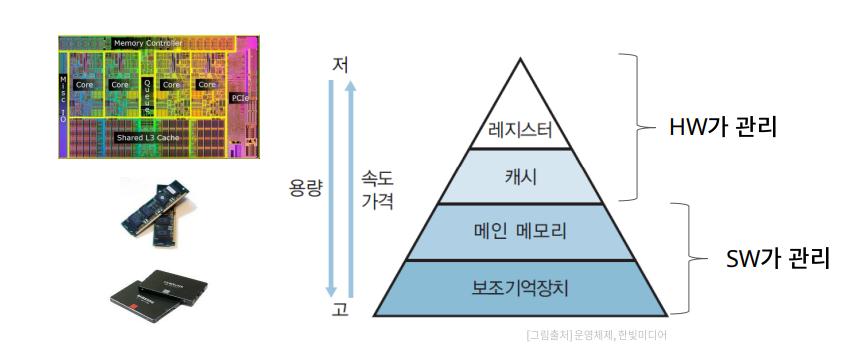
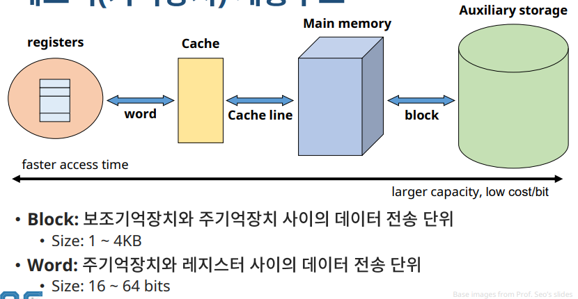
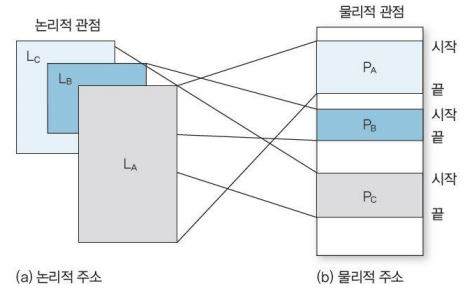
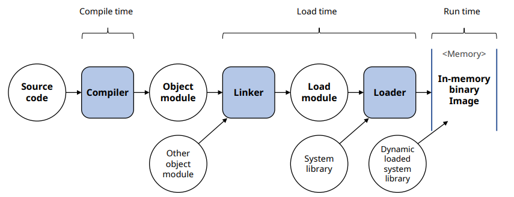
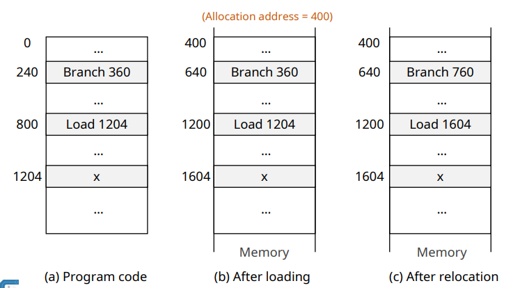
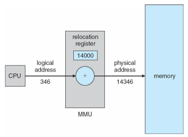
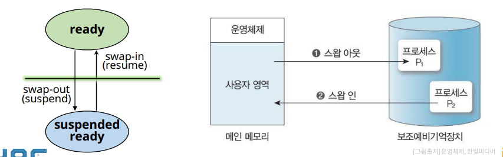

# Memory Management: Backgrounds

## 메모리(기억장치)의 종류

✔ 계층적 구조를 가지고 있다!!

## 메모리(기억장치) 계층구조

## Address Binding

✔ 프로그램의논리 주소를 실제 메모리의 물리 주소로 매핑(mapping)하는 작업

✔ Binding 시점에 따른 구분
- Compile time binding
- Load time binding
- Run time binding

✔ User Program Processing Steps

### Compile time binding

✔ 프로세스가 메모리에 적재될 위치를 컴파일러가 알 수 있는 경우
  - 위치가 변하지 않음
  
✔ 프로그램 전체가 메모리에 올라가야 한다

### Load time binding

✔ 메모리 적재 위치를 컴파일 시점에서 모르면, **대체 가능한 상대 주소**를 생성

✔ **적재 시점(load time)에 시작 주소를 반영하여 사용자 코드 상의 주소를 재설정**
- 프로그램 전체가 메모리에 올라가야함

### Run time binding

✔ Address binding을 **수행시간까지 연기**
- 프로세스가 수행 도중 다른 메모리 위치로 이동할 수 있음

✔ HW의 도움이 필요
- MMU: Memory Management Unit

✔ 대부분의 OS가 사용

## Dynamic Loading

✔ **모든 루틴을 교체 가능한 형태로 디스크에 저장**  
✔ **실제 호출 전까지는 루틴을 적재하지 않음**
- 메인 프로그램만 메모리에 적재하여 수행
- 루틴의 호출 시점에 address binding 수행

✔ 메모리 공간의 효율적 사용

## Swapping

✔ **프로세서 할당이 끝나고 수행 완료 된 프로세스는 swap device로 보내고(Swap-out)**  
✔ **새롭게 시작하는 프로세스는 메모리에 적재 (Swap-in)**