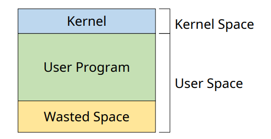
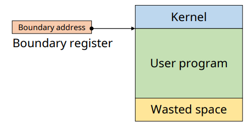
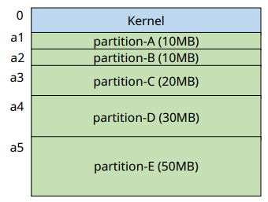
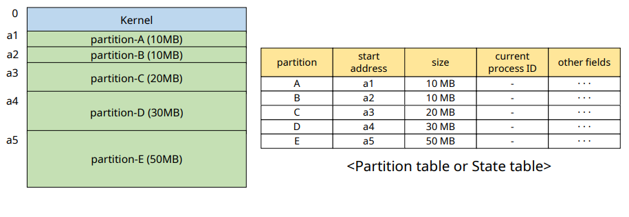
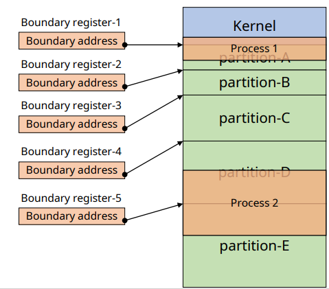

# Memory Management - Fixed Partition Multiprogramming

## Memory Allocation

✔ **Continuous Memory Allocaiotn(연속 할당)**
- Uni-programming
- Multi-programmoing
  - Fixed partition(FPM)
  - Variable partition(VPM)

✔ **Non-continuous Memory Allocation(비연속 할당)**
- Chapter.9

## Continuous Memory Allocation

✔ **프로세스 (context)를 하나의 연속된 메모리 공간에 할당하는 정책**
- 프로그램, 데이터, 스택 등

✔ **메모릭 구성 정책**
- 동시에 올라갈 수 있는 프로세스 수(Multiprogramming degree)
- 각 프로세스에게 할당되는 메모리 공간 크기
- 메모리 분할 방법

---

1. Uni-programming
   
2. Multi-programmoing
    - Fixed partition(FPM)
    - Variable partition(VPM)

## Uni-Programming

✔ **하나의 프로세스만 메모리 상에 존재**  
✔ **가장 간단한 메모리 관리 기법**

### 문제점 1: 프로그램의 크기 > 메모리 크기  

✔ 해결법: **Overlay Structure**
- 메모리에 **현재 필요한 영역만 적재**
- **사용자**가 프로그램의 흐름 및 자료구조를 모두 알고 있어야 한다.

### 문제점 2: 커널(Kernel) 보호

✔ 해결방법: **경계 레지스터(Boundary register) 사용**

### 문제점 3

✔ Low system resource utilization  
✔ Low system performance

✔ 해결방법: **Multi programming**

## Multi-Programming (Fixed Partition Multiprogramming)

✔ **메모리 공간을 고정된 크기로 분할**
- 미리 분할되어 있다

✔ **각 프로세스는 하나의 partition(분할)에 적재**
- Process : Partition = 1:1

✔ **Partition의 수  = K**
- Multiprogramming degree = K

### 자료구조의 예

### 커널 및 사용자 영역 보호

✔ 영역 침범 방지

### Fragmentation (단편화)

✔ **Internal fragmentation**
- 내부 단편화
- Partition 크기 > Process 크기
  - 메모리가 낭비 된다

✔ **External fragmentation**
- 외부 단편화
- (남은 메모리 크기 > Process 크기)지만, 연속된 공간이 아님
  - 메모리가 낭비 된다

### 요약

✔ 고정된 크기로 메모리 미리 분할  
✔ 메모리 관리가 간편함(Low overhead)  
✔ 시스템 자원이 낭비 될 수 있음 (단편화)