# Memory Management - Variable Partition Multi-programming

## Multi-Programming (Variable Partition Multiprogramming)

✔ 초기에는 전체가 하나의 영역  
✔ **프로세스를 처리하는 과정에서 메모리 공간이 동적으로 분할**

✔ **No internal fragmentation**

### VPM Example

✔ Memory space: 120 MB

#### 1. 초기상태

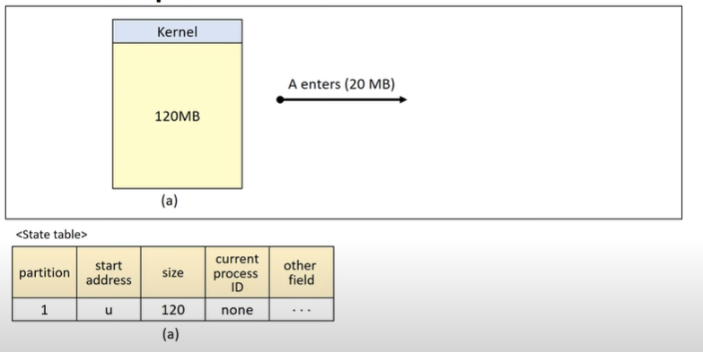

#### 2. 프로세스 A(20MB) 적재

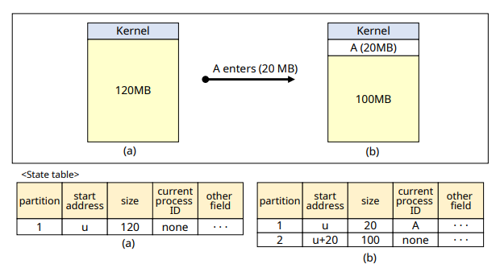

#### 3. 프로세스 B(10MB) 적재

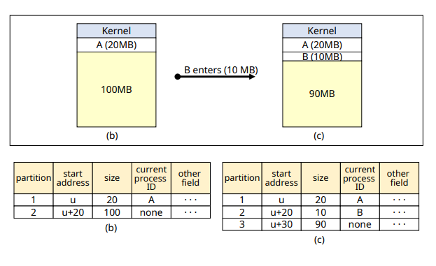

#### 4. 프로세스 C(25MB) 적재

#### 5. 프로세스 D(20MB) 적재

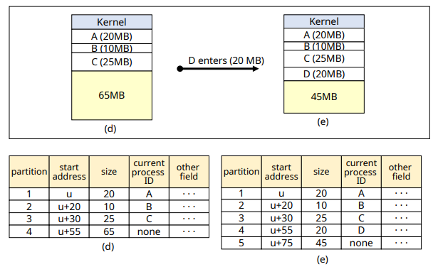

#### 6. 프로세스 B가 주기억장치 반납

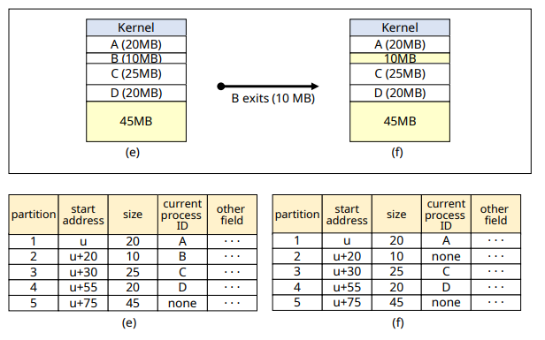

#### 7. 프로세스 E(15MB) 적재

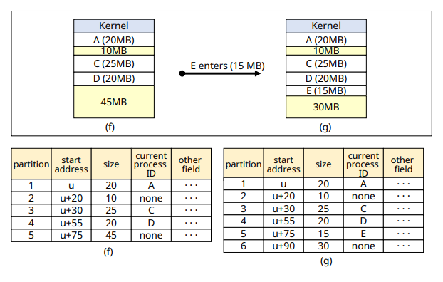

#### 8. 프로세스 D가 주기억장치 반납

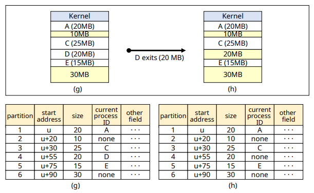

#### 9. 어디에 배치할 것인가...?

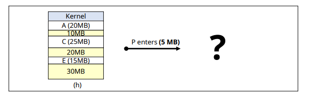

### Placement Strategies(배치 전략)

#### 1. First-fit(최초 적합)

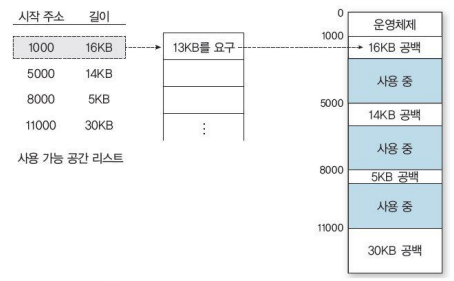

✔ 충분한 크기를 가진 첫 번째 partition 선택  
✔ simple and low overhead  
✔ 공간 활용률이 떨어질 수 있ㅇ므

#### 2. Best-fit(최적 적합)

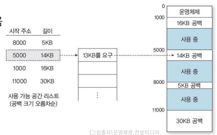

✔ Process가 들어갈 수 있는 partition 중 가장 작은 곳 선택  
✔ 탐색 시간이 오래 걸림(모든 partition 탐색)  
✔ 크기가 큰 partition 유지 가능  
✔ 활용하기 너무 작은 partition 많이 발생

#### 3. Worst-fit(최악 적합)

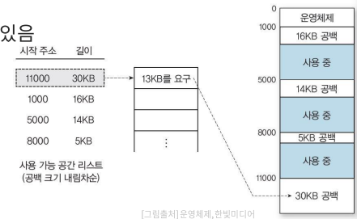

✔ Process가 들어갈 수 있는 partition 중 가장 큰 곳 선택  
✔ 탐색 시간이 오래 걸림(모든 partition 탐색)  
✔ 작은 크기의 partition 발생 줄일 수 있음  
✔ 큰 프로세스에 필요한 큰 크기의 parition 확보 어려움  

#### 4. Next-fit(순차 최초 적합)

✔ 최초 적합 전략과 유사  
✔ state table에서 마지막으로 탐색한 위치부터 탐색  
✔ 메모리 영역의 사용 빈도 균등화  
✔ Low overhead

### Coalescing holes (공간 통합)

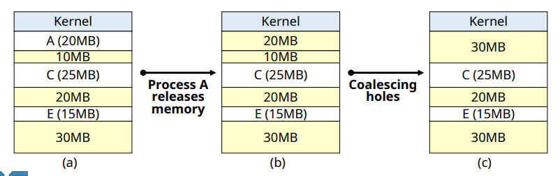

✔ **인접한 빈 영역을 하나의 partition으로 통합**
- process가 memory를 release하고 나가면 수행
- Low overhead

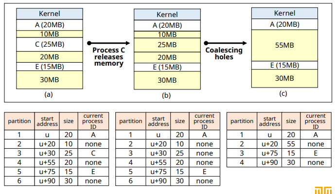

### Storage compaction(메모리 압축)

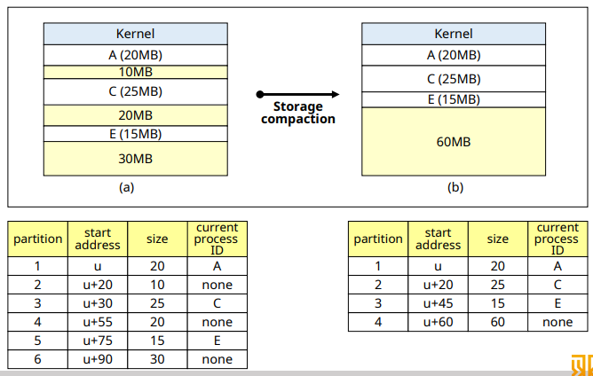

✔ **모든 빈 공간을 하나로 통합**  
✔ **프로세스 처리에 필요한 적재 공간 확보가 필요할 때 수행**

✔ **high overhead**
- 모든 process 재배치
- 많은 시스템 자원 소비