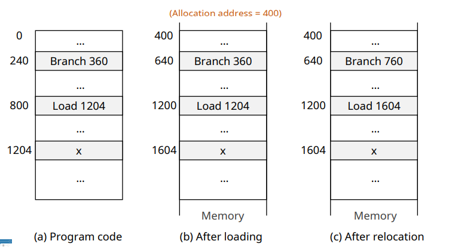
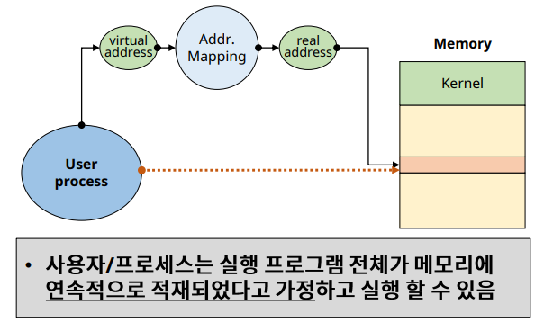
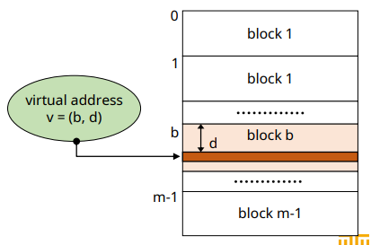
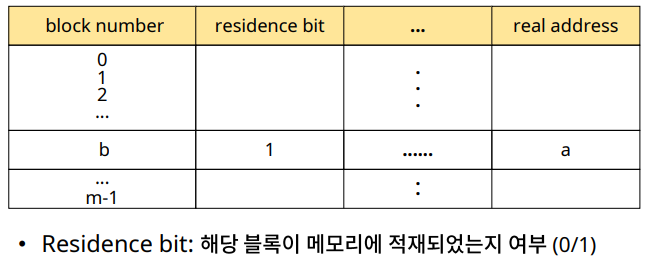
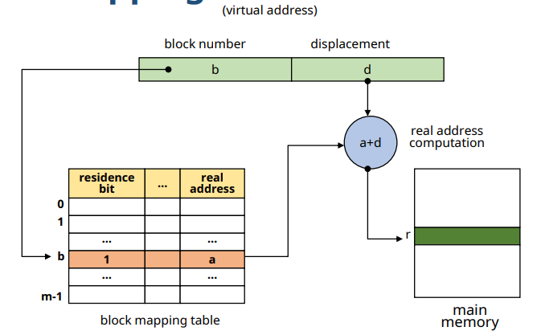
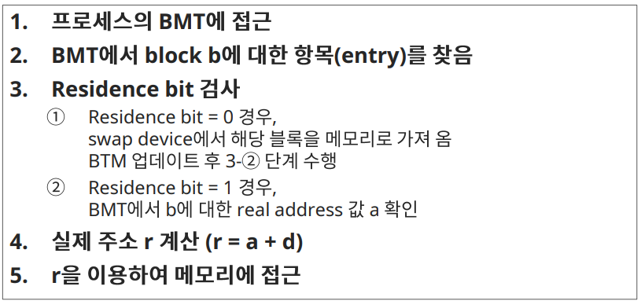

# Virtual Memory: Non-continuous allocation 

## Virtual Storage(Memory)

✔ Non-continuous allocation  
✔ 사용자 프로그램을 여러 개의 block으로 분할

✔ **실행 시, 필요한 block들만 메모리에 적재**
- 나머지 block들은 swap device에 존재

✔ 기법
- paging system
- segmentation system
- Hybrid paging/segmentation system

## Address mapping

### Continuous allocation

✔ Relative address (상대 주소)
  - 프로그램의 시작 주소를 0으로 가정한 주소

✔ Reloacation (재배치)
- 메모리 할당 후, 할당된 주소(allocation address)에 따라 상대 주소들을 조정하는 작업

### Non-continuous allocation

✔ **Virtual address (가상주소)** = relative address
- Logical address (논리주소)
- 연속된 메모리 할당을 가정한 주소

✔ Real address(실제주소) = absolute(physical)
- 실제 메모리에 적재된 주소
- 

✔ **Address mapping**
- Virtual address -> Real address

## Block Mapping

✔ **사용자 프로그램을 block 단위로 분할/관리**
- 각 block 에 대한 address mapping 정보 유지

✔ Virtual address:v = (b, d)
- b = block number
- d = displacement(offset) in a block

### Block Map Table(BMT)

✔ Address mapping 정보 관리
- Kernel 공간에 프로세스마다 하나의 BMT를 가짐

### 예시

