# Virtual Memory: Paging system

## Paging System

✔ **프로그램을 같은 크기의 블록으로 분할(Pages)**

✔ Terminologies
- Page: 프로그램의 분할된 block
- Page frame: 메모리의 분할 영역(Page와 같은 크기로 분할)

### 특징

✔ 논리적 분할이 아님(크기에 따른 분할)
- Page 공유(sharing) 및 보호(protection) 과정이 비교적 복잡

✔ Simple and Efficient
- Segmentation 대비

✔ No external fragmentation
- Internal fragmentation 발생 가능

## Address Mapping

✔ Virtual address: v = (p, d)
- p: page number
- d: displacement(offset)

✔ Address mapping
- PMT(Page Map Table)

✔ Address mapping mechanism
- Direct mapping(직접 사상)
- ASsociative mapping(연관 사상)
  - TLB(Translation Look-aside Buffer)
- Hybrid direct/associative mapping 

### Page Map Table(PMT)

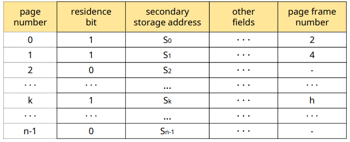

✔ secondary storage address: swap device 상에 저장된 위치

### Direct Mapping

✔ Block mapping과 유사  
✔ 가정
- PMT를 커널 안에 저장
- PMT entry size = entrySize
- Page size = pageSize

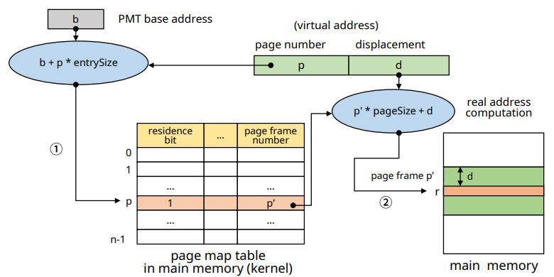

✔ Residence bit = 0인 경우 **page fault** 발생 -> 해당 page 메모리에 적재

#### Page Fault

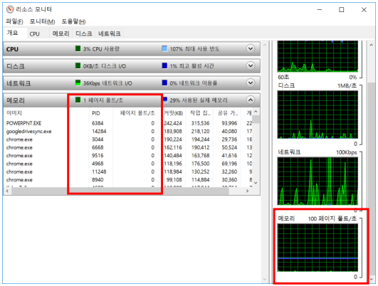

✔ swap device -> 메모리 적재는 일종의 disk I/O과정

✔ I/O: running -> asleep/block -> ready
- Context switching 발생

### 문제점과 해결방안

✔ 문제점
- **메모리 접근 횟수가 2배 (성능 저하)**
- PMT를 위한 메모리 공간 필요

✔ 해결방안
- **Associative mapping(TLB)**
- PMT를 위한 전용 기억장치(공간) 사용
  - Dedicated register of cache memory
- Hierarchical paging
- Hashed page table
- Inverted page table

### Associatice Mapping

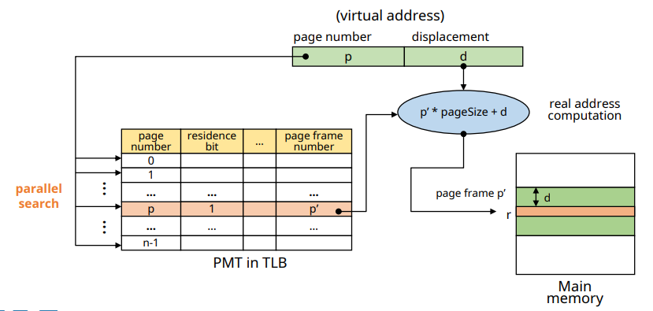

✔ **TLB(Translation Look-aside Buffer)에 PMT 적재**
- Associative high-speed memory

✔ **PMT를 병렬 탐색**

✔ Low overhead, high speed 

✔ Expensive hardware
- 큰 PMT 다루기 어려움

### Hybrid Direct/Associative Mapping

✔ **두 기법을 혼합하여 사용**
- HW 비용은 줄이고, Associative Mapping의 장점 활용

✔ **작은 크기의 TLB 사용**
- PMT: 메모리(커널 공간)에 저장
- TLB: PMT에 일부 entry들을 적재
  - 최근에 사용된 page들에 대한 저장

✔ **Locality(지역성) 활용**

### 작동 원리

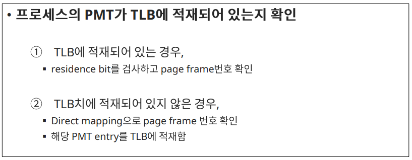

## Memory Management

✔ **Page와 같은 크기로 미리 분할하여 관리/사용**
- Page frame
- FPM 기법과 유사

### Frame table

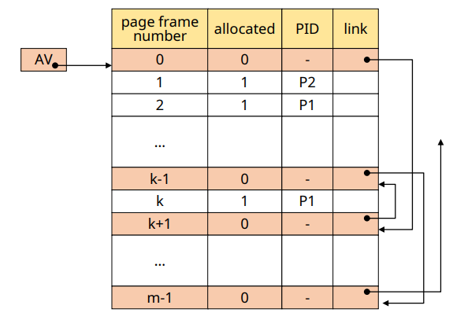

✔ Page frame당 하나의 entry

✔ 구성
  - **Allocated/available field**
  - **PID field**
  - **Link field**: for free list(사용 가능한 fp들을 연결)
  - **AV**: Free list header(free list의 시작 지점)

✔ 일종의 linked-list

## Page Sharing

✔ **여러 프로세스가 특정 page를 공유 가능**
- Non-continuous allocation

✔ **공유 가능 page**
1. **Procedure pages**
   - Pure code (reenter code)

2. **Data page**
   - Read-only data
   - Read-write data (병행성(concurrency) 제어 기법 관리 하에서만 가능)

### 예시

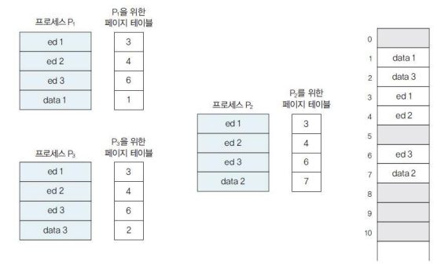

✔ Editor 프로그램을 3명이 사용하는 경우

✔ editor program(code)는 하나의 page만 올려두고 공유

✔ 작성하는 data만 다른 곳에 저장

### Data Page Sharing

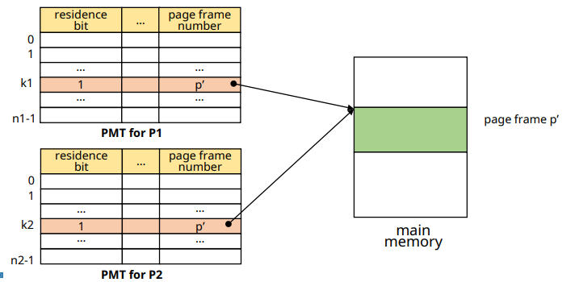

✔ 다른 프로세스가 각자 PMT에서 공유하고자 할 data에 대해 같은 page frame number 활용

### Procedure Page Sharing(Problem)

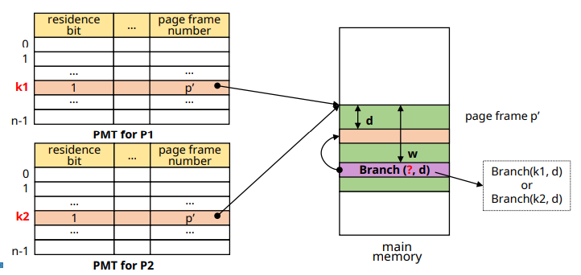

✔ 메모리 상의 같은 공간을 다른 page number가 가리키고 있다

#### solution

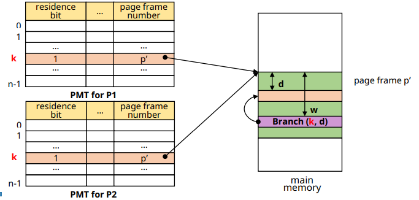

✔ 프로세스들이 shared page에 대한 정보를 PMT의 같은 entry에 저장하도록 한다 (같은 이름)

## Page Protection

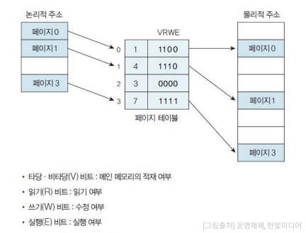

✔ **여러 프로세스가 page를 공유 할 때**
- Protection bit 사용
- 프로세스의 접근 권한을 bit로 표현

## Summary

✔ **프로그램을 고정된 크기의 block으로 분할(page) / 메모리를 block size로 미리 분할(page frame)**
- 외부 단편화 문제 없음
- 메모리 통합 / 압축 불필요
- 프로그램의 논리적 구조 고려 x (page sharing/protection 복잡)

✔ **필요한 page만 page frame에 적재하여 사용**
- 메모리의 효율적 활용

✔ **Page mapping overhead**
- 메모리 공간 및 추가적인 메모리 접근 필요
- 전용 HW 활용으로 해결 가능(비용 고려)