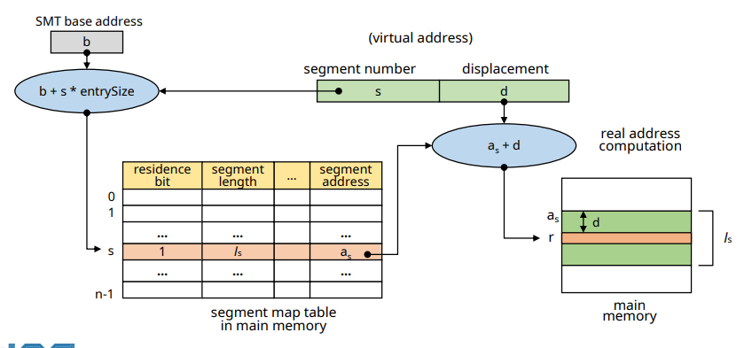
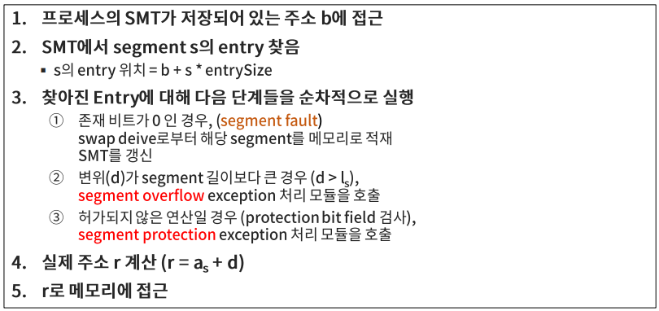
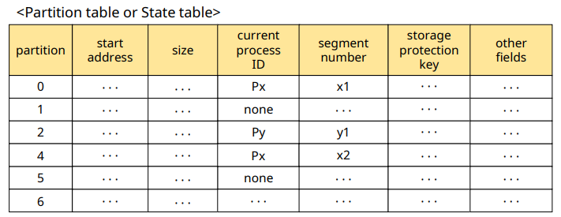
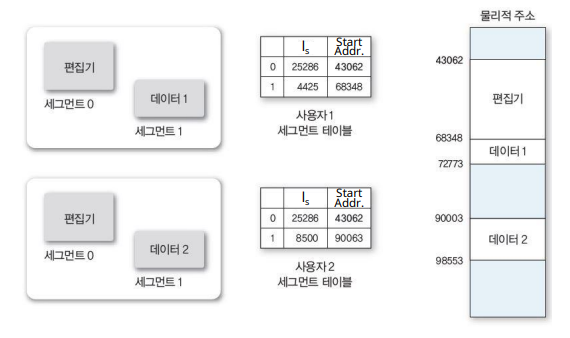

# Virtual Memory: Segmentation System

## Segmentation System

✔ 프로그램을 논리적 block으로 분할(segment)
- Block의 크기가 서로 다를 수 있다

### 특징

✔ 메모리를 미리 분할하지 않는다 (VPM과 유사)

✔ Segment sharing/protection이 용이

✔ Address mapping 및 메모리 관리의 overhead가 크다

✔ No internal fragmentation
- External fragmentation 발생 가능

## Address Mapping

✔ Virtual address : v = (s, d)
- s: segment number
- d: displacement in a segemtn  

✔ Segment Map Tagble(SMT)  
✔ Address mapping mechanism

### Segment Map Table

✔ Segmment length  
✔ Protection bits: 프로세스의 권한 

### Direct Mapping

✔ **segment fault**  
✔ **segment overflow**: 세그먼트를 벗어나는 지점에 접근하려는 경우  
✔ **segment protection**

## Memory Management

✔ VPM과 유사

✔ Segment 적재 시, 크기에 맞추어 분할 후 적재

## Segment Sharing / Protection

✔ Segment system은 **논리적으로 분할되어 있어, 공유 및 보호가 용이하다**
- protection bit
  

## Summary

✔ **프로그램을 논리 단위로 분할(segment) / 메모리를 동적으로 분할**  
- 내부 단편화 x
- sharing/protection 용이
- paging system 대비 관리 overhead 큼

✔ **필요한 segment만 메모리에 적재하여 사용**
- 메모리의 효율적 활용

✔ **Segment mapping overheae**
- 메모리 공간 및 추가적인 메모리 접근 필요
- 전용 HW 활용으로 해결 가능

### Paging vs Segmentation

|Paging System|Segmentation System|
|:---:|:---:|
|**No logical concept for patitioning**|**Logical concept for partitioning**|
|Simple / Low overhead|High management overhead|
|Complex page sharing mechanism|Simple and easy sharing mechanism|