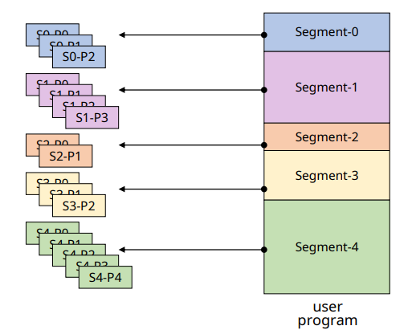
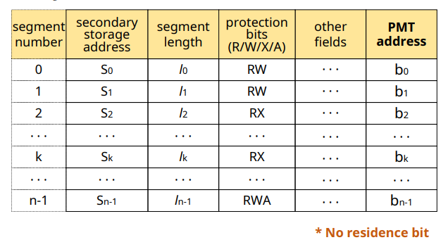
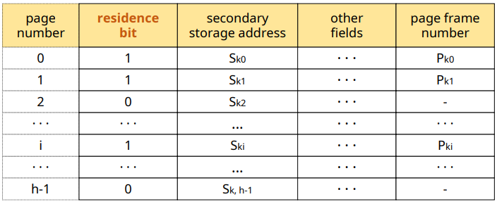
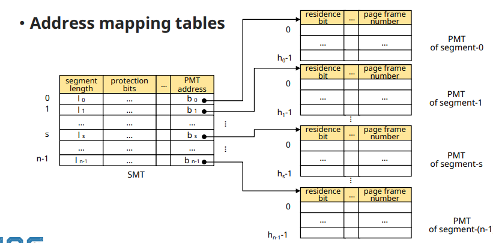
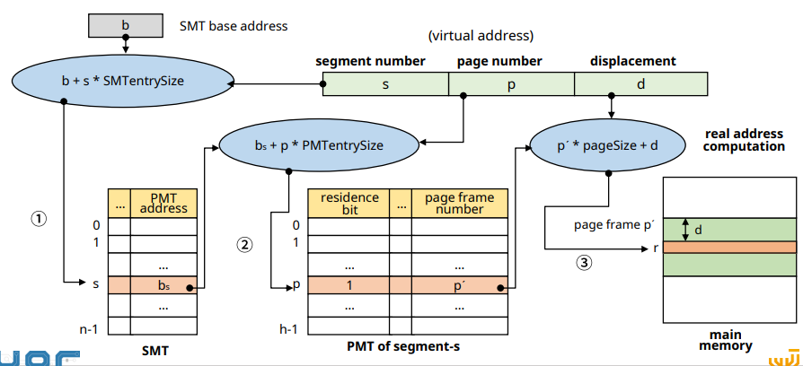

# Virtual Memory: Hybrid Paging-Segmentation System 

##  Hybrid Paging-Segmentation System 

✔ **Paging과 Segmentation의 장점 결합**

✔ **프로그램 분할**
1. 논리 단위의 segment로 분할
2. 각 segment를 고정된 크기의 page들로 분할

✔ **Page 단위로 메모리에 적재**

## Address Mapping

✔ Virtual address: v = (s, p, d) 
- s: segment number
- p: page number
- d: offset in a page

✔ SMT와 PMT 모두 사용
- 각 프로세스마다 하나의 SMT
- 각 segment마다 하나의 PMT

✔ Address mapping
- Direct, associated 등

✔ 메모리 관리
- FPM과 유사

### SMT in hybrid mechanism

✔ **Residenc bit x: 메모리에** 올라가는 건 segment가 아닌 page

### PMT for a segment k in hybrid mechanism

### Address Mapping Tables

### Direct(address) Mapping

## Summary

✔ **논리적 분할(segment)와 고정 크기 분할(page)을 결합**
- page sharing/protection이 쉬움
- 메모리 할당/관리 overhead가 작음
- No external fragmentation

✔ **전체 테이블의 수 증가**
- 메모리 소모 증가
- Address mapping 과정 복합

✔ **Direct Mapping의 경우 메모리 접근이 3배**
- 성능이 저하될 수 있음

