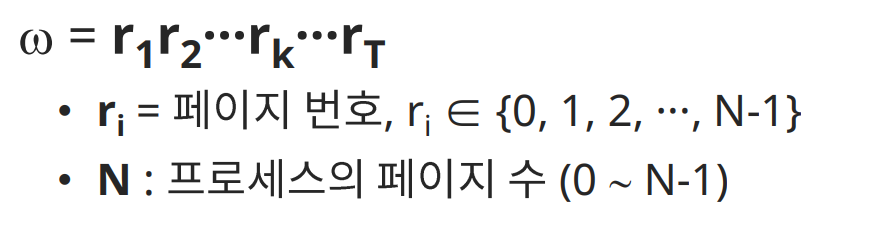
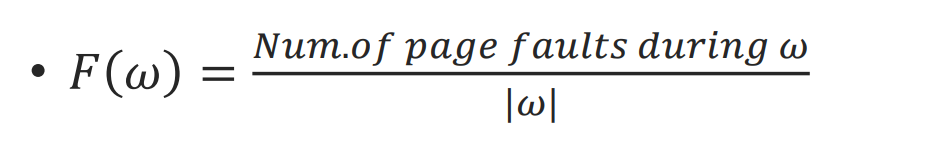
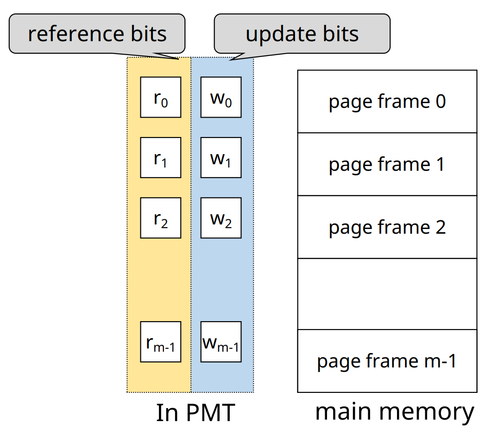
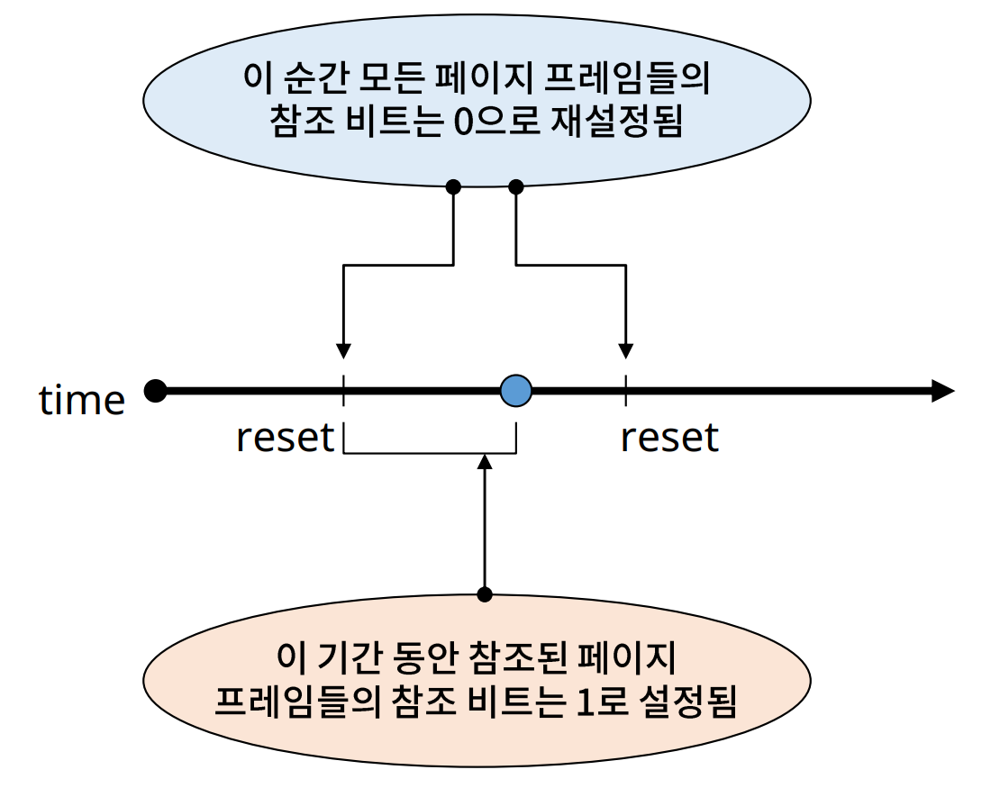

# Virtual Memory Management: Cost model, HW components 

## Virtual Memory Management

✔ 가상 메모리(기억 장치)

✔ 가상 메모리 관리의 목적
- 가상 메모리의 시스템 성능 최적화
  - Cost Model
  - 다양한 최적화 기법
  
## Cost Model for VM System

**✔ Page fault frequency (발생 빈도)**   
**✔ Page fault rate (발생률)**

✔ Page fault rate를 최소화 할 수 있도록 전략들을 설계해야 한다
- context switch 및 kernel 개입을 최소화
- 시스템 성능 향상

✔ Page reference string(d)
- 프로세스의 수행 중 참조한 페이지 번호 순서
  

✔ Page fault rate = F{w}

## Hardware Components

✔ Address translation device(주소 사상 장치)
- 주소 사상을 효율적으로 수행하기 위해 사용
- ex) TLB, Dedicated page-table register, Cache memories

✔ Bit vectors
- Page 사용 상황에 대한 정보를 기록하는 비트
- Reference bits (used bit)
  - 참조 비트
- Update bits (modified bits, write bits, dirty bits)
  - 갱신 비트

### Bit vectors

#### Reference bit vector

✔ 메모리에 적재된 각가의 page가 참조 되었는지를 표시

✔ 운영
  - 프로세스에 의해 참조되면 해당 page의 referece bit를 1로 설정
  - 주기적으로 모든 reference bit를 0으로 초기화

✔ Reference bit를 확인함으로써 최근에 참조된 page들을 확인 가능

#### Update bit vector

✔ Page가 메모리에 적재 된 후, 프로세스에 의해 수정 되었는지를 표시

✔ **주기적 초기화 없음**

✔ Update bit = 1
- 해당 page의 (Main memory 상 내용) != (Swap device 내용)
- 해당 page에 대한 write-back(to swap device)이 필요