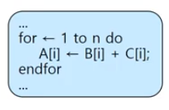
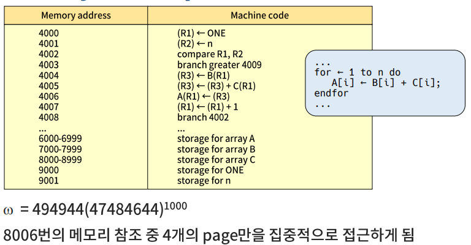
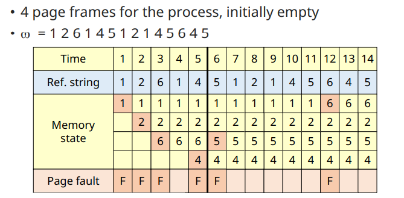
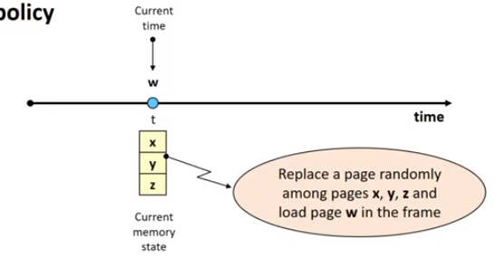
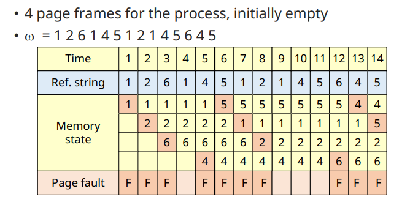
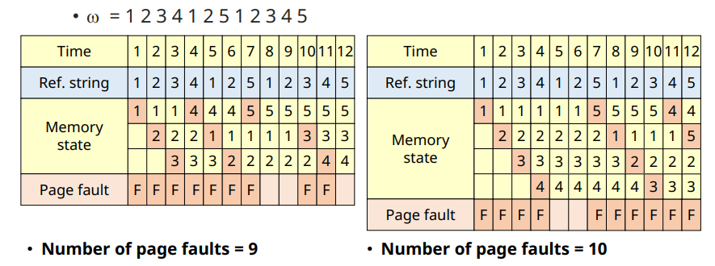
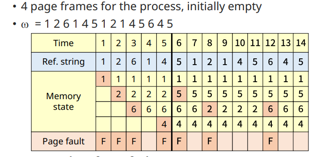

# Virtual Memory Management: Replacement Strategies for Fixed Alloc.1

## Locality

✔ 프로세스가 프로그램/데이터의 특정 영역을 집중적으로 참조하는 현상

✔ 공간적 지역성 (Spatial locality)  
✔ 시간적 지역성 (Temporal locality)

### Locality(Example)

✔ 가정
- paging system
- page size = 1000 words
- Machine instruction size = 1 word
- 주소 지정은 word 단위로 이루어짐
- 프로그램은 4번 page에 continuous allocation 됨
- n = 1000  
  

## Replacement Strategies

✔ **Fixed Allocation**
- MIN(OPT, B0) algorithm
- Random algorithm
- FIFO algorithm
- LRU(Least Recently Used) algorithm
- LFU(Least Frequently Used) algorithm
- NUR(Not Used Recently) algorithm
- Clock algorithm
- Second chance algorithm

✔ Variable Allocation
- WS(Working Set) algorithm
- PFF(Page Fault Frequency) algorithm
- VMIN(Variable MIN) algorithm

### Min Algorithm (OPT algorithm)

✔ 1966 Beadly가 제시

✔ **Minimize page fault frequency**(proved)
- Optimal Solution

✔ 기법
- 앞으로 가장 오랫동안 참조되지 않을 page 교체
  - Tie-breaking rule: page 번호가 가장 큰/작은 페이지 교체

✔ **실현 불가능한 기법 (Unrealizable)**
- Page reference string을 미리 알고 있어야 한다

✔ **교체 기법의 성능 평가 도구로 사용**

#### Example

✔ Number of page faultes = 6

### Random Algorithm

✔ **무작위로 교체할 page 선택**

✔ Low ovehead

✔ No policy

✔ 평가 지표로 사용

### FIFO Algorithm

✔ **First In First Out**
- 가장 오래된 page를 교체

✔ Page가 적재된 시간 기억하고있어야 함

✔ 자주 사용되는 page가 교체 된 가능성이 높음
- Locality에 대한 고려가 없음

✔ FIFO anomaly (Belady's anomaly)
- FIFO 알고리즘의 경우, 더 많은 page frame을 할당 받음에도 불구하고 page fault의 수가 증가하는 경우가 있다

#### Example

✔ Number of page faults = 10

#### Example (FIFO anomaly)

### LRU (Least Recently Used) Algorithm

✔ **가장 오랫동안 참조되지 않은 page 교체**  
✔ Page 참조 시마다 시간을 기록해야 함

✔ **Locality에 기반을 둔 교체 기법**  
✔ MIN algorithm에 근접한 성능

✔ 실제로 가장 많이 활용되는 기법

✔ 단점
- 참조시마다 시간을 기록해야 함(Overhead)
  - 간소화된 정보 수집으로 해소 (시간 대신 순서만 기록)
- Loop 실행에 필요한 크기보다 작은 수의 pageframe이 할당된 경우, page fault 수가 급격히 증가
  - Allocation 기법에서 해결

#### Example

✔ Number of page faults = 7