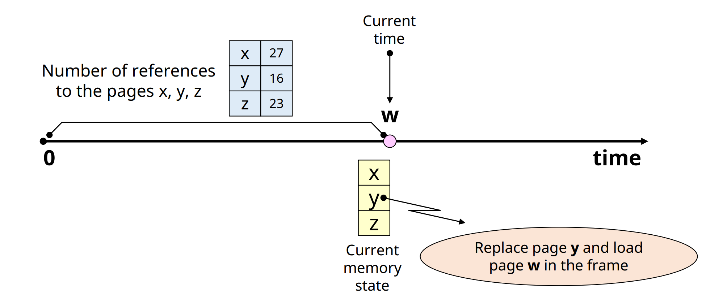
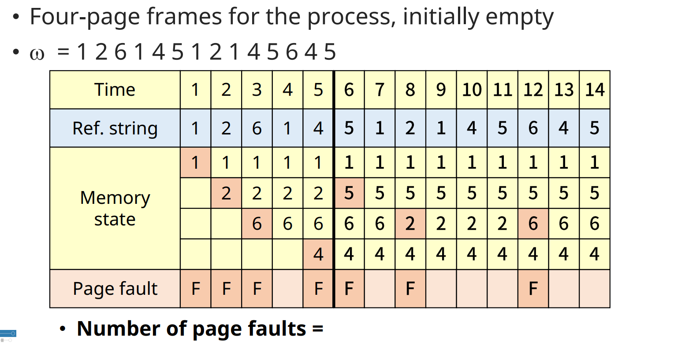
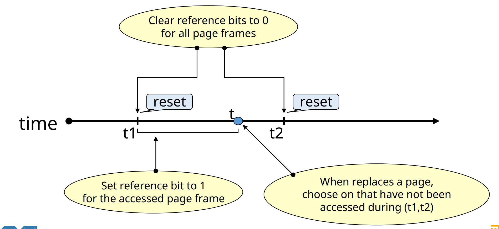
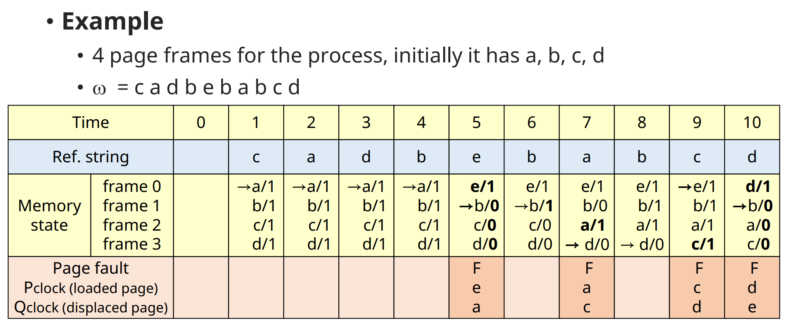
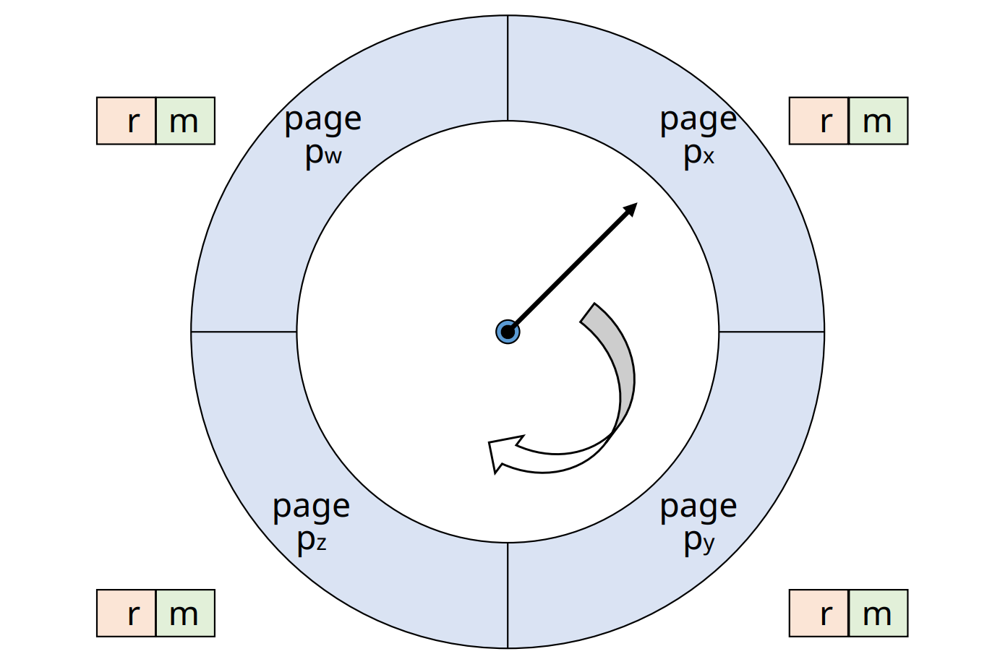
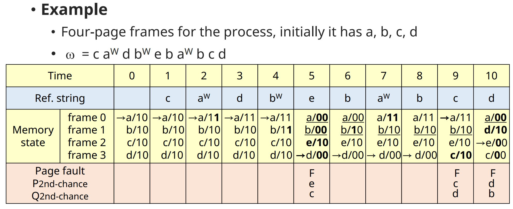

# Virtual Memory Management:  Replacement Strategies for Fixed Alloc. 2 

## LFULeast Frequently Used) Algorithm

Z

✔ **가장 참조 횟수가 적은 page 교체**
- Tie-braking rule: LRU

✔ page 참조 시마다, 참조 횟수를 누적 시켜야함

✔ **Locality 활용**
- LRU 대비 적은 overhead

✔ 단점
- 최근 적재된 참조될 가능성이 높은 page가 교체될 가능성
- 참조 횟수 누적 overhead

### Example

✔ Number of page faults = 7

## NUR(Not Used Recently) Algorithm

✔ **LRU approximation shceme**
- LRU보다 적은 overhead로 비슷한 성능 달성 목적

✔ **Bit vector** 사용
- Reference bit vector(r), Updated bit vector(m)
- reference bit가 주기적으로 초기화 되는 특성 이용

✔ 교체 순서

1. (r, m) = (0, 0)
2. (r, m) = (0, 1)
3. (r, m) = (1, 0)
4. (r, m) = (1, 1)

- update bit 지양(memory write back)

## Clock Algorithm

✔ IBM VM/370 OS

✔ Reference bit 사용함
- 주기적 초기화 없음

✔ **Page frame들을 순차적으로 가리키는 pointer(시계바늘)을 사용하여 교체될  page 결정**

### 설명

✔ **Pointer를 돌리면서 교체 page 결정**
- 현재 가리키고 있는 page의 reference bit(r) 확인
- r = 0 인 경우, 교체 page로 결정
- r = 1인 경우, reference bit 초기화 후  pointer 이동

✔ **먼저 적재된 page가 교체될 가능성이 높음**
- FIFO와 유사

✔ **Reference bit를 사용하여 교체 페이지 결정**
- Locaity 반영
- LRU(or NRU)와 유사

### Example

## Second Chance Algorithm

✔ Clock algorithm 과 유사

✔ Update bit(m)도 함께 고려함
- 현재 가리키고 있는 page의 (r, m) 확인
- (0, 0): 교체 page로 결정
- (0, 1): -> (0, 0), write-back (cleaning) list에 추가 후 이동
- (1, 0): -> (0, 0)후 이동
- (1, 1): -> (0, 1)후 이동

### Example

## Other Algorithms

✔ **Additional-reference-bits algorithm**
- LRU approximation
- 여러 개의 reference bit
  - 각 time-interval에 대한 참조 여부 기록
  - History register for each page
  
✔ **MRU(Most Recently Used) Algorithm**
- LRU와 정반대 기법

✔ **MFU(Most Frequently Used) Algorithm**
- LFU와 정반대 기법