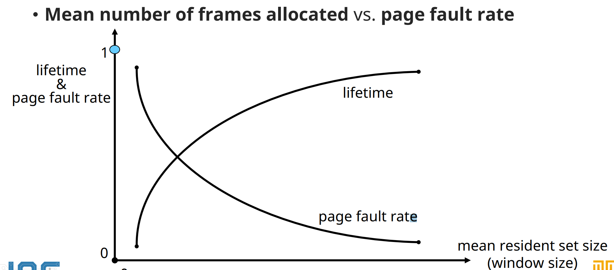
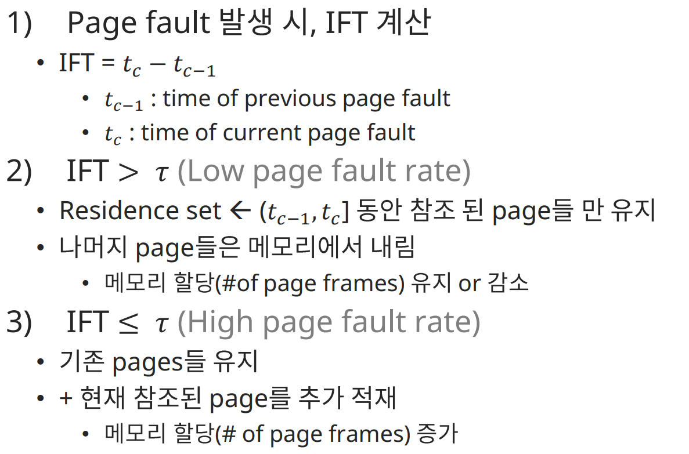
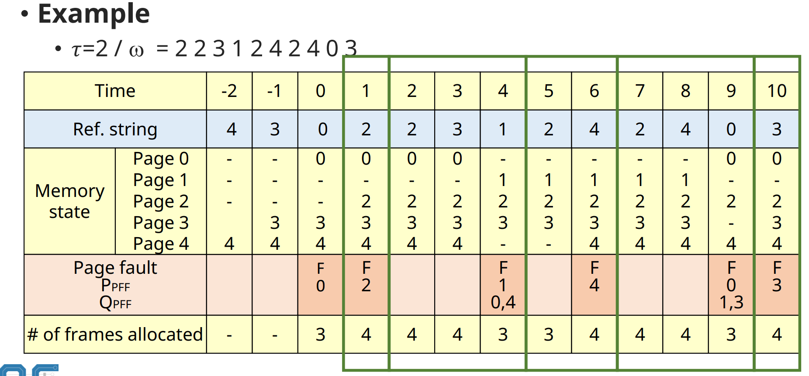

# Virtual Memory Management: Replacement Strategies for Variable Alloc.

## Working Set(WS) Alogrithm

✔ 1968 Denning

✔ **Working Set**
- Process가 특정 시점에 자주 참조하는 page들의 집합
- **최근 일정시간 동안 참조된 page들의 집합**
- 시간에 따라 변함
- W(t, Δ)
  - The working set of a process at time t
  - Time interval[t - Δ, t]동안 참조된 pages들의 집합
  - **Δ: window size, system parameter**

### Working set Memory management

✔ Locality에 기반

✔ Working set을 메모리에 항상 유지
- Page fault rate(thrashing) 감소
- 시스템 성능 향상

✔ **Window size는 고정**
- Memory allocation은 가변
- Δ 값이 성능을 결정짓는 주요 요소

### Working size vs WS size

✔ **locality**

### Working set transition

✔ 루프 -> 루프 전환될 때는 일시적으로 working set size가 증가한다

### Example

#### 성능평가

✔ Variable Allocation에서는 Page fault 수 외 다른 지표도 함께 봐야 한다
- 평균 할당 page frame
- page fault 처리 비용
- page frame 유지 비용

✔ Example
- Time interval [1, 10]
  - `#` of page fault = 5
  - 평균 할당 page frame 수 = 3.2
- 평가
  - 평균 3.2개의 page frame을 할당 받은 상태에서 5번의 page fault 발생

### window size vs page fault

✔ life time: page 유지 비용 증가

✔ 적절한 window size 설정 및 유지가 중요

### 특성 정리

✔ 적재 되는 page가 없더라도 메모리를 반납하는 page가 있을 수 있다  
✔ 새로 적재되는 page가 있더라도 교체 되는 page가 없을 수 있다

✔ 단점
- Working set management overhead
- Residence set(상주 집합)을 page fault가 없더라도, 지속적으로 관리 해야 한다.

## Page Fault Frequency (PFF) algorithm

✔ **Residence set size를 page fault rate에 따라 결정**
- Low page fault rate (long inter fault time)
  - process에게 할당된 PF 수를 감소
- High page fault rate (short inter-fault time)
  - process에게 할당된 PF 수를 증가

✔ **Residence set 갱신 및 메모리 할당**
- Page fault가 발생 시에만 수행
- Low overhead

### Criteria for page fault rate

✔ IFT > τ: Low page fault rate
✔ IFT < τ: High page fault rate

✔ **τ: threshold value**
  - system parameter

### Alogrithm

### Example

✔ τ = 2, # of pages = 5 (0, 1, 2, 3, 4)  
✔ Initially pages {0, 3, 4} in the memory at time 0  
✔ ɷ = 2 2 3 1 2 4 2 4 0 3

#### 성능 평가

✔ Variable Allocation에서는 Page fault 수 외 다른 지표도 함께 봐야 한다
- 평균 할당 page frame
- page fault 처리 비용
- page frame 유지 비용

✔ Example
- Time interval [1, 10]
  - `#` of page fault = 5
  - 평균 할당 page frame 수 = 3.7
- 평가
  - 평균 3.7개의 page frame을 할당 받은 상태에서 5번의 page fault 발생

### 특징

✔ 메모리 상태 변화가 page fault 발생 시에만 변한하
- Low overhead

## Variable MIN (VMIN) algorithm

✔ **Variable allocation 기반 교체 기법 중 optimal algorithm**
- 평균 메모리 할당량과 page fault 발생 횟수 모두 고려 했을 때의 Optimal

✔ **실현 불가능 기법**
- Page reference string을 미리 알고 있어야 한다
- 알고리즘 평가에 활용

✔ 기법
- [t, t + Δ] 고려하여 교체할 page 선택

### Algorithrm

✔ Page r이 t 시간에 참조 되면, page r이 (t, t + Δ] 사이에 다시 참조 되는지 확인  

✔ 참조 된다면 page r을 유지  
✔ 참조 안 단된다면 page r을 메모리에서 내림

### Example

#### 성능 평가

✔ Variable Allocation에서는 Page fault 수 외 다른 지표도 함께 봐야 한다
- 평균 할당 page frame
- page fault 처리 비용
- page frame 유지 비용

✔ Example
- Time interval [1, 10]
  - `#` of page fault = 5
  - 평균 할당 page frame 수 = 1.6
- 평가
  - 평균 1.76의 page frame을 할당 받은 상태에서 5번의 page fault 발생

### 최적 성능을 위한 Δ 값은?

✔ $Δ = {R \over U}$
- U = 한 번의 참조 시간 동안 page를 메모리에 유지하는 비용
- R = Page fault 발생 시 처리되는 비용

✔ R > Δ * U, (Δ가 작은 경우)
- 처리 비용 > page 유지 비용

✔ R < Δ * U, (Δ가 큰 경우)
- 처리 비용 < page 유지 비용

