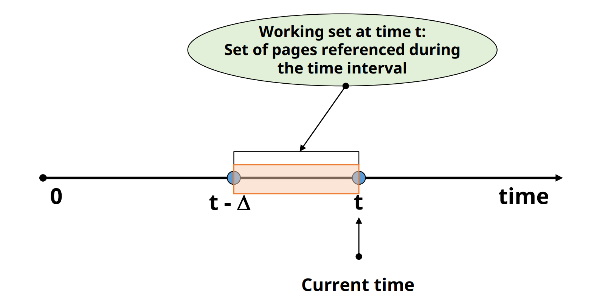
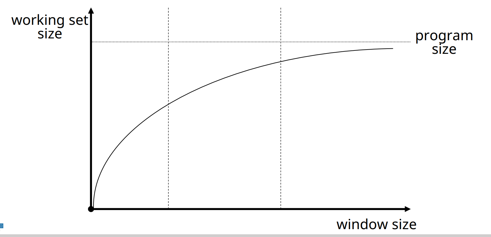
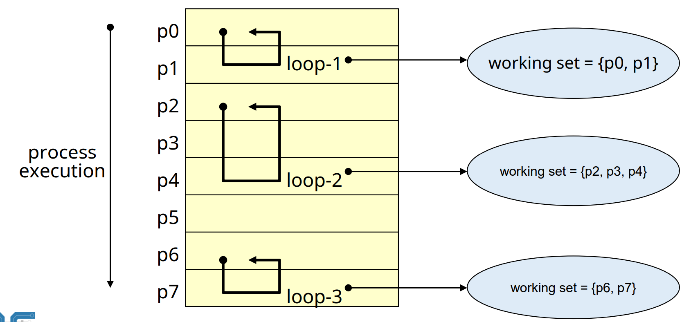
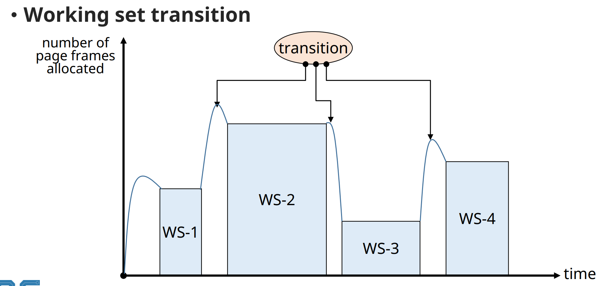
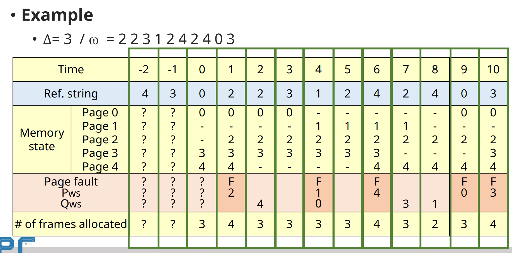

# Virtual Memory Management: Replacement Strategies for Variable Alloc.

## Working Set(WS) Alogrithm

✔ 1968 Denning

✔ **Working Set**
- Process가 특정 시점에 자주 참조하는 page들의 집합
- **최근 일정시간 동안 참조된 page들의 집합**
- 시간에 따라 변함
- W(t, Δ)
  - The working set of a process at time t
  - Time interval[t - Δ, t]동안 참조된 pages들의 집합
  - **Δ: window size, system parameter**

### Working set Memory management

✔ Locality에 기반

✔ Working set을 메모리에 항상 유지
- Page fault rate(thrashing) 감소
- 시스템 성능 향상

✔ **Window size는 고정**
- Memory allocation은 가변
- Δ 값이 성능을 결정짓는 주요 요소

### Working size vs WS size

✔ **locality**

### Working set transition

✔ 루프 -> 루프 전환될 때는 일시적으로 working set size가 증가한다

### Example

