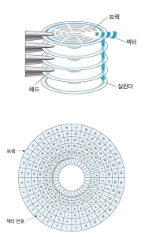
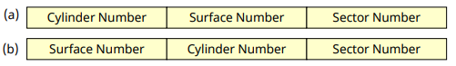
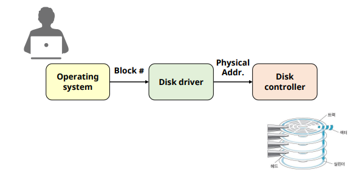

# Disk System

## Disk System

### Disk Pack

✔ 데이터 영구 저장 장치 (비휘발성)

✔ 구성
- **Sector**
  - 데이터 저장/판독의물리적 단위
- **Track**
  - Platter 한 면에서 중심으로 같은 거리에 있는 sector들의 집합
- **Cylinder**
  - 같은 반지름을 갖는 track의 집합
- **Platter**
  - 양면에 자성 물질을 입힌 원형 금속판
  - 데이터 기록/판독이 가능한 기록 매체
- **Surface**  
  - Platter의 윗면과 아랫면

### Disk Drive

✔ Disk pack에 데이터를 기록하거나 판독할 수 있도록 구성된 장치

✔ 구성
- **Head**
  - 디스크 표현에 데이터를 기록/판독
- **Arm**
  - Head를 고정/지탱
- **Positioner (boom)**
  - Arm을 지탱
  - Head를 원하는 track으로 이동
- **Spindle**
  - Disk pack을 고정(회전축)
  - 분당 회전 수 (RPM: revolutions per minute)

## Disk Address

✔ Physical disk address
- sector(물리적 데이터 전송 단위)를 지정
  
  

✔ Logical disk address: relative address
- Disk system의 데이터 전체를 block들의 나열로 취급
  - Block에 번호 부여
  - 임의의 block에 접근 가능
- Block 번호 -> physical address 모듈 필요 (disk driver)
  - B_0, B_1, B_2 ... B_(n-2), B_(n-1)

### Disk address mapping

## Data Access in Disk System

1. Seek time
   - 디스크 head를 필요한 cylinder로 이동하는 시간
2. Rotational delay
   - (1 이후부터) 필요한 sector가 head위치로 도착하는 식나
3. Data transmission time
   - (2 이후부터) 해당 sector를 읽어서 전송(or 기록)하는 시간