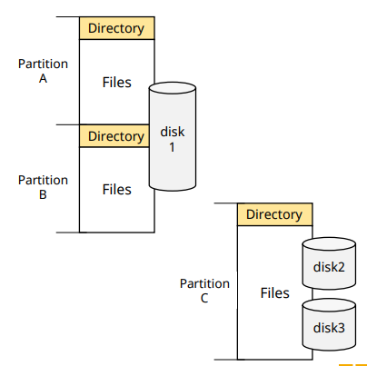
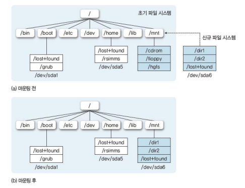

# File System Overview

## File System

✔ **사용자들이 사용하는 파일들을 관리하는 운영체제의 한 부분** 

✔ File system의 구성
1. **Files**
   - 연관된 정보의 집합

2. **Directory Structure**
   - 시스템 내 파일들의 정보를 구성 및 제공

3. **Partitions**
   - Directory들의 집합을 논리적/물리적으로 구분

## File Concept

✔ **보조 기억 장치에 저장된 연관된 정보들의 집합**
- 보조 기억 장치 할당의 최소 단위
- Sequence of bytes (물리적 정의)

### File의 분류

✔ 내용에 따른 분류
- Program file
  - Source program, object program, executable files
- Data file

✔ 형태에 따른 분류
- Text(ascii) file
- Binary file

### File attributes(속성)

✔ Name  
✔ Identifier  
✔ Type  
✔ Location  
✔ Size  
✔ Protection  
✔ User identification(owner)  
✔ Time, Date

### File operations

✔ Create  
✔ Write  
✔ Read  
✔ Reposition  
✔ Delete  
✔ Etc.

✔ **OS는 file operation들에 대한 system call을 제공해야 한다**

## File Access Methods

✔ **Sequential Access (순차 접근)**
- File을 record(or bytes)단위로 순서대로 접근

✔ **Directed Access (직접 접근)**
- 원하는 Block을 직접 겁근

✔ **Indexed Access**
- Index를 참조하여 원하는 block을 찾은 후 데이터에 접근

## File System Organization

✔ Paritions(minidisks, volumes)
- Virtual disk

✔ Directory
- File 들을 분류, 보관하기 위한 개념
- Operations on directory
  - Search file
  - Create file
  - Delete file
  - List a directory
  - Rename file
  - Traverse the file system

### Mounting

✔ 현재 file system에 다른 file system에 붙이는 것

✔ Mount point