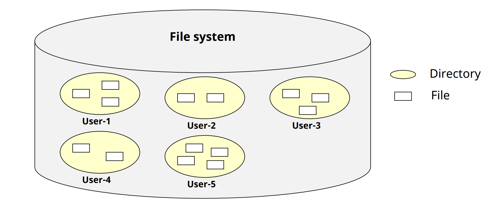
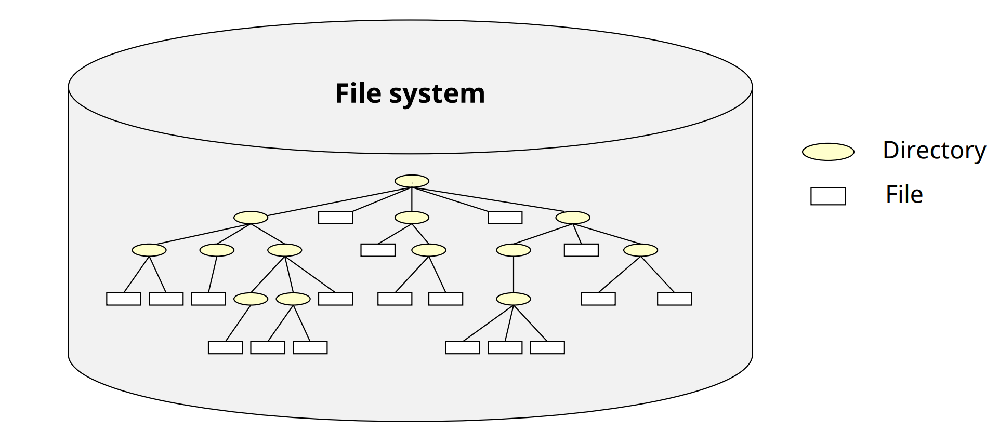
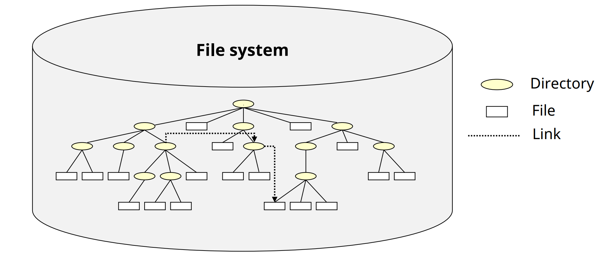
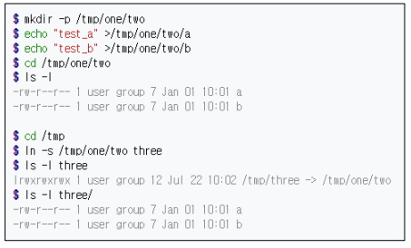
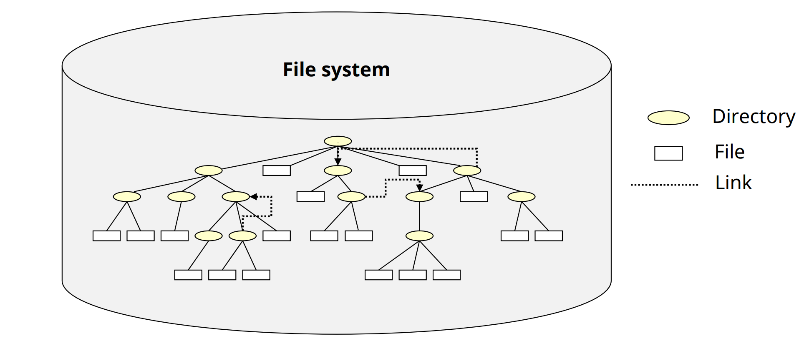

# Directory Structure

## Directory Structure

✔ **Logical directory structure**
- Flat(Single level)
- 2-level
- Hierarchical(tree-structure)
- Acyclic graph
- General graph

## Flat Directory Structure

✔ **FS 내에 하나의 directory만 존재**
- Single-level directory structure

✔ Issues
- File naming
- File protection
- File management
- **다중 사용자 환경에서 문제가 더욱 커진다**

✔ ex: 초창기 mp3 player

## 2-level Directory Structure

✔ **사용자마다 하나의 directory 배정**

✔ 구조
- MFD (Master File Directory)
- UFD (User File Directory)

✔ Problems
- Sub-directory 생성 불가능 (file naming issue)
- 사용자 간 파일 공유 불가

## Hierarchical Directory Structure

✔ **Tree 형태의 계층적 directory 사용 가능**

✔ 사용자가 하부 directory 생성/관리 가능
- system call이 제공 되어야함
- Terminologies
  - Home directory, Current directory
  - Absolute directory, Relative pathname

✔ **대부분의 OS가 사용**

## Acyclic Graph Directory Structure

✔ **Hierarchical directory structure 확장**

✔ **Directory 안에 shared directory, shared file을 담을 수 있음**

✔ **Link 개념 사용**
- ex: Unix system의 symbolic link

    

## General Graph Directory Structure

✔ **Acyclic Graph Directory Structure의 일반화**
- Cycle 허용

✔ Problem
- File 탐색 시, infinite loop을 고려해야 함