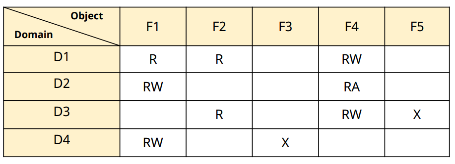
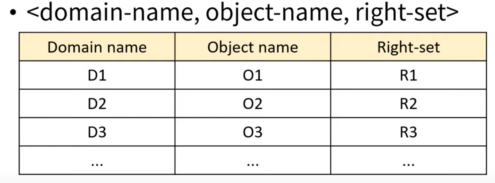
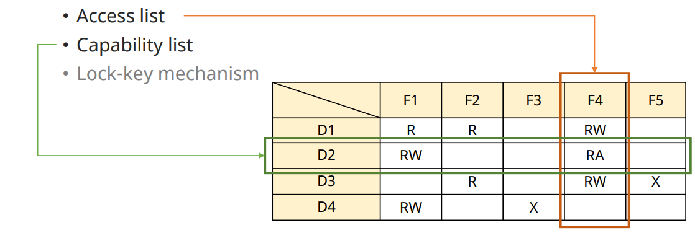

# File Protection

## File Protection

✔ **File에 대한 부적절한 접근 방지**
- 다중 사용자 시스템에서 더욱 필요

✔ 접근 제어가 필요한 연산들
- Read(R)
- Write(W)
- Execute(X)
- Append(A)

## File Protection Mechanism

✔ 파일 보호 기법은 sytem size 및 응용 분야에 따라 다를 수 있다.

1. Password 기법
   - 각 file들에 PW 부여
   - 비현실적 (모든 file에 접근 불가)

2. Access Matrix 기법

### Access Matrix

✔ **범위(domain)와 개체(object)사이의 접근 권한을 명시**

✔ Terminologies
- Object
  - 접근 대상(file, device등 HW/SW objects)
- Domain (Protection domain)
  - 접근 권한의 집합
  - 같은 권한을 가지는 그룹(사용자, 프로세스)
- ACcess right
  - <object-name, rights-set>

#### Global Table

✔ **시스템 전체 file들에 대한 권한을 Table로 유지**

✔ 단점
- Large table size (빈 공간도 저장)

#### Access List

✔ **Access matrix의 열(column)을 list로 표현**
- **각 Object에 대한 접근 권한 나열**
- $A_{list}(F_k) = \{<D1, R1>, <D2, R2}, ... , <Dm, Rm>}\$

✔ Object 생성 시, 각 domain에 대한 권한 부여  
✔ Object 접근 시 권한 검사

✔ 실제 OS에서 많이 사용됨
- UNIX

#### Capability List

✔ **Access matrix의 행(row)을 List로 표현**
- 각 domain에 대한 접근 권한 나열
- $C_{list}(D_k) = \{<F1, R1>, <F2, R2}, ... , <Fp, Rp>}\$

✔ Capability를 가짐이 권한을 가짐을 의미
- 프로세스가 권한을 제시, 시스템이 검증 승인

✔ 시스템이 capability list자체를 보호 해야 함
- 보안 문제 발생 가능성
- kernel 안에 저장

#### Lock-key Mechanism

✔ **Access list와 Capability list를 혼합한 개념**

✔ Object는 Lock을, Domain은 Key를 가짐
- lock/key: unique bit patterns

✔ Domain 내 프로세스가 object에 접근 시, 
- 자기의 key와 object의 lock 짝이 맞아야 한다

✔ 시스템은 key list를 관리 해야 한다.

#### Comparision

✔ Global table
- simple, but large

✔ Access list
- Object별 권한 관리 용이
- 모든 접근마다 권한을 검사 해야함
  - Object 많이 접근하는 경우 -> 느림

✔ Capability list
- List 내 object들 (localized info.)에 대한 접근 유리
- Object별 권한 관리 (권한 취소 등)이 어려움

✔ **많은 OS가 Access list와 Capability list 개념을 함께 사용**
- Object에 대한 첫 접근 -> Access list 탐색
  - 접근 허용 시,  capability 생성 후 해당 프로세스에게 전달
    - 이후 접근 시에는 권한 검사 불필요
- 마지막 접근 후 -> capability 삭제