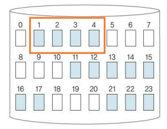
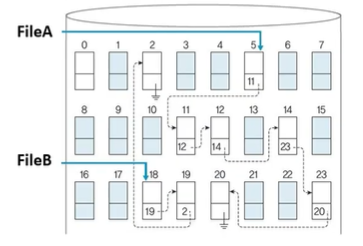
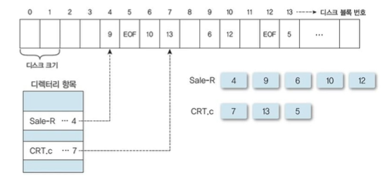
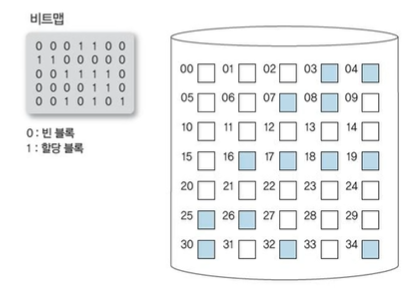
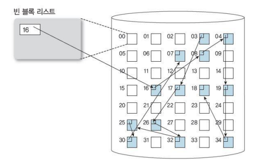
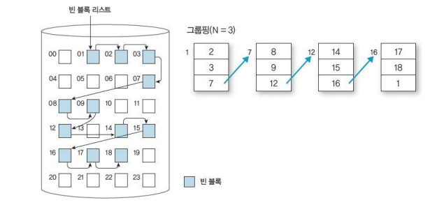

# File System Implementation 

## Allocation Methods

✔ Continuous allocation

✔ Discontinuous allocation
- Linked allocation
- Indexed allocation

### Continuous Allocation

✔ **한 File을 디스크의 연속된 block에 저장**

✔ 장점
- 효율적인 file 접근 (순차, 직접 접근)

✔ 문제점
- 새로운 file을 위한 공간 확보 어려움
- External fragmentation
- File 공간 크기 결정이 어려움
  - 파일이 커져야 하는 경우 고려 필요

### Linked Allocation (Discontinuous alloc.)

✔ **File이 저장된 Block들을 Linked List로 연결**
- 비연속 할당 가능

✔ Directory는 각 file에 대한 첫 번째 block에 대한 포인터를 가진다

✔ 장점
- Simple, No external fragmentation

✔ 단점
- 직접 접근에 비효율적
- 포인터 저장을 위한 공간 필요
- 신뢰성 문제 (사용자가 포인터 실수로 수정)

### Linked Allocation : variation -> FAT

✔ **File Allocation Table (FAT)**
- 각 block의 **시작 부분**에 다음 블록의 번호 기록
- direct access 등 탐색 시 이점

✔ MS-DOS, Windows 등에 사용

### Indexed Allocation

✔ **File이 저장된 block의 정보(pointer)를 Index block에 모아 둠**

✔ **직접 접근에 효율적**
- 순차 접근에는 비효율적

✔ **Filed 당 Index block을 유지**
- Space overhead
- Index block 크기에 따라 파일의 최대 크기 제한

✔ Unix 등에 사용

## Free Space Management

1. Bit Vector
2. Linked List
3. Grouping
4. Counting

### Bit vector

✔ **시스템 내 모든 block들에 대한 사용 여부를 1 bit flag로 표시**

✔ Simple and Efficient

✔ Bit vector 전체를 메모리에 보관해야 함
- 대형 시스템에 부적합

### Linked List

✔ **빈 Block을 Linked List로 연결**

✔ 비효율적

### Grouping

✔ **N개의 빈 block을 그룹으로 묶고, 그룹 단위로 linked list로 연결**

✔ 연속된 빈 block을 쉽게 찾을 수 있다

### Counting

✔ **연속된 빈 block들 중 첫 번째 block의 주소와 연속된 block의 수를 table로 유지**

✔ Continuous allocation 시스템에 유리