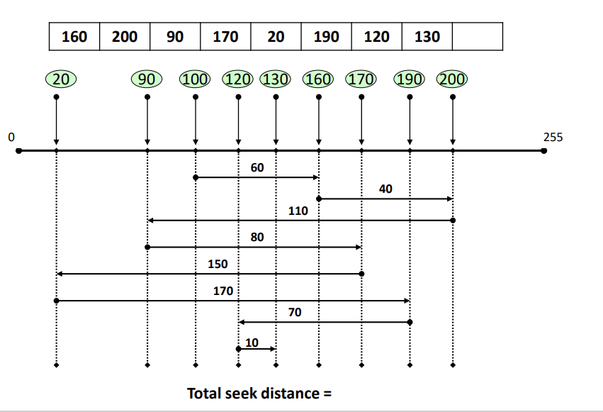

# 입출력 시스템 & 디스크 관리

## I/O System (HW)

I/O : 프로세서가 필요한 정보 요청하면 데이터 읽어오거나 내 보내는 것

결국 필요한 데이터는 메인 메모리에 저장 되어야함

## I/O Mechanisms

CPU가 제어하는 메모리 접근 방법 2가지

프로세서가 제어하는 것 / 아닌것

## Polling (Programmed I/O)

Polling : 프로세서가 주기적으로 I/O 장치 상태 확인하고 순환하면서 물어보는 방식(Processor가 controll)

키보스, 마우스 입력은 자주 받으므로 이게 좋음

but 계속 돌고 있어야 하니깐 overhead

## Interrupt

계속 찌르면 프로세서는 Interrupt handling overhead 커지는 단점

## Interrupt

## Direct Memory Access(DMA)

보낼 때 마다 프로세서가 계속 보고 있어야함 => 오버헤드 큼

=> 프로세서는 명령만 내려 놓고 자기 일 하면 된다!

=> DMA

## I/O Services of OS

OS가 어떤 support를 할 수 있을까?

커널 입출력 서브시스템 : I/O service 제공!

OS가 I/O를 위해 많은일 하고 있구나~

## Disk Scheduling

성능이란게 모호하기 때문에 평가 기준 필요

## First Come First Service(FCFS)

Total seek distance = 690

## Shortest Seek Time First(SSTF)

멀리 있는 애가 언제 서비스 받을 수 있는지 모름 predictability

total seek distance = 300

## Scan Scheduling

TSD = 300

효율 적이지만 starvation X

## C-Scan Scheduling

TSD = 490

횡단 한번해서 비효율적인 면도 있음

## Look Scheduling

TSD = 260

Rotational Delay 줄이기

## Shortest Latency Time First(SLTF)

## Shortest Positioning Time First(SPTF)

## Shortest Positioning Time First (SPTF)

## RAID Architecture

싼거 모아서 비싼거 처럼 쓰자

## RAID 0

OS 입장에서 DISK는 연속된 하나의 블럭

이상적으로 4개의 디스크 쓰면 4배의 속도, 하나하나씩 안가져 와도 되니깐

디스크 하나만 고장나도 데이터 손실

## RAID 1

중요한 데이터 다룰 때 씀

## RAID 3

Raid 0 와 다르게 Byte 단위로 분할해서 저장

RAID 1 보단 효율적으로 쓸 수 있지만 신뢰성도 확보

## RAID 4

## RAID 5

패리티도 나눠서 저장

참고

