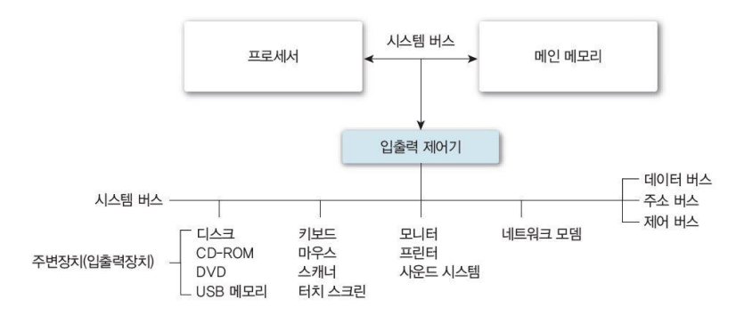
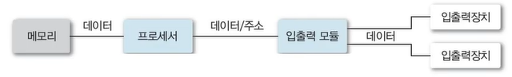
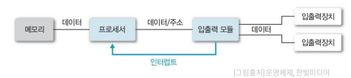
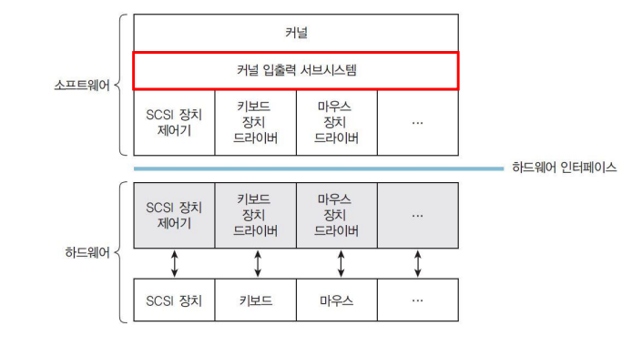
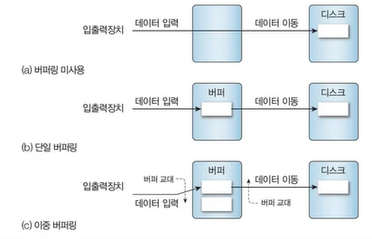

# I/O System

## I/O System (HW) 

## I/O Mechanism

1. **Processor controlled memory access**
   
- Polling (Programmed I/O)
- Interrupt

2. **Direct Memory Access (DMA)**

### Pooling (Programmed I/O)

✔ **Processor가 주기적으로 I/O 장치의 상태 확인**
- 모든 I/O 장치를 순환하며 확인
- 전송 준비 및 전송 상태 등

✔ 장점
- Simple
- I/O 장치가 빠르고, 데이터 전송이 잦은 경우 효율적

✔ 단점
- Processor의 부담이 큼
  - Pooling overhead (I/O device가 느린 경우)

### Interrupt

✔ **I/O 장치가 작업을 완료한 후, 자신의 상태를 Processor에게 전달**
- Interrupt 발생 시, Processor는 데이터 전송 수행

✔ 장점
- Pooling 대비 low overhead
- 불규칙적인 요청 처리에 적합

✔ 단점
- Interrupt handling overhead 

### Direct Memory Access (DMA)

✔ Process controlled memory access의 문제점 : **Processor가 모든 데이터 전송을 처리 해야 한다**
- High overhead

✔ I/O 장치와 Memory 사이의 데이터 전송을 Processor 개입 없이 수행

✔ **Processor는 데이터 전송의 시작/종료만 관여**

## I/O Services of OS

✔ **커널 입출력 서브 시스템**: I/O service 제공

### I/O Scheduling

✔ 입출력 요청에 대한 처리 순서 결정
  - 시스템의 전반적 성능 향상
  - Process의 요구에 대한 공평한 처리

✔ ex) Disk I/O scheduling

### Error Handling

✔ 입출력 중 발생하는 오류 처리

✔ ex) disk access fail, network communication error

### I/O device information managements

### Buffering

✔ I/O 장치와 Program 사이에 전송되는 데이터를 Buffer에 임시 저장

✔ 전송속도(or 처리 단위) 차이 문제 해결

### Caching

✔ 자주 사용하는 데이터 미리 복사

✔ Cache hit 시 I/O 생략 가능

### Spooling

✔ 한 I/O 장치에 여러 Program이 요청을 보낼 시, 출력이 섞이지 않도록 하는 기법
- 각 Program에 대응하는 disk file에 기록(spooling)
- Spooling이 완료 되면, Spool을 한 번에 하나씩 I/O 장치로 전송